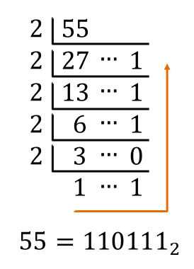
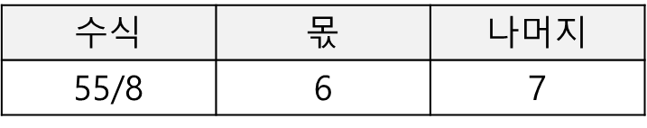
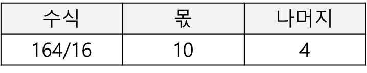

# 진법변환
## 목차
- [x] [2진수 변환](#2진수-변환)
- [x] [8진수 변환](#8진수-변환)
- [x] [16진수 변환](#16진수-변환)

## 진법이란 무엇인가?
- 특정 단위(digits)를 사용하여 수를 표현하는 방법
- 예를 들어 10진법은 0~9의 10가지 수를 이용하여 수를 표현하는 진법

## 2진수 변환
### 2진법이란 무엇인가
- 2진법은 0과 1, 두개의 숫자만으로 수를 표현하는 방법
- 2진수는 자릿값이 올라감에 따라 크기가 2배씩 커지게 됨

### 10진수에서 2진수로 변환
1. 10진수를 2로 나누고, 해당 나머지를 기록합니다.
2. 나눈 몫을 또 다시 2로 나누고, 해당 나머지를 기록합니다.
3. 1~2번 과정을 반복 수행 하다가 나눈 몫이 2보다 작아지면 중단합니다.
4. 마지막 몫과 지금까지 기록한 나머지들을 역으로 연결하면 2진수가 완성됩니다.

예를 들어 10진수 55를 2진수로 변환하면 다음과 같습니다.

### 2진수에서 10진수로 변환
1. 2진수의 가장 작은 자릿수(오른쪽)부터 시작함
2. 각각의 자릿수의 값 * 2의 n-1승을 각각 계산합니다.
   - 가장 작은 자릿수(오른쪽)는 1번째 자리로써 2^0 = 1을 곱합니다.
3. 각각의 계산 결과의 합계가 10진수가 됩니다.

예를 들어 이진수 110111를 10진수로 변환하는 것은 다음과 같습니다.

## 8진수 변환
### 8진법이란 무엇인가
- 8진법은 0,1,2,3,4,5,6,7 8개의 숫자만으로 수를 표현하는 방법
- 8진수는 자릿값이 올라감에 따라 크기가 8배씩 커지게 됨

### 10진수에서 8진수로 변환
1. 10진수를 8로 나누고, 해당 나머지를 기록합니다.
2. 나눈 몫을 또 다시 8로 나누고, 해당 나머지를 기록합니다.
3. 1~2번 과정을 반복 수행 하다가 나눈 몫이 8보다 작아지면 중단합니다.
4. 마지막 몫과 지금까지 기록한 나머지들을 역으로 연결하면 8진수가 완성됩니다.

예를 들어 10진수 55를 8진수로 변환하면 다음과 같습니다.

위와 같이 55를 8진수로 변환하면 67입니다.

### 8진수에서 10진수로 변환
1. 8진수의 가장 작은 자릿수(오른쪽)부터 시작함
2. 각각의 자릿수의 값 * 8의 n-1승을 각각 계산합니다.
3. 각각의 계산 결과의 합계가 10진수가 됩니다.

## 16진수 변환
- 16진법은 0,1,2,3,4,5,6,7,8,9,A,B,C,D,E,F 16개의 숫자와 문자로 수를 표현하는 방법
- 16진수는 자릿값이 올라감에 따라 크기가 16배씩 커지게 됩니다.
- A,B,C,D,E,F는 십진수로 10,11,12,13,14,15를 의미하며 효율을 위해 하나의 문자로 치환하여 사용합니다.

### 10진수에서 16진수로 변환
1. 10진수를 16으로 나누고, 해당 나머지를 기록합니다.
2. 나눈 몫을 또 다시 16으로 나누고, 해당 나머지를 기록합니다.
3. 1~2번 과정을 반복 수행하다가 나눈 몫이 16보다 작아지면 중단합니다.
4. 마지막 몫과 지금까지 기록한 나머지들을 역으로 연결하면 16진수가 완성됩니다.
   - 이때 10~15의 몫은 A~F까지의 문자로 치환합니다.

예를 들어 10진수 164를 16진수로 변환하면 다음과 같습니다.

위와 같이 16진수로 변환하면 16진수로 A4로 표현할 수 있습니다.

## 16진수에서 10진수로 변환
1. 16진수의 가장 작은 자릿수(오른쪽)부터 시작함
2. 각각의 자릿수의 값 * 16의 n-1승을 각각 계산합니다.
3. 각각의 계산 결과를 합계가 10진수가 됩니다.

예를 들어 16진수 A4를 10진수로 표현하면 다음과 같습니다.

