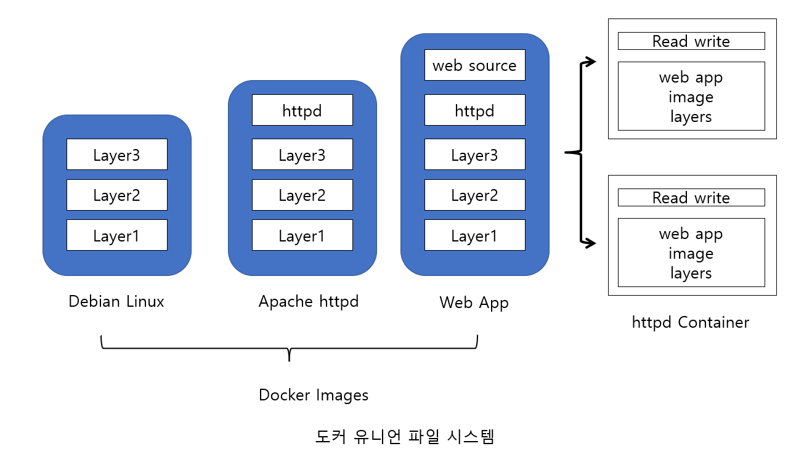
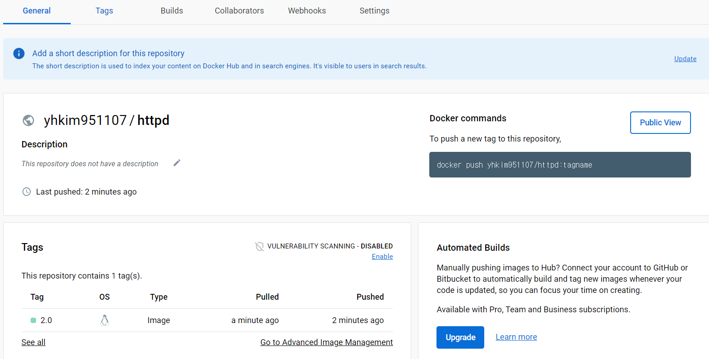

# 도커 명령어 활용
## 목차
- [x] [docker pull](#도커-이미지-내려받기-docker-pull)
- [x] [docker image](#도커-이미지-세부-정보-조회-docker-image)
- [x] [docker image tag](#docker-image-tag)
- [x] [docker login](#docker-login)
- [ ] [도커 이미지를 파일로 관리(docker image save)](#docker-image-save)

## 도커 이미지 명령어
## 도커 이미지 내려받기 docker pull
- docker [image] pull [OPTIONS] name[:TAG | @IMAGE_DIGEST]
- **docker pull** 명령어는 도커 허브 레지스트리에서 원하는 이미지 파일을 다운로드하는 명령어입니다. 
- docker pull 명령어 옵션
  - --all-tags, -a : 저장소에 태그로 지정된 여러 이미지를 모두 다운로드
  - --disable-content-trust : 이미지 검증 작업 스킵
  - --platform : 플랫폼을 지정하여 pull함
    - ex) --platform=linux
  - --quiet, -q : 이미지 다운로드 과정에서 화면에 나타나는 상세 출력 숨김

```shell
# 명시적으로 최신 버전 지정
$ docker pull debian:latest

# 이미지 식별 정보인 다이제스트 지정.
$ docker pull debian:sha256:28579893...258

# 도커 허브 레지스트리 명시적 지정
$ docker pull library/debian:latest
$ docker pull docker.io/library/debian:latest
$ docker pull index.docker.io/library/debian:latest

# 외부 레지스트리 주소를 이용하는 방법(예로 구글에서 제공하는 샘플 애플리케이션 이미지 지정)
# 주의할 것은 웹 주소 URL에서 도메인 주소의 시작인 http://를 붙이지 않고 이미지 주소를 써야함
$ docker pull gcr.io/google-samples/hello-app:1.0
```

#### 다이제스트(Digest)
- 도커 허브에서 관리하는 이미지의 고유 식별값
- 다이제스트 값을 포함한 이미지 조회 명령어는 **docker images --digests**

## 도커 이미지 세부 정보 조회 docker image
- **docker image inspect [OPTIONS] IMAGE [IMAGE...]**
- 도커 오브젝트(이미지, 컨테이너 등)에 대한 세부 정보를 조회합니다.
- docker image inspect 명령어 옵션
  - --format, -f : JSON 형식의 정보 중 지정한 형식의 정보만 출력할 수 있고, {} 중괄호 형식과 대소문자에 유의해야함

```shell
# 아파치 웹 서비스를 할수 있는 httpd 도커 이미지 검색
$ docker search httpd

# httpd 최신 버전으로 다운로드
$ docker pull httpd:latest

# 다운로드한 이미지 조회
$ docker images

# 다운로드한 이미지 세부 정보 조회
$ docker image inspect httpd

# 계층 형식으로 되어 있어 하위 정보 조회시 .상위[.하위] 방식으로 조회
$ docker image inspect --format="{{.RepoTags}}" httpd

$ docker image inspect --format="{{.Os}}" httpd

$ docker image inspect --format="{{.Created}}" httpd

$ docker image inspect --format="{{.ContainerConfig.Env}}" httpd

$ docker image inspect --format="{{.RootFS.Layers}}" httpd
```

- **docker image history [OPTIONS] IMAGE**
- 현재 이미지 구성을 위해 사용된 레이블 정보와 각 레이어의 수행 명령, 크기 등을 조회하는 명령어입니다.

```shell
$ docker image history httpd
```

출력 결과 중 CREATED BY 열을 보면 특정 이미지를 구성하기 위해 사용된 명령과 환경 설정 정보등을 볼 수 있다.

실행 결과를 보면 CMD, EXPOSE, ENV, WORKDIR 등의 명령을 통해 베이스 이미지에 필요한 설정 정보를 결합하여

새로운 이미지를 만들게 됩니다.

위와 같은 레이어를 쌓는 이미지를 도커 유니언 파일 시스템이라고 하며 그림으로 표현하면 다음과 같다.



1. 도커 이미지 구조의 기본 운영체제 레이어들을 쌓음
2. 데비안 리눅스 운영체제 이미지 위에 아파치 웹 서버를 설치한 레이어를 올림
3. 아파치 웹 서비스에 필요한 리소스 정보 및 환경 정보가 포함된 레이어를 올림.
이렇게 구성된 이미지는 불변의 읽기 전용 레이어들의 집합 구조인 유니언 파일 시스템이 된다.
4. 도커 이미지를 실행하면 여러 개의 컨테이너를 구동할 수 있음.
각각의 컨테이너에서 발생한 모든 변경 정보를 저장하기 위해 읽고-쓰기 레이어를 두고 저장하게 된다.

#### 왜 도커 유니언 파일 시스템 구조를 사용하는가?
이미지 레이어의 상단에 있는 웹 애플리케이션 소스 레이어의 환경 설정 및 리소스 설정이 변경되어 이미지로

변경되더라도 기존 레이어(큰 용량을 차지하는 데비안)를 제외한 변경된 웹 소스 레이어만 내려받아 사용하기 때문에 효율적이기 때문이다.

## docker image tag
- 원본 이미지에 참조 이미지 이름을 붙이는 명령어

```shell
docker image tag 원본이미지[:태그] 참조이미지[:태그]
```

```shell
# 이미지 태그 설정
~ $ docker image tag httpd:latest debian-httpd:1.0

# 도커 허브와 같은 레지스트리에 업로드하는 경우 저장소명과 함께 태그 지정
~ $ docker image tag httpd:latest yhkim951107/httpd:2.0
```

## docker login
- 도커 허브에 원격 접속하는 명령어

```shell
~ $ docker login
# 아이디 비밀번호 입력

# 도커 허브에 이미지 업로드
~ $ docker push yhkim951107/httpd:2.0

# 본인 도커 허브 저장소에 업로드된 이미지 내려받기
~ $ docker pull yhkim951107/httpd:2.0
```



## docker image save
- docker image save 명령어는 도커 원본 이미지의 레이어 구조까지 포함한 복제를 수행하여 확장자 tar(Tape ARchiver) 파일로 이미지를 저장하는 
명령어입니다.

### 도커 이미지를 파일로 관리할 필요가 있는 경우
- 도커 허브에서 이미지를 내려받아서 내부망으로 이전하는 경우
- 신규 애플리케이션 서비스를 위해서 Dockerfile로 새롭게 생성한 이미지를 저장하고 배포해야 하는 경우
- 컨테이너를 완료(commit)하여 생성한 이미지를 저장 및 배포해야 하는 경우
- 개발 및 수정한 이미지 등

### docker image save 명령어 형식
```
# 도커 이미지를 tar 파일로 저장.
docker image save [옵션] <파일명> [image명]

# docker save로 저장한 tar 파일을 이미지로 불러옴
docker image load [옵션]
```

### docker image save & docker image load 예제
```shell
$ docker pull mysql:5.7

# docker image save 명령어를 이용해 이미지를 tar 파일로 저장
$ docker image save mysql:5.7 > test-mysql57.tar
$ ls -lh test-mysql57.tar
total 428M
-rw-rw-r-- 1 yonghwan yonghwan 428M  2월 23 23:51 test-mysql57.tar

# tar 명령의 옵션중 tvf(t(list), v(verbose), f(file))를 이용해 묶인 파일 내용을 확인할 수 있습니다. 이미지 레이어들의
다이제스트값으로 만들어진 디렉터리 파일입니다
$ tar tvf test-mysql57.tar
drwxr-xr-x 0/0               0 2023-01-18 15:01 14cd969708a3853b713c5260aff4f49659fd3a14ddca25ddb5f607b3fa31e704/
-rw-r--r-- 0/0               3 2023-01-18 15:01 14cd969708a3853b713c5260aff4f49659fd3a14ddca25ddb5f607b3fa31e704/VERSION
-rw-r--r-- 0/0             482 2023-01-18 15:01 14cd969708a3853b713c5260aff4f49659fd3a14ddca25ddb5f607b3fa31e704/json
-rw-r--r-- 0/0            2560 2023-01-18 15:01 14cd969708a3853b713c5260aff4f49659fd3a14ddca25ddb5f607b3fa31e704/layer.tar
...

$ docker image rm mysql/mysql-server:5.7
# docker image load 명령을 이용해 파일로 만들어진 이미지 tar 파일 내용을 불러옵니다.
$ docker image load < test-mysql57.tar

# 로컬에 저장된 tar 파일을 기반으로 새롭게 지정한 이미지명과 태그로 이미지 등록이 가능함
$ cat test-mysql57.tar | docker import - mysql57:1.0
```
- tvf 옵션 : tar 아카이브 파일 내부의 파일 목록을 출력합니다.

#### gzip 옵션을 사용한 tar 파일 용량 줄이기
```shell
$ docker image save mysql/mysql-server:5.7 | gzip > test-mysql57zip.tar.gz

$ ls -lh test-mysql57zip.tar.gz
```
