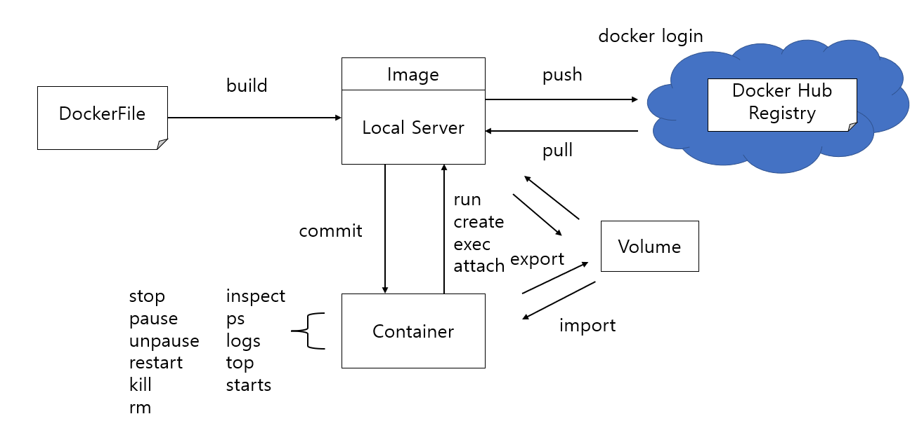

# 도커 명령어 활용

## 목차

- [x] [도커 이미지 명령어](#도커-이미지-명령어)
    - [x] [docker pull](#도커-이미지-내려받기-docker-pull)
    - [x] [docker image](#도커-이미지-세부-정보-조회-docker-image)
    - [x] [docker image tag](#docker-image-tag)
    - [x] [docker login](#docker-login)
    - [x] [도커 이미지를 파일로 관리(docker image save)](#docker-image-save)
    - [x] [도커 이미지 삭제(docker image rm)](#docker-image-rm)
- [ ] 도커 컨테이너 명령어
    - [x] [컨테이너는 프로세스다](#컨테이너는-프로세스다)
    - [ ] [컨테이너 실행](#컨테이너-실행)
        - [ ] MySQL 5.7 컨테이너 실행
        - [ ] 컨테이너 모니터링 도구 cAdvisor 컨테이너 실행
        - [ ] Nginx 컨테이너 실행
        - [ ] Python 프로그래밍 환경을 위한 컨테이너 실행
        - [ ] node.js 테스트 환경을 위한 컨테이너 실행
- [ ] 도커 볼륨 활용

# 도커 이미지 명령어

## 도커 이미지 내려받기 docker pull

- docker [image] pull [OPTIONS] name[:TAG | @IMAGE_DIGEST]
- **docker pull** 명령어는 도커 허브 레지스트리에서 원하는 이미지 파일을 다운로드하는 명령어입니다.
- docker pull 명령어 옵션
    - --all-tags, -a : 저장소에 태그로 지정된 여러 이미지를 모두 다운로드
    - --disable-content-trust : 이미지 검증 작업 스킵
    - --platform : 플랫폼을 지정하여 pull함
        - ex) --platform=linux
    - --quiet, -q : 이미지 다운로드 과정에서 화면에 나타나는 상세 출력 숨김

```shell
# 명시적으로 최신 버전 지정
$ docker pull debian:latest

# 이미지 식별 정보인 다이제스트 지정.
$ docker pull debian:sha256:28579893...258

# 도커 허브 레지스트리 명시적 지정
$ docker pull library/debian:latest
$ docker pull docker.io/library/debian:latest
$ docker pull index.docker.io/library/debian:latest

# 외부 레지스트리 주소를 이용하는 방법(예로 구글에서 제공하는 샘플 애플리케이션 이미지 지정)
# 주의할 것은 웹 주소 URL에서 도메인 주소의 시작인 http://를 붙이지 않고 이미지 주소를 써야함
$ docker pull gcr.io/google-samples/hello-app:1.0
```

#### 다이제스트(Digest)

- 도커 허브에서 관리하는 이미지의 고유 식별값
- 다이제스트 값을 포함한 이미지 조회 명령어는 **docker images --digests**

## 도커 이미지 세부 정보 조회 docker image

- **docker image inspect [OPTIONS] IMAGE [IMAGE...]**
- 도커 오브젝트(이미지, 컨테이너 등)에 대한 세부 정보를 조회합니다.
- docker image inspect 명령어 옵션
    - --format, -f : JSON 형식의 정보 중 지정한 형식의 정보만 출력할 수 있고, {} 중괄호 형식과 대소문자에 유의해야함

```shell
# 아파치 웹 서비스를 할수 있는 httpd 도커 이미지 검색
$ docker search httpd

# httpd 최신 버전으로 다운로드
$ docker pull httpd:latest

# 다운로드한 이미지 조회
$ docker images

# 다운로드한 이미지 세부 정보 조회
$ docker image inspect httpd

# 계층 형식으로 되어 있어 하위 정보 조회시 .상위[.하위] 방식으로 조회
$ docker image inspect --format="{{.RepoTags}}" httpd

$ docker image inspect --format="{{.Os}}" httpd

$ docker image inspect --format="{{.Created}}" httpd

$ docker image inspect --format="{{.ContainerConfig.Env}}" httpd

$ docker image inspect --format="{{.RootFS.Layers}}" httpd
```

- **docker image history [OPTIONS] IMAGE**
- 현재 이미지 구성을 위해 사용된 레이블 정보와 각 레이어의 수행 명령, 크기 등을 조회하는 명령어입니다.

```shell
$ docker image history httpd
```

출력 결과 중 CREATED BY 열을 보면 특정 이미지를 구성하기 위해 사용된 명령과 환경 설정 정보등을 볼 수 있다.

실행 결과를 보면 CMD, EXPOSE, ENV, WORKDIR 등의 명령을 통해 베이스 이미지에 필요한 설정 정보를 결합하여

새로운 이미지를 만들게 됩니다.

위와 같은 레이어를 쌓는 이미지를 도커 유니언 파일 시스템이라고 하며 그림으로 표현하면 다음과 같다.


1. 도커 이미지 구조의 기본 운영체제 레이어들을 쌓음
2. 데비안 리눅스 운영체제 이미지 위에 아파치 웹 서버를 설치한 레이어를 올림
3. 아파치 웹 서비스에 필요한 리소스 정보 및 환경 정보가 포함된 레이어를 올림.
   이렇게 구성된 이미지는 불변의 읽기 전용 레이어들의 집합 구조인 유니언 파일 시스템이 된다.
4. 도커 이미지를 실행하면 여러 개의 컨테이너를 구동할 수 있음.
   각각의 컨테이너에서 발생한 모든 변경 정보를 저장하기 위해 읽고-쓰기 레이어를 두고 저장하게 된다.

#### 왜 도커 유니언 파일 시스템 구조를 사용하는가?

이미지 레이어의 상단에 있는 웹 애플리케이션 소스 레이어의 환경 설정 및 리소스 설정이 변경되어 이미지로

변경되더라도 기존 레이어(큰 용량을 차지하는 데비안)를 제외한 변경된 웹 소스 레이어만 내려받아 사용하기 때문에 효율적이기 때문이다.

## docker image tag

- 원본 이미지에 참조 이미지 이름을 붙이는 명령어

```shell
docker image tag 원본이미지[:태그] 참조이미지[:태그]
```

```shell
# 이미지 태그 설정
~ $ docker image tag httpd:latest debian-httpd:1.0

# 도커 허브와 같은 레지스트리에 업로드하는 경우 저장소명과 함께 태그 지정
~ $ docker image tag httpd:latest yhkim951107/httpd:2.0
```

## docker login

- 도커 허브에 원격 접속하는 명령어

```shell
~ $ docker login
# 아이디 비밀번호 입력

# 도커 허브에 이미지 업로드
~ $ docker push yhkim951107/httpd:2.0

# 본인 도커 허브 저장소에 업로드된 이미지 내려받기
~ $ docker pull yhkim951107/httpd:2.0
```


## docker image save

- docker image save 명령어는 도커 원본 이미지의 레이어 구조까지 포함한 복제를 수행하여 확장자 tar(Tape ARchiver) 파일로 이미지를 저장하는
  명령어입니다.

### 도커 이미지를 파일로 관리할 필요가 있는 경우

- 도커 허브에서 이미지를 내려받아서 내부망으로 이전하는 경우
- 신규 애플리케이션 서비스를 위해서 Dockerfile로 새롭게 생성한 이미지를 저장하고 배포해야 하는 경우
- 컨테이너를 완료(commit)하여 생성한 이미지를 저장 및 배포해야 하는 경우
- 개발 및 수정한 이미지 등

### docker image save 명령어 형식

```
# 도커 이미지를 tar 파일로 저장.
docker image save [옵션] <파일명> [image명]

# docker save로 저장한 tar 파일을 이미지로 불러옴
docker image load [옵션]
```

### docker image save & docker image load 예제

```shell
$ docker pull mysql:5.7

# docker image save 명령어를 이용해 이미지를 tar 파일로 저장
$ docker image save mysql:5.7 > test-mysql57.tar
$ ls -lh test-mysql57.tar
total 428M
-rw-rw-r-- 1 yonghwan yonghwan 428M  2월 23 23:51 test-mysql57.tar

# tar 명령의 옵션중 tvf(t(list), v(verbose), f(file))를 이용해 묶인 파일 내용을 확인할 수 있습니다. 이미지 레이어들의
다이제스트값으로 만들어진 디렉터리 파일입니다
$ tar tvf test-mysql57.tar
drwxr-xr-x 0/0               0 2023-01-18 15:01 14cd969708a3853b713c5260aff4f49659fd3a14ddca25ddb5f607b3fa31e704/
-rw-r--r-- 0/0               3 2023-01-18 15:01 14cd969708a3853b713c5260aff4f49659fd3a14ddca25ddb5f607b3fa31e704/VERSION
-rw-r--r-- 0/0             482 2023-01-18 15:01 14cd969708a3853b713c5260aff4f49659fd3a14ddca25ddb5f607b3fa31e704/json
-rw-r--r-- 0/0            2560 2023-01-18 15:01 14cd969708a3853b713c5260aff4f49659fd3a14ddca25ddb5f607b3fa31e704/layer.tar
...

$ docker image rm mysql/mysql-server:5.7
# docker image load 명령을 이용해 파일로 만들어진 이미지 tar 파일 내용을 불러옵니다.
$ docker image load < test-mysql57.tar

# 로컬에 저장된 tar 파일을 기반으로 새롭게 지정한 이미지명과 태그로 이미지 등록이 가능함
$ cat test-mysql57.tar | docker import - mysql57:1.0
```

- tvf 옵션 : tar 아카이브 파일 내부의 파일 목록을 출력합니다.

#### gzip 옵션을 사용한 tar 파일 용량 줄이기

```shell
$ docker image save mysql/mysql-server:5.7 | gzip > test-mysql57zip.tar.gz

$ ls -lh test-mysql57zip.tar.gz
```

## docker image rm

- docker image rm 명령어는 도커 이미지를 삭제하는 명령어입니다.

### 도커 이미지 삭제 명령어 형식

```
docker image rm [옵션] {이미지 이름[:태그] | 이미지 ID}
docker rmi [옵션] {이미지 이름[:태그] | 이미지 ID}
```

```shell
$ docker pull ubuntu:14.04

# 이미지 삭제시 latest 버전을 제외한 나머지는 반드시 태그명을 명시해야 합니다. (Error)
$ docker image rm ubuntu
Error response from daemon: No such image: ubuntu:latest

$ docker image rm ubuntu:14.04

```

# 도커 컨테이너 명령어

다음 그림에 나와있는 컨테이너 구동, 접근, 로그, 운영 등의 명령어를 다룹니다.

컨테이너 명령어도 dockered 데몬이 제공하는 **docker CLI API**를 통해 제공됩니다.



## 컨테이너는 프로세스다

- 도커 컨테이너 : 도커 이미지를 기반으로 만들어지는 `스냅숏(snapshot)`입니다.
- 스냅숏 : 읽기 전용의 도커 이미지를 복제한 것이고 그 위에 **읽고 쓰기가 가능한 컨테이너 레이어를 결합한 것**이 컨테이너입니다.

### 컨테이너란 무엇인가?

일반적으로 컴퓨터 애플리케이션은 프로세스를 통해 이루어집니다.

그와 비슷하게 **컨테이너는 격리된 공간에서 프로세스가 동작하는 기술**입니다.

더 자세하게는 컨테이너는 **프로세스 격리 기술(namespace, cgroups, chroot)**의 표준으로 OCI(Open Container Initiative)
로 컨테이너 포맷과 런타임에 대한 개방형 업계 표준을 만들기 위한 목적으로 리눅스 파운데이션의 지원을 받아 구성된 오픈 프로젝트입니다.

컨테이너가 동작하게 되면 가상의 격리 환경에 독립된 프로세스가 동작하게 됩니다. 마치 서버 호스트 운영체제가 독립적으로
동작하는 것과 유사합니다.

예를 들어 리눅스 호스트 운영체제를 부팅하면 PID 1번은 init(systemd) 프로세스가 도앚ㄱ하며 이 프로세스는 나머지
모든 시스템 프로세스의 부모 프로세스가 됩니다.

다음 예제는 도커 컨테이너의 PID 1번 프로세스도 init 프로세스인지 확인하는 예제입니다.

```shell
# 현재 호스트에서 실행 중인 셸 프로세스 ID 확인
$ echo $$
1842

# centos 8 버전 이미지 다운로드 후 컨테이너 bash 모드로 접속
$ docker run -it centos:8 bash
...
[root@cdc1bef7f247 /]# echo $$
1

# 다른 터미널에서 실행 중인 PID 조회
$ ps -ef | grep 1842
yonghwan    1842    1841  0 15:32 pts/0    00:00:00 -bash
yonghwan    5511    1842  0 16:48 pts/0    00:00:00 ps -ef
yonghwan    5512    1842  0 16:48 pts/0    00:00:00 grep --color=auto 1842

# /proc와 하위 네임스페이스(ns) 경로 확인
$ cd /proc/1842
/proc/1842 $ ls -l

# 호스트 운영체제의 PID 1번과 현재 호스트에서 실행 중인 셸 프로세스 비교
$ sudo ls -l /proc/1/ns
lrwxrwxrwx 1 root root 0  3월 12 15:29 cgroup -> 'cgroup:[4026531835]'
lrwxrwxrwx 1 root root 0  3월 12 16:17 ipc -> 'ipc:[4026531839]'
lrwxrwxrwx 1 root root 0  3월 12 15:30 mnt -> 'mnt:[4026531841]'
lrwxrwxrwx 1 root root 0  3월 12 16:17 net -> 'net:[4026531840]'
lrwxrwxrwx 1 root root 0  3월 12 16:17 pid -> 'pid:[4026531836]'
lrwxrwxrwx 1 root root 0  3월 12 16:17 pid_for_children -> 'pid:[4026531836]'
lrwxrwxrwx 1 root root 0  3월 12 16:17 time -> 'time:[4026531834]'
lrwxrwxrwx 1 root root 0  3월 12 16:17 time_for_children -> 'time:[4026531834]'
lrwxrwxrwx 1 root root 0  3월 12 16:17 user -> 'user:[4026531837]'
lrwxrwxrwx 1 root root 0  3월 12 16:17 uts -> 'uts:[4026531838]'

$ sudo ls -l /proc/1842/ns
lrwxrwxrwx 1 yonghwan yonghwan 0  3월 12 16:18 cgroup -> 'cgroup:[4026531835]'
lrwxrwxrwx 1 yonghwan yonghwan 0  3월 12 16:18 ipc -> 'ipc:[4026531839]'
lrwxrwxrwx 1 yonghwan yonghwan 0  3월 12 16:18 mnt -> 'mnt:[4026531841]'
lrwxrwxrwx 1 yonghwan yonghwan 0  3월 12 16:18 net -> 'net:[4026531840]'
lrwxrwxrwx 1 yonghwan yonghwan 0  3월 12 16:18 pid -> 'pid:[4026531836]'
lrwxrwxrwx 1 yonghwan yonghwan 0  3월 12 16:18 pid_for_children -> 'pid:[4026531836]'
lrwxrwxrwx 1 yonghwan yonghwan 0  3월 12 16:18 time -> 'time:[4026531834]'
lrwxrwxrwx 1 yonghwan yonghwan 0  3월 12 16:18 time_for_children -> 'time:[4026531834]'
lrwxrwxrwx 1 yonghwan yonghwan 0  3월 12 16:18 user -> 'user:[4026531837]'
lrwxrwxrwx 1 yonghwan yonghwan 0  3월 12 16:18 uts -> 'uts:[4026531838]'
```

- docker run 수행시 PID 네임스페이스 커널 기능을 통해 시스템의 1번 프로세스(init)의 PID(4026531836)를
  공유하고 그 하위로 프로세스를 격리합니다.
- 이렇게 격리된 프로세스를 루트로 변경하는 chroot 커널 기능을 통해 독립된 1번 PID를 갖게 됩니다.
- 컨테이너 동작 시 필요한 자원에 대한 할당은 cgroups 커널 기능을 통해 이루어집니다.

## 컨테이너 실행

### docker run 대신 수동으로 컨테이너 제어보해기

```shell
# docker create는 run과 달리 container 내부 접근을 하지 않고 생성만 수행합니다.
$ docker create -it --name container-test1 ubuntu:14.04

# docker ps 명령의 status를 보면 start가 아닌 'created'임을 알 수 있습니다.
# 생성된 스냅숏을 동작시킵니다.
$ docker start container-test1
$ docker ps
CONTAINER ID   IMAGE          COMMAND       CREATED          STATUS          PORTS     NAMES
328d830cc003   ubuntu:14.04   "/bin/bash"   16 seconds ago   Up 2 seconds              container-test1

# 컨테이너에 접속해봅니다. (docker attach 명령은 실행 중인 애플리케이션 컨테이너에 단순한 조회 작업 수행시 유용합니다.)
$ docker attach conatiner-test1 
root@328d830cc003:/# exit

# 빠져나온 컨테이너가 강제 종료되어 삭제됩니다.
$ docker rm container-test1
```

위 작업을 docker run으로 수행하면 다음과 같습니다.

```shell
$ docker run -it --name container-test1 ubuntu:14.04 bash
root@328d830cc003:/# exit
$ docker rm container-test1
```

- docker run의 특징은 호스트 서버에 ubuntu:14.04 이미지가 없어도 도커 허브에서 자동으로 다운로드하여 진행한다는 점입니다.
- docker run 명령어 마지막에 해당 컨테이너에서 실행할 명령(ex, bash)을 입력하면 컨테이너 동작과 함께 처리됩니다.

```shell
docker run = [pull] + create + start + [command]
```

- 위와 같이 docker run은 pull을 선택적으로 하고 컨테이너를 생성하고 실행한다음에 선택적으로 command를 실행하는
  종합적인 명령어입니다.

### docker run 명령어 옵션

| 옵션                                   | 설명                                                                           |
|--------------------------------------|------------------------------------------------------------------------------|
| -i, --interactive                    | 대화식 모드 열기                                                                    |
| -t                                   | TTY(단말 디바이스) 할당                                                              |
| -d, --detach=true                    | 백그라운드에서 컨테이너 실행 후 컨테이너 ID 등록                                                 |
| --name                               | 실행되는 컨테이너에 이름 부여(미지정시 자동으로 부여됨: 딕셔너리 워드 랜덤 선택                                |
| --rm                                 | 컨테이너 종료 시 자동으로 컨테이너 제거                                                       |
| --restart                            | 컨테이너 종료 시 적용할 재시작 정책 지정<br/>([no OR on-failure OR on-failure:횟수n OR always]) |
| --env                                | 컨테이너의 환경 변수 지정(--env-file은 여러 환경 변수를 파일로 생성하여 지정하는 방법)                       |
| -v, --volume=호스트경로:컨테이너경로            | 호스트 경로와 컨테이너 경로의 공유 볼륨 설정(Bind mount)                                        |
| -h                                   | 컨테이너의 호스트명 지정(미지정 시 컨테이너 ID가 호스트명으로 등록)                                      |
| -p [Host포트]:[Container포트], --publish | 호스트 포트와 컨테이너 포트 연결                                                           |
| -P, --publish-all=[true OR false]    | 컨테이너 내부의 노출된(expose) 포트를 호스트 임의의 포트에 게시                                      |
| --link=[container:container_id]      | 동일 호스트의 다른 컨테이너와 연결 설정으로 IP가 아닌 컨테이너의 이름을 이용해 통신                             |


