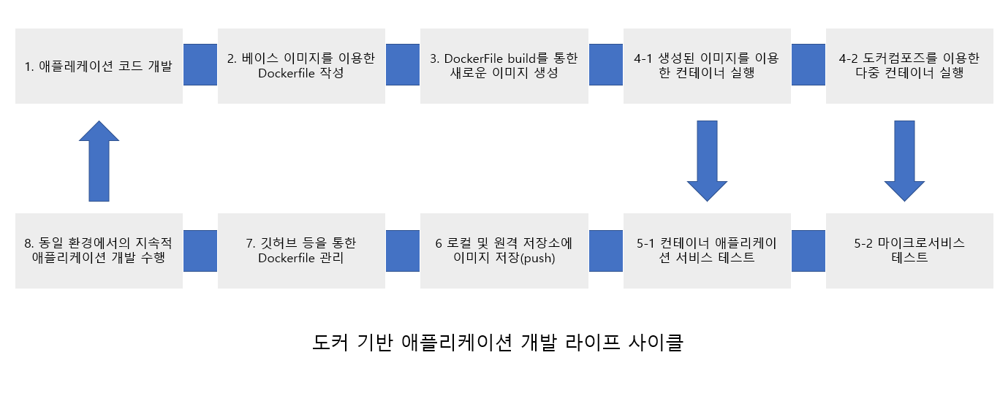

# 컨테이너 서비스
## 컨테이너 서비스란
컨테이너에 내가 개발한 애플레케이션의 코드와 실행중인 프로그램을 격리하여 실행하는 서비스

### 애플리케이션 개발환경이 도커 기반의 컨테이너 서비스 환경으로 전환된 이유는 무엇인가
가변적인 인프라 환경으로 인한 일관성이 없는 환경의 제공때문이다.

위 의미는 개발, 테스트, 배포, 운영의 컴퓨팅 환경(저장소, 네트워크, 보안, 패치 등) 차이로 인한 시행착오와 오류 해결에

너무 많은 시간을 쏟는 문제가 있다는 의미이다.

### 컨테이너 서비스가 해결한 문제
애플리케이션이 가지고 있는 운영체제, 하드웨어(CPU, 메모리, 스토리지 등)에 대한 의존성 문제를 해결하였다.

### 하드웨어 레벨 가상화
하이퍼바이저 등을 이용한 가상머신의 방식을 말한다. EX) VMWARE, VIRTUAL BOX

### 운영체제 레벨 가상화
컨테이너 기반의 애플리케이션 서비스 방식을 말한다.

운영체제 레벨 가상화는 호스트 운영체제를 공유하고 애플리케이션에 필요한 환경을 패키징한다.

## 왜 도커 컨테이너 서비스를 사용하는가
도커 컨테이너 서비스를 사용하여 개발자는 애플리케이션 개발, 테스트, 배포 시마다 모든 인프라 구성 요소를 하나하나 수동적으로 체크하거나

맞출 필요가 없고, **변경 불가능한 인프라** 환경에서 언제든 동일한 상태에서의 개발이 가능해진다.

1. 애플리케이션 코드 개발
애플레케이션 코드 및 웹 화면을 위한 코드를 개발한다

2. 베이스 이미지를 이용한 Dockerfile 작성
개발에 필요한 구성 요소를 Dockerfile에 작성한다.

도커 허브에서 베이스 이미지를 다운로드하고 구동 명령어(FROM, RUN, CMD, ENDPOINT, ENV, ADD 등)와 1에서 작성한 애플리케이션 코드,

라이브러리, 여러 도구를 Dockerfile에 포함시킨다

3. Dockerfile build를 통한 새로운 이미지 생성
docker build 명령을 통해 작성한 Dockerfile을 실행한다.

각 단계별로 실행되는 로그를 화면에서 확인하고 오류 발생 내용도 확인할 수 있다.

4. 컨테이너 실행
   1. 생성한 이미지를 이용한 컨테이너 실행
      - docker image 명령어를 통해 생성된 이미지를 확인하고 이미지를 통한 컨테이너를 구동한다.
   2. 도커 컴포즈를 이용한 다중 컨테이너 실행
      - docker-compose.yml을 통해 다중 컨테이너 간 실행 순서, 네트워크, 의존성 등을 통합 관리할 수 있고 아미크로서비스 개발에 활용한다.

5. 테스트
   1. 컨테이너 애플리케이션 서비스 테스트
      - 예를 들어, Nginx를 이용한 웹 애플리케이션 컨테이너 서비스였다면 연결하는 IP와 포트 번호를 이용하여 웹 브라우저를 이용한 페이지
      연결을 확인할 수 있다.
   2. 마이크로서비스 테스트
      - 5-1과 마찬가지로 해당 서비스에 대한 테스트를 진행한다.

6. 로컬 및 원격 저장소에 이미지 저장
로컬 및 원격에 있는 이미지 저장소에 생성한 이미지를 저장하여 다른 팀 간의 공유 및 지속적인 이미지 관리를 수행한다.

7. 깃허브 등을 활용한 Dockerfile 관리
Dockerfile 코드를 깃허브 사이트에 저장 및 관리할 수 있음

도커 허브 사이트와 연동하게 되면 자동화된 빌드 기능을 이용한 이미지 생성도 가능함

8. 동일 환경에서의 지속적 애플리케이션 개발 수행
1 ~ 7 과정을 통해 업무용 애플리케이션 이미지를 지속적으로 개발, 운영 및 관리할 수 있다.

