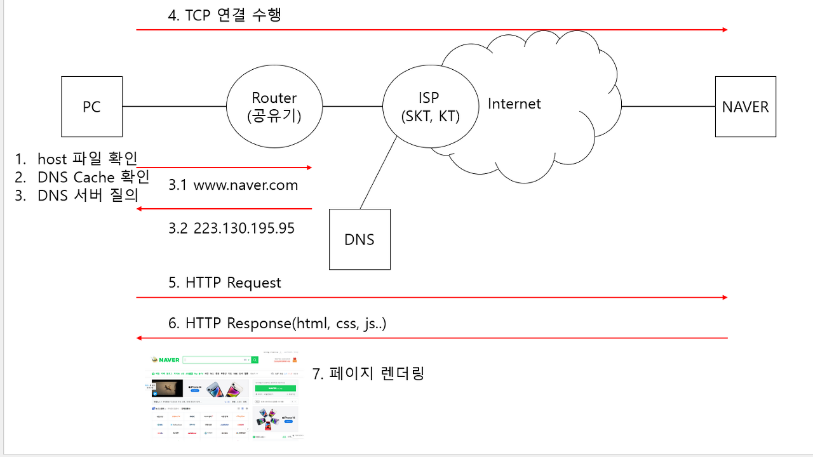

# 브라우저에서 네이버를 입력하면 페이지가 보이기까지 무슨일이 일어나는가

1. PC의 브라우저에서 "www.naver.com"을 입력하고 엔터
2. "www.naver.com" 도메인 이름에 대한 IP 주소를 질의, DNS 서버에 질의하기 전 다음과 같은 방법을 우선 확인 호스트 파일, DNS Cache에도 없다면 DNS 서버로 질의한다.
    1.  HOST 파일 확인
    2.  DNS Cache 확인
    3.  DNS 서버 질의
        1.  공유기의 포트포워딩을 통한 DNS 서버 질의
        2.  ISP의 DNS 설정을 따라서 DNS 서버 질의
3. DNS 서버로부터 응답이 와서 도메인 네임에 따른 IP 주소를 얻게 됨
4. PC쪽에서 서버(Naver)쪽으로 IP 주소로 TCP 연결을 수행함
    -   TCP 연결을 수행하는 이유는 HTTP 프로토콜을 사용하여 통신하기 때문임
    -   HTTP 프로토콜 통신은 TCP 연결을 기반으로 하기 때문임
5. TCP 연결에 성공하면 서버(Naver)쪽으로 HTTP Request를 하게 됨
6. 요청에 성공하면 서버(Naver)로부터 HTTP Response를 받게 됨
7. 응답은 HTTP Response에 있는 리소스로 네이버 메인 페이지를 렌더링함

### References

> [웹 브라우저에 URL 입력하면 일어나는 일 - 인프라 위주](https://www.youtube.com/watch?v=GAyZ_QgYYYo&t=1s)