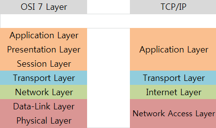

# OSI 7 계층
## OSI 모델 개념
OSI(Open Systems Interconnection) 모델은 **한 컴퓨터에서 다른 컴퓨터로 데이터를
전송하는 과정을 7개의 계층으로 나누어 정의한 모델**입니다.

## OSI 7 계층 모델의 역할
### 물리 계층(Physical Layer)
- 역할
  - 데이터를 전기적인 신호로 변환하여 전송또는 전송받는 역할
  - 전송을 위해서 물리적 연결의 설정, 유지, 해제를 담당
- 전송 단위 : Bit
- 필요성
  - 한 컴퓨터에서 다른 컴퓨터로 데이터를 전송하기 위해서 전기적인 신호의 변환이 필요함

### 데이터 링크 계층(DataLink Layer)
- 역할
  - 물리적인 통신 채널에서 오류없이 데이터를 전송하기 위한 기능 제공
  - 네트워크 계층에서 정보를 받아서 주소와 제어 정보를 헤더와 테일에 추가
  - 전송 데이터를 프레임으로 변환
  - 오류 제어
  - 흐름 제어
- 전송 단위 : Frame
- 주소 : Mac Address
- 필요성
  - 데이터 전송 시 물리적인 매체에 대한 제어가 필요함
    - 예를 들어 여러 대의 컴퓨터가 같은 매채를 공유하고 전송할때 충돌을 방지하고 조절할 필요가 있음
  - 데이터 전송 순서를 보장하고 중복된 데이터를 제거하거나 방지해야할때 필요함
  - 논리적인 주소를 사용하여 데이터를 전송해야 할 필요가 있음
    - 이더넷 프로토콜에서는 물리적인 주소인 MAC 주소를 사용하여 논리적인 주소를 구성함
    - 같은 물리적인 링크를 사용하는 여러 대의 컴퓨터 간에 데이터를 전송할 수 있고
    , 각 컴퓨터는 자신의 논리적인 주소를 가지고 있어 다른 컴퓨터와 구분이 가능함

### 네트워크 계층(Network Layer)
- 역할
  - 데이터를 목적지 까지 전달하기 위한 경로를 설정하고 전달함
  - 패킷의 전송을 관리함
- 전송 단위 : Packet
- 주소 : IP
- 필요성
  - 서로 다른 네트워크 간의 통신을 지원하기 위해서 필요함
    - 라우터와 같은 네트워크 장비를 통해 다른 네트워크로 데이터를 전송할 수 있음
  - IP 주소를 사용하여 논리적인 주소 체계를 제공하기 위해서 필요함
    - IP 주소는 네트워크 상에서 각각의 호스트를 식벽하는데 사용되는 논리적인 주소
    - IP 주소를 통해서 호스트 간에 데이터를 주고 받을 수 있고 라우팅을 위한 정보도 전달됨

### 전송 게층(Transport Layer)
- 역할
  - 송신 측에서 메시지(세션 계층의 전송 단위)를 분할하여 수신측에 전달하고,
  수신 측에서는 이를 재조립하여 상위 계층으로 전달하는 역할
- 프로토콜
  - TCP
    - 신뢰성 & 연결 지향적 프로토콜
    - 데이터 전송 중 손실된 패킷을 재전송하고 데이터의 순서를 보장
  - UDP
    - 신뢰성 없음 & 비 연결적 프로토콜
    - 데이터의 송수신을 보장하지 않고 손실된 패킷도 재전송하지 않음
- 전송 단위 : Segment
- 주소 : Port
- 필요성
  - 데이터를 분할하고 패킷들의 순서를 지정하며, 수신측에서도 패킷들을 재조립하여 전체 데이터를 받기 위해서 필요함 
  - 에러 검출 및 복구, 흐름 제어, 혼잡 제어를 하기 위해서 필요함

### 세션 계층(Session Layer)
- 역할
  - 통신 세션을 관리하고 유지하는 역할
  - 사용자 간의 대화 제어를 담당하며, 세션 수립, 유지, 종료 등의 기능을 제공함
  - 오류 복구, 회복, 체크 포인팅 등의 기능을 제공함
    - 송 수신 중에 발생할 수 있는 오류를 처리하고 데이터 전송의 신뢰성을 유지함
    - 세션 복구 기능을 제공하여 중단된 통신 세션을 복구 할 수 있음
- 프로토콜
  - RPC, NetBIOS, SSH
- 전송 단위 : Message
- 필요성
  - 통신 세션을 설정하고 유지하기 위해서 필요함
  - 통신이 이루어지는 동안 세션 연결 설정, 유지, 종료, 오류 복구, 체크 포인팅 등의 작업을 처리하기 위해서 필요함

### 표현 계층(Presentation Layer)
- 역할
  - 데이터를 전송 가능한 형태로 인코딩 및 디코딩
  - 데이터 압축, 암호화 기능 수행
  - 양쪽의 컴퓨터 간에 상호 운용성(interoperability)을 보장하는 역할
    - 상호 운용성 : 하나의 시스템이 동일 또는 이기종의 다른 시스템과 아무런 제약이 없이 서로 호환되어 사용할 수 있는 성질
- 프로토콜
  - JPEG, MPEG, ASCII 등 다양할 수 있음
- 전송 단위 : Message
- 필요성
  - 다양한 데이터 형식을 변환하기 위해서 필요함
    - 예를 들어 이미지, 비디오, 오디오, 텍스트 데이터 등은 각각 다른 형식으로 표현되며,
    이러한 데이터들을 주고 받는 경우 각각의 형식에 맞게 변환할 필요가 있습니다. 이를 위해서
    표현 계층은 암호화, 압축 등의 작업을 수행하여 전송할 수 있도록 함
  - 데이터 표현 방식을 정의함으로써 시스템 간의 호환성을 보장하기 위해서 필요함
    - 예를 들어서 서로 다른 운영체제나 언어로 작성된 애플리케이션이 데이터를 주고 받을 때,
    이를 표현하는 방식이 다르면 데이터의 해석이 불가능해질 수 있음

### 응용 계층(Application Layer)
사용자와 컴퓨터 네트워크 간의 인터페이스를 제공하는 최상위 계층

- 역할
  - 사용자가 네트워크를 통해 데이터를 전송하고 수신하는 방법을 제어함
  - 다양한 프로토콜을 사용하여 응용 프로그램과 통신하는 역할
- 프로토콜
  - HTTP, FTP, SMTP, POP, IMAP 등
- 필요성
  - 사용자가 네트워크를 이용하여 통신을 할때 필요한 프로토콜을 사용하기 위하여 필요함
  - 사용자가 인터넷을 통해서 데이터를 공유하기 위해서 필요함
