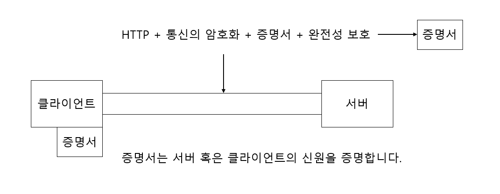
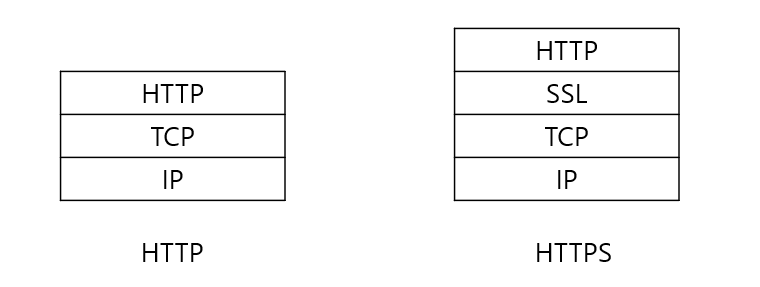
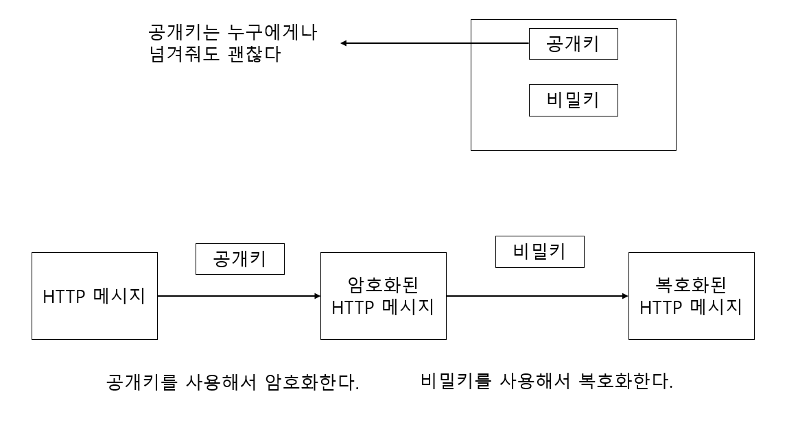
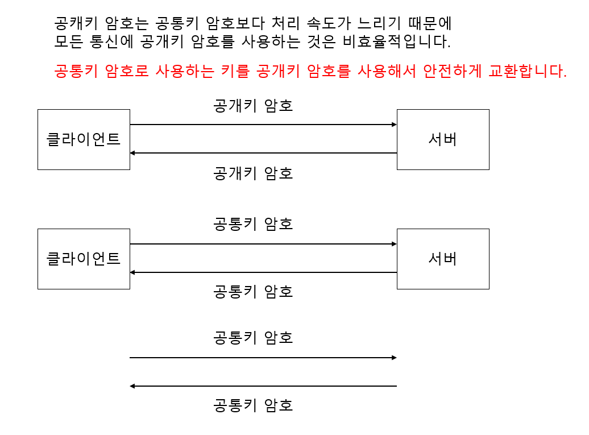
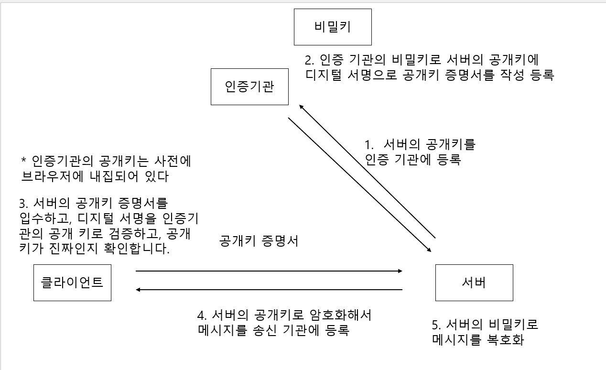

# HTTP + 암호화 + 인증 + 완전성 보호 = HTTPS

## 목차

- HTTP에 암호화와 인증과 완전성 보호를 더한 HTTPS
- HTTPS는 SSL의 껍질을 덮어쓴 HTTP
- 상호간에 키를 교환하는 공개키 암호화 방식
- 공개키가 정확한지 아닌지를 증명하는 증명서

## HTTP에 암호화와 인증과 완전성 보호를 더한 HTTPS

HTTPS(HTTP Secure)는 HTTP에 암호화나 인증 등의 구조를 더한 것입니다.

HTTPS를 사용한 통신은 브라우저 URI에 "https://"로 시작합니다.

## HTTPS는 SSL의 껍질을 덮어쓴 HTTP

HTTPS는 새로운 애플리케이션 계층의 프로토콜이 아닌 HTTP 통신하는 소켓 부분을 **SSL(Secure Socket Layer)** 나

**TLS(Transport Layer Security)** 이라는 프로토콜로 대체하고 있을 뿐입니다.

HTTP는 일반적으로 TCP와 통신하지만 HTTPS는 SSL이 TCP와 통신합니다.

## 상호간에 키를 교환하는 공개키 암호화 방식

SSL은 공개키 암호화 방식을 사용하고 있습니다.

공개키 암호화 방식은 암호화하는 키는 공개되어 있는 상태이고 복호화하기 위한 비밀키는 노출시키지 않는 암호화 방식입니다.

### 공통키 암호의 딜레마

공통키 암호화 방식은 암호화와 복호화에 하나의 키를 같이 사용하는 방식입니다.

공통키 암호화 방식은 공통키를 네트워크를 사용해서 키를 전달하는게 어렵습니다. 왜나하면 통신이 도청되어 공격자에게

빼앗기게 되면 암호화의 의미가 없어지게 되기 때문입니다.

또한 받은 키를 안전하게 보관하기 위한 노력을 하지 않으면 안됩니다.

즉, 공통키 암호화 방식의 문제점은 키 배송에 문제가 있습니다.

### 두 개의 키를 사용하는 공개키 암호

공개키 암호화 방식은 공통키 암호의 문제를 해결하기 위해서 개발된 방식입니다.

공개키 암호화 방식은 다른 두개의 키 페어를 사용합니다.

하나는 공개키이고 다른 하나는 비밀키입니다.

- 공개키 : 외부에 노출되어도 되며 HTTP 메시지를 암호화 하는데 사용됩니다.
- 비밀키 : 누구에게도 알려지면 안되는 키이며, 암호화된 HTTP 메시지를 복호화 하는데 사용됩니다.

비밀키를 통신으로 보낼 필요가 없기 때문에 도청에 의해서 키를 빼앗길 걱정은 없습니다.

### HTTPS는 하이브리드 암호 시스템

HTTP는 **공통키 암호** 와 **공개키 암호**의 양쪽 성질을 가진 하이브리드 암호 시스템입니다.

공캐키 암호는 공통키 암호에 비해서 처리 속도가 늦습니다.

**키를 교환하는 곳에서는 공개키 암호를 사용하고 그 후의 통신에서 메시지를 교환하는 곳에서는 공통키 암호를 사용합니다.**

## 공개키가 정확한지 아닌지를 증명하는 증명서

공개키 암호에도 문제점이 존재합니다. 문제점은 **공개키가 진짜인지 아닌지를 증명할 수없다**는 문제점입니다.

예를 들어, 서버와 공개키 암호를 사용해서 통신시 수신한 공개키가 본래 의도한 서버가 발행한 공개키인지 증명할 방법이 없다는 점입니다.

이 문제점을 해결하기 위해서 **인증 기관(CA, Certificate Authority)** 과 그 기관이 발행하는 **공개키 증명서**가 이용되고 있습니다.

### 공개키 증명서를 이용한 공개키 암호화 방식 진행

1. 서버의 운영자가 인증 기관에 공개키를 제출합니다.
2. 인증 기관은 제출된 공개키에 디지털 서명을 하고 서명이 끝난 공개키를 만듭니다.
3. 공개키 인증서에 서명이 끝난 공개키를 담습니다.
4. 서버는 이 인증 기관에 의해서 작성된 공개키 인증서를 클라이언트에 보내고 공개키 암호로 통신을 합니다.
5. 증명서를 받은 클라이언트는 증명 기관의 공개키를 사용해서 서버의 공개키를 인증한 것이 진짜 인증 기관이라는 것과
   서버의 공개키가 신뢰할 수 있다는 것을 알 수 있습니다.

### 조직의 실제성을 증명하는 EV SSL 증명서

역할을 가진 증명서를 EV SSL 증명서라고 합니다.

EV SSL 증명서는 세계 표준의 인정 가이드라인에 의해서 발행되는 증명서입니다.

### 클라이언트를 확인하는 클라이언트 증명서

HTTPS에서는 클라이언트 증명서도 이용할 수 있습니다.

클라이언트 증명서를 이용하여 서버 증명서와 같이 서버가 통신하고 있는 상대가 의도한 클라이언트인 것을 증명하는 클라이언트 인증을 할 수 있습니다.

#### 클라이언트 증명서 문제점

1. 증명서의 입수와 배포
    - 클라이언트가 클라이언트 증명서를 인스톨할 필요가 있습니다.
2. 클라이언트 인증서는 어디까지나 클라이언트의 실재를 증명할 뿐입니다.
    - 클라이언트 증명서가 들어간 컴퓨터를 사용할 권한이 있다면 누구든지 클라이언트 증명서를 이용할 수 있습니다.

### 인증 기관은 신용이 제일

믿을 수 없는 인증 기관의 서명도 올바른 증명서로 인식하는 문제가 있습니다.

### 지가 인증 기관 발행 증명서는 '나야 나' 증명서

OpenSSL 등의 소프트웨어를 사용하면 누구든지 인증 기관을 구축할 수 있어서 서버 증명서를 발행할 수 있습니다.

그러나 이 서버 증명서는 인터넷 상에서는 증명서로서 구실을 하지 못하며 쓸모가 없습니다.

### 마니어 인증 기관을 사용하면 '나야 나' 증명서가 될 수도 있다

인증 기관이 발행한 서버 증명서는 어떤 브라우저에서 정규 증명서로서 취급되더라도 다른 브라우저에서는 '나야 나' 증명서로서 취급될 수 있습니다.
