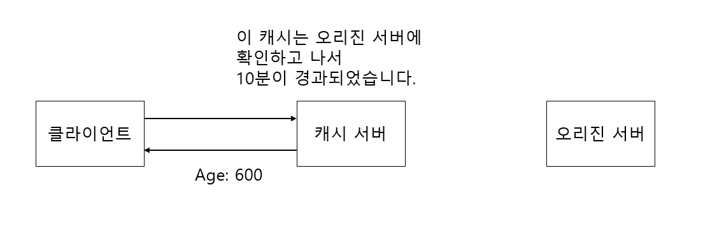
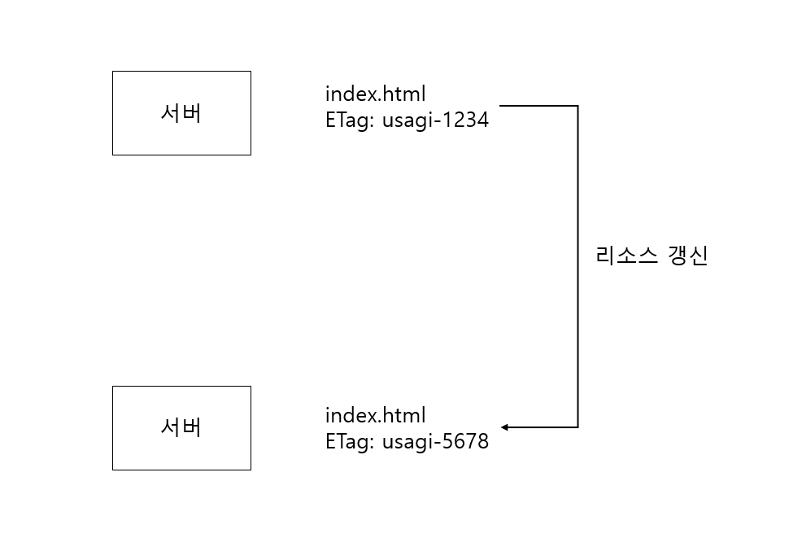
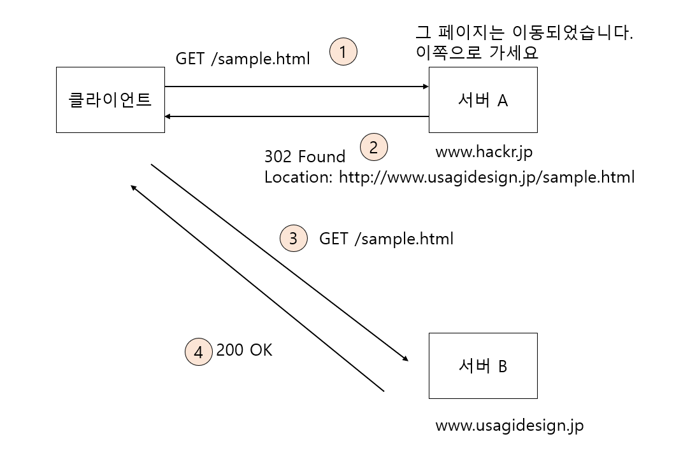

# 리스폰스 헤더 필드

리스폰스 헤더 필드는 서버에서 클라이언트로 HTTP 리스폰스 메시지를 전송할때 리스폰스의 정보를 알려주는 값들이나

클라이언트에게 정보를 요구하는 값들입니다.

## Accept-Ranges

```
Accept-Ranges: bytes
Accept-Ranges: none => Range 리퀘스트 수신 불가능인 경우
```

Accept-Ranges 헤더 필드는 서버가 클라이언트에게 Accept-Ranges 헤더 필드를 이용하여 요청한 리소스가

일부분만 지정해서 얻을 수 있는지 여부를 알려줍니다.

예를 들어 위 예제에서 Accept-Range 헤더 필드의 값이 "bytes"이면 일부분만 취득할 수 있다는 의미입니다.

## Age

```
Age: 600
```

Age 헤더 필드는 캐시 서버가 클라이언트에게 이 리소스가 오리진 서버에 확인하고나서 얼마나 지났는지를 알려줍니다.

위 예제에서는 요청한 리소스가 10분이 지난 리소스임을 알수 있습니다.

프록시가 리스폰스를 생성하는 경우 Age 헤더 필드는 필수입니다.



## ETag
```
ETag: "82e222..d12"
```
ETag는 엔티티 태그라고 불리며 리소스를 특정하기 위한 식별 문자열을 전달합니다.

리소스가 갱신되면 ETag도 갱신됩니다.



### ETag 필요성

리소스를 캐시할때는 리소스를 임시적으로 정하고 싶은 상황이 있습니다.

예를 들면 "http://www.google.com"에 한국어 버전의 브라우저를 사용해서 접근하려면

한국어의 리소스가 반환되지만 영문판 브라우저를 사용해서 접근하면 영어의 리소스를 반환합니다.

둘다 URI는 같지만 URI 만으로는 캐시했었던 리소스를 특정하기는 어렵습니다. 따라서 도중에

다운로드가 끊겨서 다시 하는 경우에 ETag 값을 참조해서 리소스를 특정하는데 사용할 수 있습니다.

### 강력한 ETag값과 약한 ETag값
- 강력한 ETag값 : 엔티티가 아주 조금 다르더라도 반드시 값은 변환합니다.
```
ETag: "Usagi-1234"
```
- 약한 ETag값 : 약한 ETag값은 리소스가 같다는 것만을 나타냅니다.
```text
ETag: W/"usagi-1234"
```

## Location


```
Location: http://www.usagidesign.jp/sample.html
```

Location 헤더 필드는 리스폰스의 수신자에 대해서 Request-URI 이외의 리소스 접근을 유도하는 경우에 사용됩니다.

브라우저는 Location 헤더 필드를 포함한 리스폰스를 받으면 강제로 리다이렉트 하는 곳의 리소스에 접근을 시도합니다.

## Proxy-Authenticate
```text
Proxy-Authenticate: Basic realm="Usagidesign Auth"
```
Proxy-Authenticate 헤더 필드는 프록시 서버에서의 인증 요구를 클라이언트에 전달합니다.

클라이언트와 서버와의 HTTP 접근 인증과 비슷하지만 다른점은 클라이언트와 프록시 사이에서 인증이 이루어집니다.

클라이언트 서버와의 경우는 WWW-Authorization 헤더 필드와 같은 역할을 합니다.

## Retry-After
```text
Retry-After: 120
```
Retry-After 헤더 필드는 클라이언트가 일정 시간 후에 리퀘스트를 다시 보내야 하는지를 전달합니다.

상태 코드 503 리스폰스나 3xx 리스폰스와 함께 사용됩니다.

## Server
```text
Server: Apache/2.2.17(Unix)
```
Server 헤더 필드는 서버에 설치되어 있는 HTTP 서버의 소프트웨어를 알려줍니다.

## Vary
```text
Vary: Accept-Language
```
Vary 헤더 필드는 캐시를 제어하기 위해서 사용합니다.

오리진 서버가 프록시 서버에 로컬 캐시를 사용하는 방법에 대해서 알려줍니다.

Vary 헤더 필드를 포함한 리스폰스를 응답받은 프록시 서버는 이후에 캐시된 때의 리퀘스트와 같은 Vary에

지정되어 잇는 헤더 필드를 가진 리퀘스트에 대해서만 캐시를 반환할 수 있습니다.

## WWW-Authenticate
```text
WWW-Authenticate: Basic realm="Usagidesign Auth"
```
WWW-Authenticate 헤더 필드는 HTTP 접근 인증에 사용되는데 Request-URI에 지정했던 리소스에

적용할 수 있는 인증 스키마("Basic" 또는 "Digest")와 파라미터를 나타내는 challenge를 전달합니다. 


