# 서버에 임무를 부여하는 HTTP 메소드

## GET : 리소스 획득
- GET 메서드는 리퀘스트 URI로 식별된 리소스를 가져올 수 있도록 요구합니다.

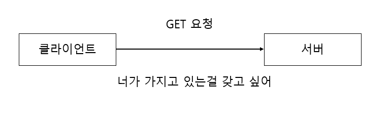

다음은 GET 메서드를 사용한 리퀘스트/리스폰스 예시입니다.

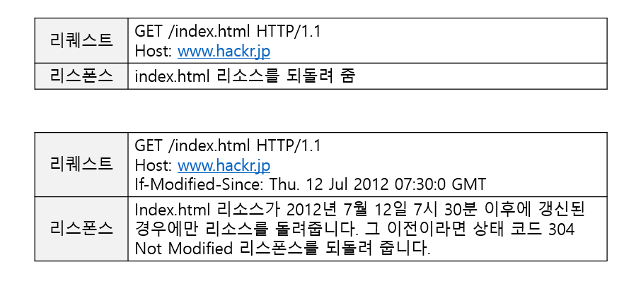

## POST : 엔티티 전송
- POST 메서드는 실제 데이터를 전송하기 위해서 사용합니다.

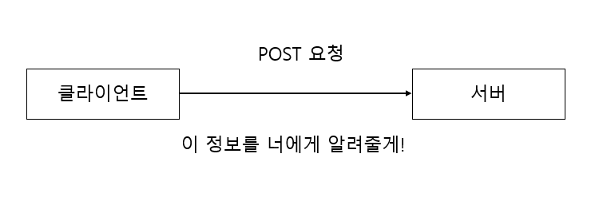

다음은 POST 메서드를 사용한 리퀘스트/리스폰스 예시입니다.

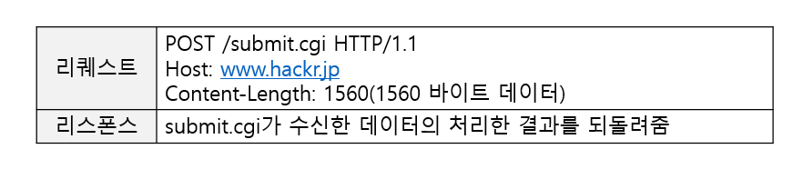

## PUT : 파일 전송
- PUT 메서드는 파일을 전송하기 위해서 사용됩니다.
- HTTP/1.1 PUT 메서드 자체에 인증 기능이 없어서 누근든지 파일을 업로드 가능하여 보안 상의 문제가 있습니다.
- 웹 애플리케이션 등에 의한 인증 기능과 짝을 이루는 경우나 REST와 같이 웹끼리 연재하는 설계 양식을 사용시 이욯하는 경우가 있습니다.

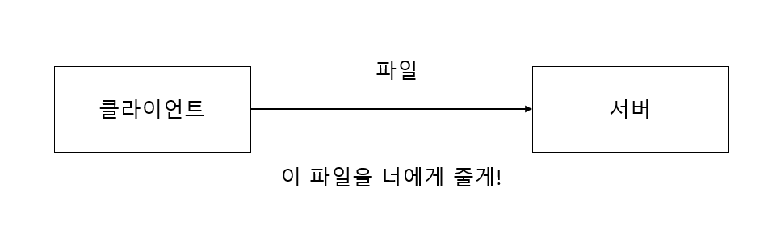

다음 그림은 PUT 메서드를 사용한 리퀘스트/리스폰스 예시입니다.

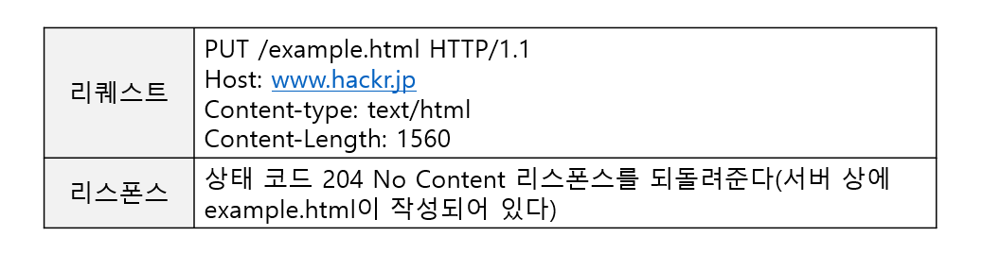

## HEAD : 메시지 헤더 취득
- GET 메서드와 동일한 기능이지만 메시지 바디는 돌려주지 않고 헤더만 받습니다.
- URL 유효성과 리소스 갱신 시간을 확인하는 목적으로 사용됨

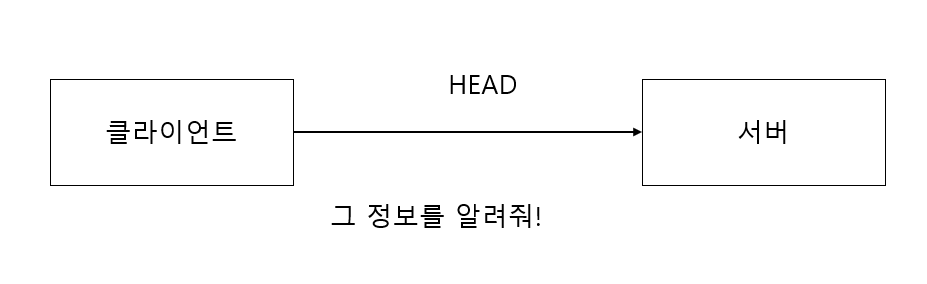

다음 그림은 HEAD 메서드를 사용한 리퀘스트/리스폰스 예시입니다.

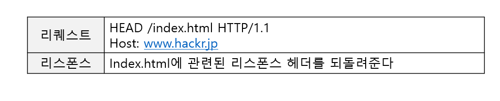

## DELETE : 파일 삭제
- DELETE 메서드는 클라이언트가 서버에게 파일 삭제를 요청하는 메서드입니다.
- PUT 메서드와 같이 인증 기능이 없기 때문에 보안문제로 사용되고 있지 않습니다.
- 웹 애플리케이션 등에 의한 인증 기능과 짝을 이루는 경우나 REST를 사용하는 경우에 사용되는 경우가 있습니다.

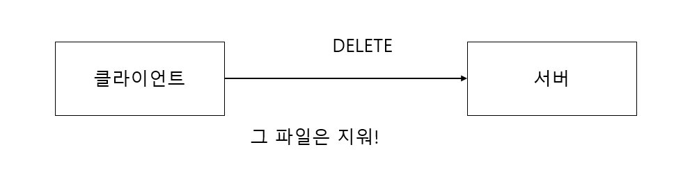

다음 그림은 DELETE 메서드를 사용한 리퀘스트/리스폰스 예시입니다.

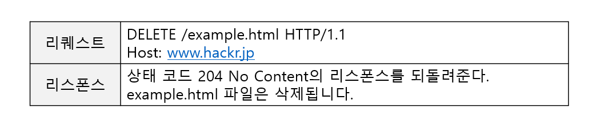

## OPTIONS : 제공하고 있는 메서드의 문의
- OPTIONS 메서드는 리퀘스트 URI로 지정한 리소스가 제공하고 있는 메서드를 조사하기 위해 사용됩니다.

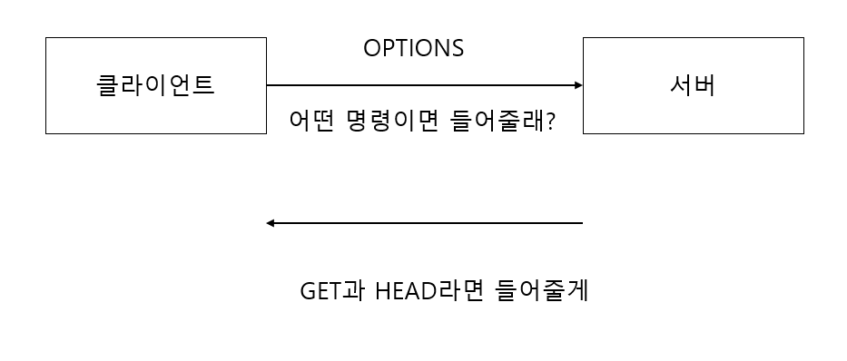

다음 그림은 OPTIONS 메서드를 사용한 리퀘스트/리스폰스 예시입니다.

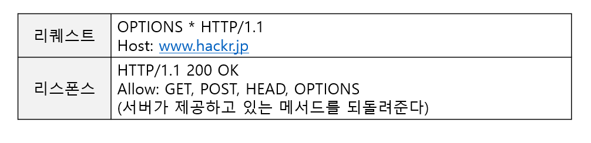

## TRACE: 경로 조사
- TRACE 메서드는 웹 서버에 접속해서 자신에게 통신을 되돌려 받는 루프백(loop-back)을 발생시킵니다.

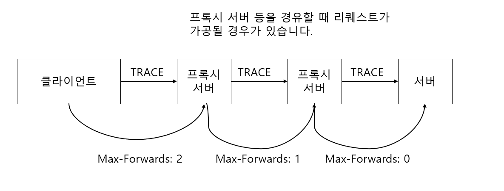

다음 그림은 TRACE 메서드를 사용한 리퀘스트/리스폰스 예시입니다.

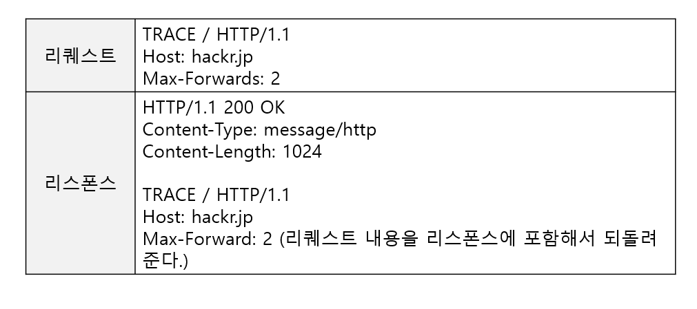

## CONNECT: 프록시에 터널링 요구
- CONNECT 메서드는 프록시에 터널 접속 확림하여 TCP 통신을 터널링 시키기 위해서 사용됩니다.
- SSL이랑 TLS 등의 프로토콜로 암호화된 것을 터널링 시키기 위해서 사용되고 있습니다.

### CONNECT 메서드 형식
```
CONNECT 프록시서버:포트 HTTP 버전
```

 
 
다음 그림은 CONNECT 메서드를 사용한 리퀘스트/리스폰스 예시입니다.

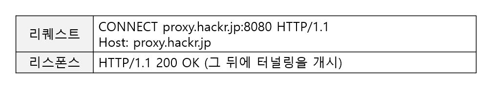

# 메서드를 사용해서 지시를 내리다
- 메서드는 리소스에 어떤 행동을 하기 원하는지를 지시하기 위해서 존재합니다.

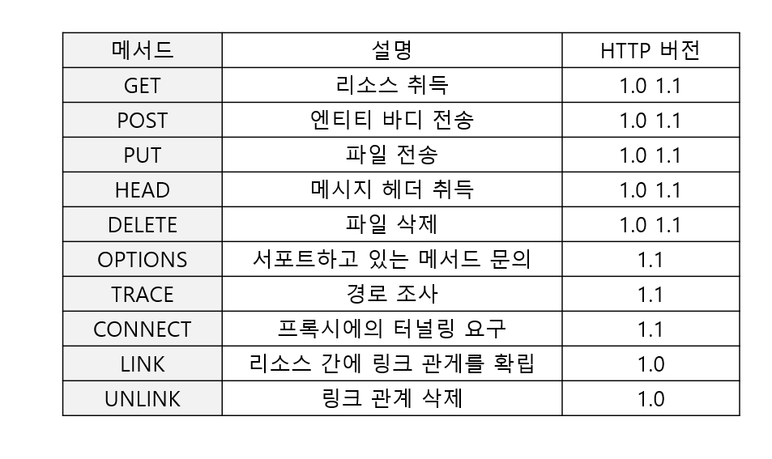

