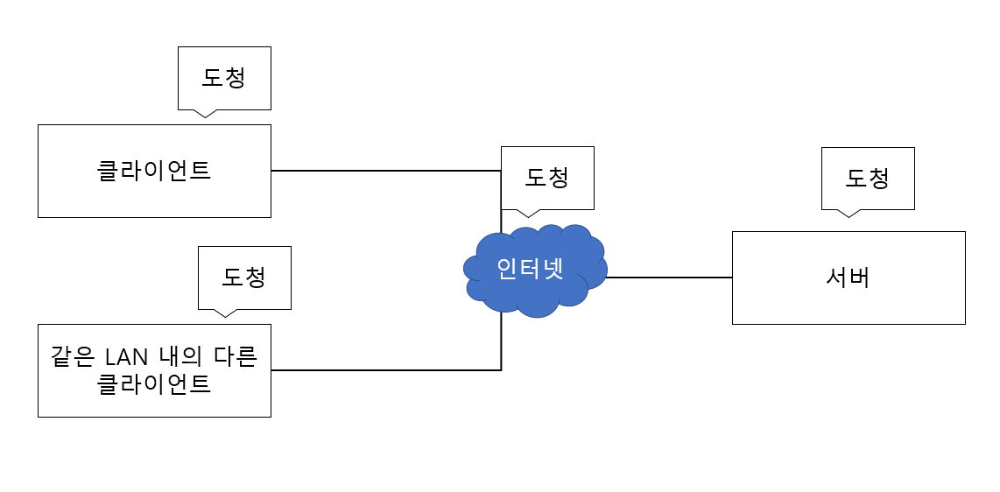
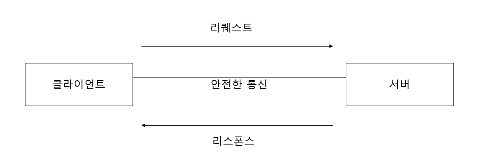
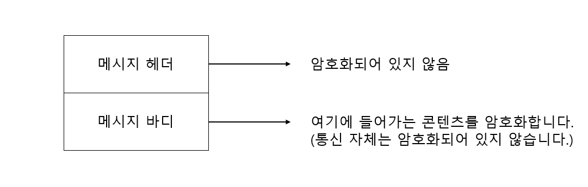
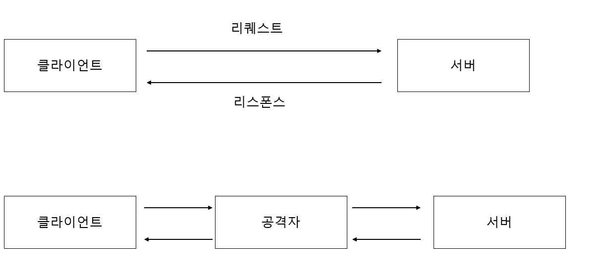

# HTTP의 약점

## 목차

- 평문이기 때문에 도청 가능
    - TCP/IP는 도청 가능한 네트워크
    - 암호화로 도청을 피하다
        - 통신 암호화
        - 콘텐츠 암호화
- 통신 상대를 확인하지 않기 때문에 위장 가능
    - 누구나 리퀘스트할 수 있다
    - 상대를 확인하는 증명서
- 완전성을 증명할 수 없기 때문에 변조 가능
    - 수신한 내용이 다를지도 모른다
    - 변조를 방지하려면?

## 평문이기 때문에 도청 가능

HTTP 메시지는 자신을 암호화하는 기능이 없기 때문에 통신 전체가 암호화되지 않습니다.

### TCP/IP는 도청 가능한 네트워크

암호화되지 않은 통신에 약점이 있는 이유는 **TCP/IP 구조의 통신 내용은 전부 통신 경로 도중에 엿볼 수 있기 때문**입니다.

위 그림과 같이 Wireshark와 같은 툴을 이용하여 패킷을 볼 수 있습니다.

### 암호화로 도청을 피하다

통신 도청으로부터 정보를 지키는 대표적인 방법은 암호화입니다. 암호화에는 대표적으로 2가지 종류가 있습니다.

#### 1) 통신 암호화

첫번째 방법은 클라이언트와 서버 사이에 **통신하는 것을 암호화**하는 것입니다.

HTTP에는 암호화 구조는 없지만 **SSL(Secure Socket Layer)** 이나 **TLS(Transport Layer Security)** 라는 다른

프로토콜을 조합함으로써 HTTP 통신 내용을 암호화할 수 있습니다.

HTTP에 SSL을 조합한 HTTP를 **HTTPS(HTTP Secure)** 나 HTTP over SSL이라고 불리고 있습니다.

#### 2) 콘텐츠 암호화

**콘텐츠 암호화는 통신하고 있는 콘텐츠 내용 자체를 암호화해버리는 방법**입니다.

HTTP 메시지에 포함되는 콘텐츠만 암호화하는 것이고 통신 자체를 암호화하지는 않습니다.

이 경우 클라이언트에서 HTTP 메시지를 암호화해서 출력하는 처리가 필요하게 됩니다.

## 통신 상대를 확인하지 않기 때문에 위장 가능

HTTP를 사용한 리퀘스트나 리스폰스에서는 통신 상대를 확인하지 않습니다.

### 누구나 리퀘스트 할 수 있다

HTTP에 의한 통신에는 상대가 누구인지 확인하는 처리가 없기 때문에 누구라도 서버에 리퀘스트에 보낼 수 있습니다.

또한 서버는 상대가 누구건 무조건 리스폰스를 반환합니다.(단, IP 주소나 포트 등에서 그 웹 서버에 접근제한이 없는 경우)

상대가 누군인지 확인하지 않은 약점인 이유

- 리퀘스트를 보낸 곳의 웹 서버가 위장한 웹서버일 수 있습니다.
- 리스폰스를 반환받을 클라이언트가 위장한 클라이언트 일수 있습니다.
- 통신하고 있는 상대가 접근이 허가된 상대인지 아닌지 확인할 수 없습니다.
- 누가 리퀘스트 했는지 알 수 없습니다.
- 의미 없는 리퀘스트를 하여 디도스 공격을 당할 수 있습니다.

### 상대를 확인하는 증명서

HTTP에서는 상대를 확인할 수 없지만 SSL에서는 상대를 확인할 수 있습니다.

**SSL은 암호화뿐만 아니라 상대를 확인하는 수단으로 증명서를 제공하고 있습니다.**

증명서는 신뢰할 수 있는 제3자 기관에 의해 발행되는 것이기 때문에 서버나 클라이언트가 실재하는 사실을 증명합니다.

또한 증명서를 위조하는 것은 어렵습니다. 통신 상대의 서버나 클라이언트가 가진 증명서를 확인함으로써 통신 상대가

내가 통신하고자 하는 상대인지 아닌지를 판단할 수 있습니다.

## 완전성을 증명할 수 없기 때문에 변조 가능

완전성이란 정보의 정확성을 의미합니다. 증명할 수 없다는 의미는 정보가 정확한지 아닌지 확인할 수 없다는 것입니다.

### 수신한 내용이 다를지도 모른다

**HTTP가 완전성을 증명할 수 없다는 의미는 리퀘스트나 리스폰스가 발싱한 후에 상대가 수신할때까지 사이에 변조되었다고 하더라도 변조된 사실을 알 수 없다는 의미** 입니다.

예를 들어 어떤 웹 사이트에서 콘텐츠를 다운로드 했다고 하면 클라이언트에 다운로드한 파일과 서버 상에 있는 파일이

정말 같은 것인지 아닌지 모른다는 것입니다.

위 예제와 같이 공격자가 도중에 리퀘스트나 리스폰스를 빼앗아 변조하는 공격을 **중간자 공격(Man-in-the-Middle 공격)** 이라고 합니다.

### 변조를 방지하려면?

자주 사용하는 방법은 MD5나 SHA-1 등의 해시 값을 확인하는 방법과 파일의 디지털 서명을 확인하는 방법입니다.

파일 다운로드 서비스를 제공하고 있는 웹사이트에서는 PGP(Pretty Good Privacy)에 의한 서명과 MD5에 의한 해시값을 제공하는 일이 있습니다.

PGP는 파일을 작성했다는 증명을 위한 서명입니다.

MD5는 단방향성 함수에 의한 해시 값입니다.

클라이언트에서 자신이 받은 파일을 토대로 검사할 필요가 있습니다. 브라우저에서 자동으로 검사가 진행되지 않습니다.

그러나 PGP, MD5 자체도 적절하게 수정되어 있다고 하면 유저로서는 알 수 없습니다.

**가장 확실한 방법은 HTTPS를 사용하는 것입니다. SSL에는 인증이나 암호화, 그리고 다이제스트 기능을 제공하고 있습니다.**

HTTP만으로는 완전성을 보증하는 것이 어렵기 때문에 다른 프로토콜을 조합함으로써 실현하고 있습니다.

