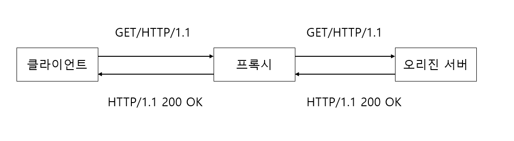
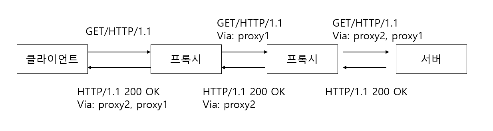
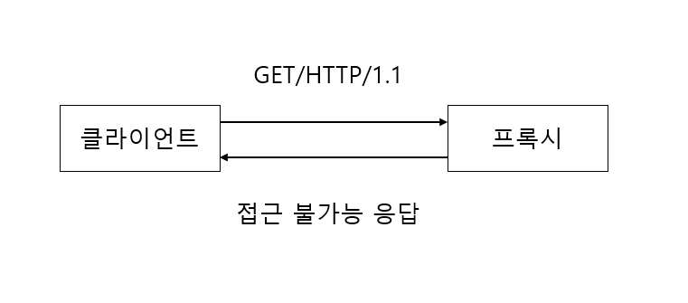
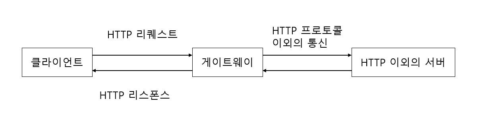
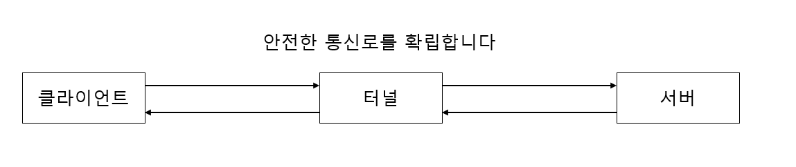
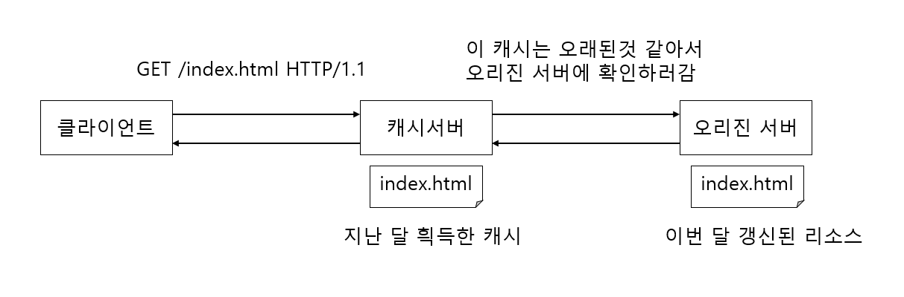

## 1대로 멀티 도메인을 가능하게 하는 가상 호스트

### 가상 호스트

- 물리적으로 서버는 1대이지만 가상으로 서버가 여러대가 있는 것처럼 설정하는 기술입니다.
- 즉, **하나의 컴퓨터나 IP로 여러 이름의 도메인으로 운용할 수 있는 기술**

## 통신을 중계하는 프로그램 : 프록시, 게이트웨이, 터널

## 프록시

- 프록시 서버의 기본적인 동작은 클라이언트로부터 받은 리퀘스트를 다른 서버에 전송하는 것입니다.
- 클라이언트로부터 받은 **리퀘스트 URI를 변경하지 않고** 그 다음의 리소스를 가지고 있는 서버에 전송합니다.
- 리소스 본체를 가진 서버 : 오리진 서버(Origin Server)

- 위 그림과 같이 HTTP 통신시, 프록시 서버를 여러 대 경유하는 것도 가능합니다.
- 체인과 같이 여러 대 경유해서 리퀘스트랑 리스폰스를 중계해 나갑니다.
- 중계할 때에는 Via 헤더 필드에 경유한 호스트 정보를 추가해야 합니다.

- 위 그림과 같이 조직 내에 특정 웹 사이트에 대한 액세스 제한, 엑세스 로그를 흭득하는 정책을 지키려는
  목적으로 사용하는 경우도 있습니다.

### 캐싱 프록시(Cashing Proxy)

- 프록시 서버 상에 리소스 캐시를 보존해주는 타입의 프록시입니다.
- 프록시에 다시 같은 리소스에 리퀘스트가 온 경우, 오리진 서버로부터 리소스를 흭득하는 것이 아니라
  캐시를 리스폰스로 되돌려 줍니다.

### 투명 프록시(Transparent Proxy)

- 프록시로 리퀘스트와 리스폰스를 중계를 할 때 메시지 변경을 하지 않는 타입의 프록시를 투명 프록시라고 합니다.
- 메시지에 변경을 가하는 타입의 프록시 : 비투과 프록시

## 게이트웨이

- 게이트웨이는 프록시와 매우 유사합니다.
- 게이트웨이의 경우에는 그 다음에 있는 서버가 HTTP 서버 이외의 서비스를 제공하는 서버가 됩니다.
- 게이트웨이 역할
    - 클라이언트와 게이트웨이 사이를 암호화하는 등으로 안전하게 접속하게 합니다.
    - ex) 쇼핑 사이트 등에서 신용 카드 결제 시스템 등과 연계할 때 사용될 수 있습니다.

## 터널

- 터널은 요구에 따라서 다른 서버와의 통신 경로를 확립합니다.
- 터널의 역할
    - 클라이언트와 서버간에 SSL같은 암호화 통신을 위해서 사용합니다.
- 터널 자체는 HTTP 리퀘스트를 해석하려고 하지 않습니다.

## 리소스를 보관하는 캐시

- 캐시(Cache) : 프록시 서버와 클라이언트의 로컬 디스크에 보관된 리스소의 사본을 가리킵니다.
- 캐시 장점
    - 통신 시간 절약
    - 서버 부담 경감

### 캐시는 유효기간이 있다.

- 캐시 서버에 캐시가 있는 경우라도 같은 리소스의 리퀘스트에 대해서 항상 캐시를 돌려준다고 할 수 없습니다.
- 캐시를 가지고 있어도 클라이언트의 요구나 캐시 유효 기간 등에 의해서 오리진 서버에 리소스의 유효성을 확인하거나
  새로운 리소스를 다시 얻으로 가게 되는 경우가 있습니다.

### 클라이언트 측에도 캐시는 있다.

- 인터넷 익스플로러에서 클라이언트가 보존하는 캐시를 인터넷 임시 파일이라고 부릅니다.
- 브라우저가 유효한 캐시를 가지고 있는 경우, 같은 리소스의 액세스는 서버에 액세스하지 않고 로컬 디스크로부터 불러옵니다.
- 캐시 서버와 마찬가지로 리소스가 오래 된것으로 판단된 경우에는 오리진 서버에 리소스의 유효성을 확인하러 가거나
  새로운 리소스를 다시 얻으로 가는 일이 있습니다.

