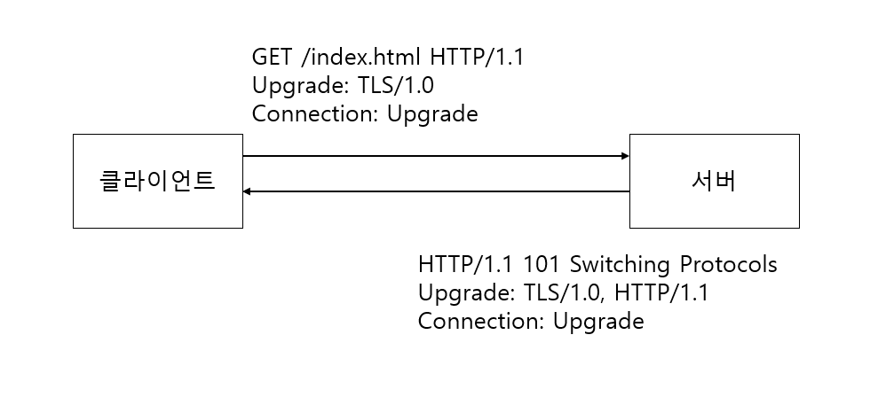
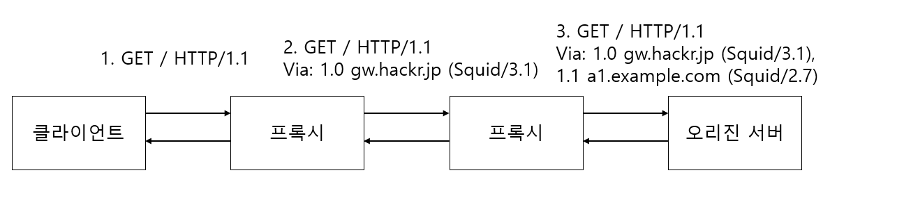

# HTTP/1.1 일반 헤더 필드

## 목차

- [Cache-Control](#Cache_Control)
- [Connection](#Connection)
- [Date](#Date)

일반 헤더 필드는 리퀘스트, 리스폰스 양쪽에서 모두 사용하는 헤더 필드입니다.

## Cache_Control

Cache-Control 헤더는 디렉티브로 불리는 명령을 사용하여 캐싱 동작을 지정합니다.


위 그림과 같이 Cache-Control 헤더 필드는 캐시의 동작을 지정합니다.

다음과 같이 Cache-Control 헤더 필드의 디렉티브는 리퀘스트 및 리스폰스 할때에 사용할 수 있습니다.

```
Cache-Control: private, max-age=0, no-cache
```

### Cache-Control 디렉티브 일람

다음은 사용이 가능한 디렉티브를 리퀘스트와 리스폰스로 나눠서 나타냅니다.

여기서 **디렉티브란 클라이언트와 서버간의 상호작용을 위해 사용되는 명령어나 지시어입니다.**

#### 캐시 리퀘스트 디렉티브

| 디렉티브            | 파라미터  | 설명                             |
|-----------------|-------|--------------------------------|
| no-cache        | 없음    | 오리진 서버에 강제적인 재검증을 요청합니다.       |
| no-store        | 없음    | 캐시는 리퀘스트, 리스폰스의 일부분을 보존하지 마시오  |
| max-age = 몇초    | 필수    | 캐시가 살아있어야할 시간을 지정합니다.          |
| max-state(=몇초)  | 생략 가능 | 기한이 지난 리스폰스를 수신하겠습니다.          |
| min-fresh = 몇초  | 필수    | 지정한 시간 이후에 변경된 리스폰스를 보내주시오     |
| no-transform    | 없음    | 프록시는 미디어 타입을 변화하지 마시오          |
| only-if-cached  | 없음    | 캐시 공간에서 리소스를 주시오               |
| cache-extension |       | 새로운 디렉티브를 위해서 토큰               |

#### 캐시 리스폰스 디렉티브

| 디렉티브             | 파라미터  | 설명                                     |
|------------------|-------|----------------------------------------|
| public           | 없음    | 어디간에 리스폰스 캐시가 가능합니다.                   |
| private          | 생략가능  | 특정 유저에 대해서만 리스폰스하겠습니다.                 |
| no-cache         | 생략 가능 | 유효성의 재확인 없니는 캐시는 사용해서는 안됩니다.           |
| no-store         | 없음    | 캐시는 리퀘스트, 리스폰스의 일부분을 보존해서는 안됩니다.       |
| no-transform     | 없음    | 프록시는 미디어 타입을 변경하지 마시오.                 |
| must-revalidate  | 없음    | 캐시 가능하지만 오리진 서버에 리소스의 재확인을 요구하세요       |
| proxy-revalidate | 없음    | 중간 캐시 서버에 대해서 캐시했던 리스폰스의 유효성을 재확인 하시오. |
| max-age = 몇초     | 필수    | 리스폰스의 최대 Age 값을 설정합니다.                 |
| s-maxage = 몇초    | 필수    | 공유 캐시 서버의 리스폰스 최대 Age 값을 설정합니다.        |
| cache-extension  |       | 새로운 디렉티브를 위한 토큰입니다.                    |

### 캐시가 가능한지 여부를 나타내는 디렉티브

1) public 디렉티브

```
Cache-control: public
```

public 디렉티브를 사용하면 서버는 해당 리소스에 대해서 다른 클라이언트에게도 캐시된 같은 리소스를 줄 수 있습니다.

예를 들어 A라는 리소스를 캐시했고 public 디렉티브로 설정되었다면 다른 클라이언트가 같은 리퀘스트를 요청한다면

캐시된 리소스 A라는 줄 수 있습니다.

2) private 디렉티브

```
Cache-Control: private
```

private 디렉티브를 사용하면 리스폰스는 특정 유저만을 대상으로 설정합니다. 즉, 서버는 특정 클라이언트를 대상으로만

이 캐시를 사용하게 할 수 있습니다. 다른 클라이언트로부터 같은 리퀘스트가 오더라도 캐시된 리소스를 반환하지 않게 됩니다.


3) no-cache 디렉티브

```
Cache-Control: no-cache
```

클라이언트가 리퀘스트에 no-cache 디렉티브를 설정하면 캐시 서버의 캐시된 리소스를 받지 않고 서버에 있는 리소스를 요청합니다.

서버가 리스폰스에 no-cache 디렉티브를 설정하면 캐시 서버는 리소스를 캐시할 수 없습니다.

```
Cache-Control: no-cache=Location
```

위와 같이 서버의 리스폰스에 no0cache의 필드 값에 헤더 필드 명이 지정된 경우에는 지정된 헤더 필드만 캐시할 수 없습니다.

### 캐시로 보존 가능한 것을 제어하는 디렉티브

1) no-store 디렉티브

```
Cache-Control: no-store
```

no-store 디렉티브가 사용된 경우 리퀘스트 또는 리스폰스에 기밀 정보가 포함되어 있음을 나타냅니다.

캐시 서버는 리퀘스트, 리스폰스의 일부분을 로컬 스토리지에 저장해서는 안됩니다.

### 캐시 기한이나 검증을 지정하는 디렉티브

1) s-maxage 디렉티브

```
Cache-Control: s-maxage=604800 (단위: 초)
```

s-maxage 디렉티브 기능은 프록시와 같은 공유 캐시에만 적용됩니다.

s-maxage 디렉티브가 사용되면 Expires 헤더 필드와 max-age 디렉티브는 무시됩니다.

2) max-age 디렉티브

```
Cache-Control: max-age=604800 (단위: 초)
```

**클라이언트의 리퀘스트로 max-age 디렉티브가 사용되면 지정한 시간보다 이전의 캐시된 리소스라면 받을 수 있다는 의미**입니다.

만약 max-age=0이라면 캐시 서버는 오리진 서버에게 무조건 요청을 넣어야 합니다.

**서버의 리스폰스에서 max-age는 캐시 서버에 유효성 재확인을 하지 않고 보존할 수 있는 최대 시간을 의미**합니다.

HTTP/1.1 캐시 서버는 동시에 Expires 헤더 필드와 max-age 디렉티브가 존재한다면 max-age 디렉티브를 우선합니다.

HTTP/1.0 캐시 서버는 반대로 Expires 헤더 필드를 우선합니다.


3) min-fresh 디렉티브

```
Cache-Control: min-fresh=60 (단위: 초)
```

**min-fresh 디렉티브 사용시 리소스를 원하는 캐싱된 리소스의 유효기간이 60초 이내이라면 캐싱된 리소스를 반환하지 않고

오리진 서버에 요청해서 리소스를 받아옵니다.** 즉, min-fresh 디렉티브로 설정된 시간 이내의 캐싱된 리소스는 받지 않습니다.

4) max-state 디렉티브

```
Cache-Control: max-state=3600 (단위: 초)
```

**max-state 디렉티브를 설정하면 해당 시간 이내에 캐싱된 리소스는 받아들인다는 의미입니다.**

만약 캐싱된 리소스가 max-state에 설정한 시간보다 경과되었다면 오리진 서버에 요청합니다.

디렉티브에 값이 설정되어 있지 않다면 시간 관계없이 무조건 캐싱된 리소스를 받는다는 의미입니다.

5) only-if-cached 디렉티브

```
Cache-Control: only-if-cached
```

**클라이언트는 캐시 서버에 대해서 목적한 리소스가 로컬 캐시에 있는 경우만 리스폰스를 반환하도록 요구합니다.**

캐시 서버는 리스폰스의 리로드와 유효성을 재확인하지 않고 응답합니다.

캐시 서버가 로컬 캐시로부터 응답할 수 없는 경우에는 "504 Gateway Timeout" 상태를 반환합니다.

6) must-revalidate 디렉티브

```
Cache-Control: must-revalidate
```

리스폰스의 캐시가 유효한지 아닌지 오리진 서버에 요구합니다.

프록시 서버가 오리진 서버에 도달할 수 없고, 리소스를 다시 요구할 없는 경우에는 캐시 서버는 클라이언트에 504(게이트웨이 에러)를 반환합니다.

또한 리퀘스트에서 max-state 디렉티브를 사용하고 있더라도 무시하고 유효한지 요청합니다.

7) proxy-revalidate 디렉티브

```
Cache-Control: proxy-revalidate
```

모든 캐시 서버는 리스폰스를 반활할 때 반드시 유효성을 재확인을 하도록 클라이언트는 캐시 서버에게 요구합니다.

8) no-transform 디렉티브

```
Cache-Control: no-transform
```

리퀘스트 또는 리스폰스에 대해서 캐시 서버가 엔티티 바디의 미디어 타입을 변경하지 않도록 요구합니다.

no-transform 디렉티브를 지정하면 캐시 서버가 리소스를 압축하지 않습니다.

### Cache-Control 확장

1) Cache-extension 토큰

```
Cache-Control: private, community="UCI"
```

Cache-Control 헤더 필드는 cache-extension 토큰을 사용하여 디렉티브를 확장할 수 있습니다.

위 예제와 같이 community라는 디렉티브는 Cache-Control 헤더 필드에는 없지만 extension tokens에 의해서 추가할 수 있습니다.

만약 캐시 서버가 "community" 디렉티브를 이해하지 못하면 무시합니다.

## Connection

### Connection 헤더 필드의 역할

- 프록시에 더 이상 전송하지 않는 헤더 필드를 지정
- 지속적인 접속 관리

프록시에 더 이상 전송하지 않는 헤더 필드를 지정

- 클라이언트 또는 서버가 리퀘스트/리스폰스를 전송할때 프록시에게 Connection 헤더 필드에 설정한 헤더 필드를 삭제해서
  보내라고 지시합니다.

지속적인 접속 관리

- HTTP/1.1에서는 지속적 접속이 기본적으로 설정되어 있습니다.
- 서버쪽에서 Connection 헤더 필드에 값으로 "Close"로 설정하면 클라이언트와의 지속 연결이 끊깁니다.
- 반대로 Connection 헤더 필드에 값으로 "Keep-Alive"로 설정하면 클라이언트와 서버간 지속 연결이 됩니다.

```
Connection: Close
Connection: Keep-Alive
```

## Date

Date 헤더 필드는 HTTP 메시지를 생성한 날짜를 나타냅니다.

HTTP/1.1 버전의 RFC1123에 다음과 같이 날짜 형식이 지정되어 있습니다.

오래된 버전의 HTTP에서는 RFC850에 다음과 같이 날짜 형식이 지정되어 있습니다.

| 프로토콜 버전  | 날짜 형식                               |
|----------|-------------------------------------|
| HTTP/1.1 | Date: Tue, 03 Jul 2012 04:40:59 GMT |
| 오래된 HTTP | Date: Tue, 03-Jul-12 04:40:59 GMT   |

## Pragma

Pragma 헤더 필드는 HTTP/1.1 보다 오래된 버전의 흔적으로 HTTP/1.0과의

이후 호환성만을 위해서 정의되어 있는 헤더 필드입니다.

Pragma 헤더 필드 형식

```
Pragma: no-cache
```

Pragma 헤더 필드는 일반 헤더 필드이지만 리퀘스트 메시지에서만 사용됩니다.

클라이언트는 캐시된 리소스의 리스폰스를 원하지 않는다고 모든 중간 서버에게 알리기 위해서 사용합니다.

## Trailer

Trailer 헤더 필드는 메시지 바디 뒤에 기술되어 있는 헤더 필드를 미리 전달하는 데 사용합니다.

Trailer 헤더 필드는 HTTP/1.1에 구현되어 있는 **청크 전송 인코딩**을 사용하고 있는 경우에 사용 가능합니다.

```
HTTP/1.1 200 OK
Date: ...
Content-Type: text/html
...
Tranfer-Encoding: chunked
Trailer: Expires
...(메시지 바디)...
0
Expires: Tue, 28 Sep 2004 23:59:59 GMT
```

위 예제에서 Trailer 헤더 필드는 Expires를 지정하고 있고, 메시지 바디 뒤(청크의 길이가 0의 뒤)에 Expires 헤더 필드가

나타나고 있습니다.

## Transfer-Encoding

Transfer-Encoding 헤더 필드는 메시지 바디의 전송 코딩 형식을 지정하는데 사용됩니다.

```
HTTP/1.1 200 OK
Date: Tue, 03, Jul 2012 04:40:56 GMT
Cache-Control: public, max-age=604800
Content-Type: text/javascript; charset=utf-8
Expires: Tue, 10 Jul 2012 04:40:56 GMT
X-Frame-Options: DENY
X-XSS-Protection: 1; mode=block
Content-Encoding: gzip

Transfer-Encoding: chunked

Connection: keep-alive

Cf0 <- 16진수(10진수로 3312)
... 3312bytes 정도의 chunk 데이터
392 <- 16진수(10진수로 914)
... 914bytes 정도의 chunk 데이터
0
```

위 예제의 경우 Tranfer-Encoding 헤더 필드에 chunked 값을 설정하여 전송 코딩 형식을 청크 전송 방식으로 설정하였고

3,312 bytes와 912 bytes의 청크 데이터로 분할되어 전송받았음을 알 수 있습니다.

## Upgrades

Upgrades 헤더 필드는 HTTP 및 다른 프로토콜의 새로운 버전이 통신에 이용 되는 경우에 사용됩니다.



위 그림과 같이 클라이언트의 메시지에 Upgrade 헤더 필드에 TLS/1.0이 지정되어 있습니다.

이때 클라이언트와 서버의 메시지 모두 Connection 헤더 필드가 지정되어 있습니다.

이는 Upgrade 헤더 필드에 의해서 업그레이드 되는 대상은 클라이언트와 인접한 서버 사이뿐이기 때문에

Upgrade 헤더 필드를 사용하는 경우는 Connection:Upgrade도 지정할 필요가 있습니다.

서버는 리스폰스에 대해서 Switching Protocols이라는 리스폰스로 응답 할 수 있습니다.

## Via

Via 헤더 필드는 클라이언트와 서버간의 메시지 경로를 알기 위해서 사용됩니다.



위 그림과 같이 프록시 서버를 거칠때마다 Via 헤더에 프록시 정보를 추가합니다.

1.0은 리퀘스트를 받아 들인 서버에 구현된 HTTP 버전입니다.

## Warning

Warning 헤더는 HTTP/1.0 리스폰스 헤더가 HTTP/1.1에서 변경된 것으로 리스폰스에 관한 추가 정보를 전달합니다.

```
Warning: 113 gw.hackr.jp:8080 "Heuristic expiration" Tue, 03 Jul => 2021 05:09:44 GMT
```

위 경고문은 리스폰스가 24시간 이상 경과하고 있는 경우(캐시의 유효기한을 24시간 이상으로 설정하고 있는 경우)에 받을 수 있습니다.

### Warning 헤더 필드 형식

```
Warning: [경고 코드][경고한 호스트:포트번호] "[경고문]" ([날짜])
```

### HTTP/1.1 경고 코드

| 코드  | 경고문                              | 설명                                                       |
|-----|----------------------------------|----------------------------------------------------------|
| 110 | Response is state                | 프록시가 유효기간이 지난 리소스를 반환했습니다.                               |
| 111 | Revalidation failed              | 프록시가 리소스의 유효성 재확인에 실패했습니다.<br/>서버의 어디에 도달할 수 없는 등의 이유    |
| 112 | Disconnection operation          | 프록시가 네트워크로부터 고의로 끊겨져 있습니다.                               |
| 113 | Heuristic expiration             | 리스폰스가 24시간 이상 경과하고 있습니다.(캐시의 유효기간을 24시간 이상으로 설정하고 있는 경우) |
| 199 | Miscellaneous warning            | 임의의 경고문                                                  |
| 214 | Transformation applied           | 프록시가 인코딩과 미디어 타입 등에 대응해서 무언가의 처리를 하고 있습니다.               |
| 299 | Miscellaneous persistent warning | 임의의 경고문                                                  |
