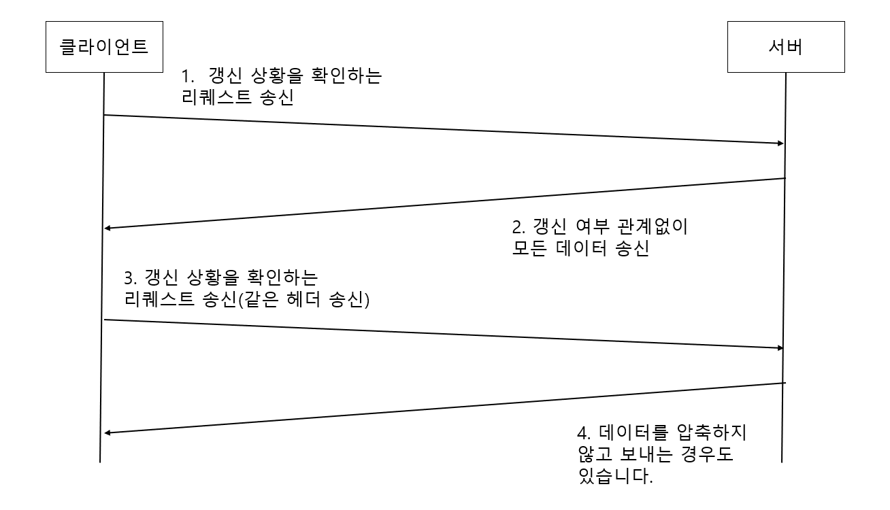
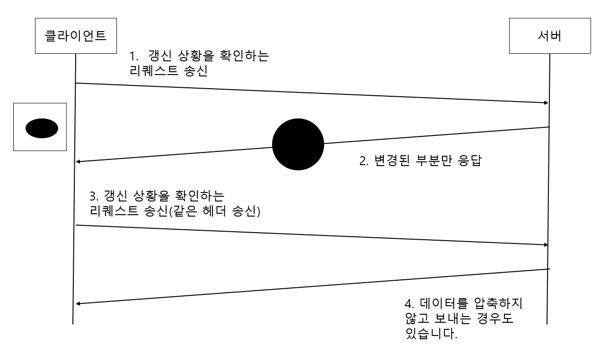
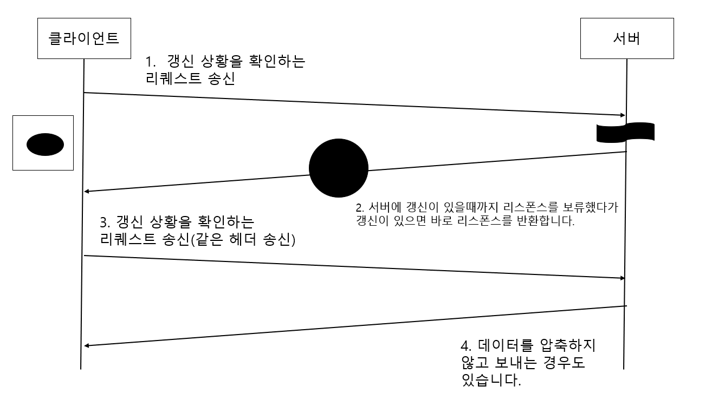
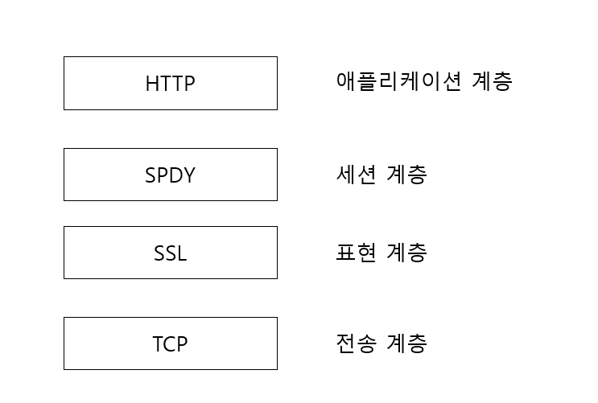
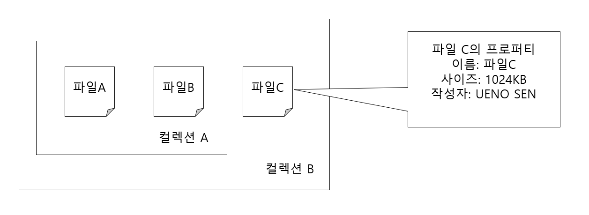
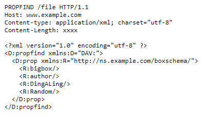
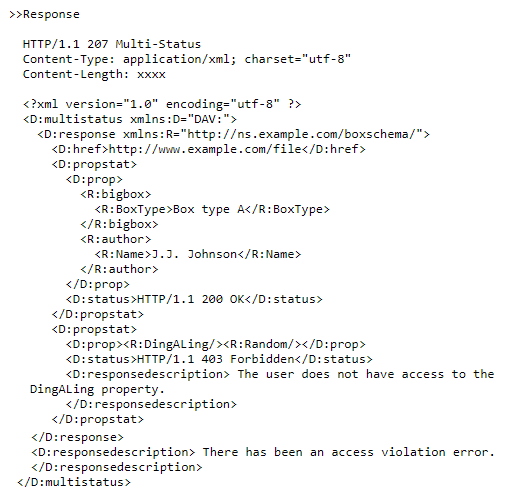

# HTTP에 기능을 추가한 프로토콜

## 목차

- HTTP를 기본으로하는 프로토콜

# HTTP를 기본으로하는 프로토콜

HTTP의 본래 용도는 HTML 파일을 전송하기 위한 프로토콜로 생각하였습니다.

그러나 시간이 지나면서 쇼핑 사이트, SNS와 같은 용도로 추가되었습니다.

하지만 HTTP라는 프로토콜로는 제한이나 한계가 존재하였습니다.

그래서 HTTP를 기반으로 추가하는 형태로 새로운 프로토콜이 구현되었습니다.

# HTTP의 병목 현상을 해소하는 SPDY

- Google 2010 발표
- HTTP 병목 현상 해결 및 로딩 시간 50% 단축 목표를 세우고 개발되고 있습니다.

## HTTP의 병목 현상

### 병목 현상의 사례

SNS는 사람들이 작성한 정보를 실시간으로 볼수 있습니다.
많은 유저가 메시지 등의 정보를 작성하면 웹 사이트에 그 정보들이 추가되면서 단시간에 대량의 갱신 정보가 발생합니다.

서버 정보가 갱신되었을 때 클라이언트의 화면에 반영할 필요가 있습니다.
그러나 HTTP에서는 이 처리를 제대로 처리를 할 수 없습니다.
이유는 갱신되었는지 알기 위해서는 클라이언트가 서버에 갱신 요청해야 하기 때문입니다.
만약 서버가 갱신되지 않았는데 클라이언트가 요청하게 되면 불필요한 통신이 발생하게 됩니다.

단순히 HTTP로 통신하게 된다면 다음과 같은 병목 현상이 발생합니다.

- 1개의 연결로 1개의 요청만 보낼 수 있습니다.
- 리퀘스트는 클라이언트에서만 시작할 수 있습니다. 리스폰스만 받는 것은 불가능합니다.
- 리퀘스트/리스폰스 헤더를 압축하지 않은채로 전달하여 헤더의 정보가 많을수록 지연이 심해집니다.
- 매번 같은 헤더를 보내 낭비가 발생합니다.
- 데이터 압축이 선택적입니다.

다음 그림은 기존 HTTP 통신을 나타낸 그림입니다.


### Ajax에 의한 해결 방법

- Ajax(Asynchronous Javascript XML) : JS나 DOM 조작 등을 활용하는 방식으로, 웹 페이지의 일부분만 고쳐쓸 수 있는 비동기 통신 방법입니다.
- 기존 동기식 통신에 비해서 페이지의 일부분만 갱신되기 때문에 리스폰스 데이터 양을 줄일 수 있습니다.
- Ajax 핵심 기술
    - XMLHttpRequest API : JS 언어로 서버와 HTTP 통신할 수 있습니다.
- 하지만 HTTP가 가지고 있는 문제는 해결되는 것은 아닙니다.



### Comet에 의한 해결 방법

- Comet : 서버 측의 콘텐츠에 갱신이 일어나는 경우, 클라이언트로부터 리퀘스트를 기다리지 않고 클라이언트에 보내기 위한 방법
- Comet에서는 리스폰스를 보류 상태로 해두고, 서버의 콘텐츠가 갱신되었을 때에 리스폰스를 반환합니다.
- 콘텐츠를 실시간으로 갱신시킬 수 있지만 리스폰스를 보류하기 위해서 연결을 유지하는 시간이 늘어납니다. 이 과정에서 연결하기 위한 리소스를 소비합니다.
- Comet 또한 HTTP 자체의 문제가 해결되는 것은 아닙니다.



### SPDY의 목표

- Ajax와 Comet 등의 방법으로 개선되었지만 HTTP 프로토콜의 제약을 없앨 수는 없습니다.
- SPDY는 HTTP의 제약인 병목 현상을 프로토콜 레벨에서 해소하기 위해 개발된 프로토콜입니다.

## SPDY 설계와 기능

SPDY는 HTTP를 완전히 바꿔 놓는 것이 아닌 **TCP/IP의 애플리케이션 계층과 전송 계층 사이에 새로운 세션 계층을 추가하는 형태로 동작합니다.**

SPDY는 보안을 위해서 표준으로 SSL 통신을 사용합니다.

SPDY는 데이터의 흐름을 제어하지만 HTTP의 연결은 확립되어 있어서 HTTP의 GET, POST같은 메소드나 쿠키, HTTP 메시지 등은 그대로 이용할 수 있습니다.



### SPDY 기능 : 다중화 스트림

다중화 스트림 기능은 단일 TCP 접속으로 복수의 HTTP 리퀘스트를 무제한으로 처리할 수 있습니다.

### SPDY 기능 : 리퀘스트 우선순위 부여

SPDY는 리퀘스트에 우선순위를 부여할 수 있습니다. 부여하는 이유는 대역폭이 좁아지면 처리가 늦어지므로 빨리 처리해야하는 리퀘스트
부터 처리하기 위해서입니다.

### SPDY 기능 : 서버 푸시 기능

SPDY는 클라이언트에서 리퀘스트가 오는 것을 기다리지 않고 먼저 서버쪽에서 데이터를 푸시할 수 있도록 할 수 있습니다.

### SPDY 기능 : 서버 힌트 기능

서버가 클라이언트에게 리퀘스트 해야할 리소스를 제안하는 기능입니ㅏㄷ.

## SPDY는 웹의 병목현상을 해결하는가?

SPDY는 기본적으로 한개의 도메인(IP 주소)과의 통신을 다중화할 뿐이기에 하나의 웹 사이트에서 복수의 도메인으로 리소스를
사용하고 있는 경우에는 그 효과가 한정적입니다.

SPDY는 HTTP의 병목 현상을 해결하는 좋은 기술이지만, 대부분의 웹 사이트의 문제는 HTTP의 병목 현상 때문만은 아닙니다.

# 브라우저에서 양방향 통신을 하는 WebSocket

## WebSocket의 설계와 기능

- Websocket
    - 웹 브라우저와 웹 서버를 위한 양방향 통신 규격
    - Ajax와 Comet에서 사용하는 XMLHttpRequest의 결점인 HTTP 병목현상 해결하기 위한 기술

## WebSocket 프로토콜

**Websocket은 웹 서버와 클라이언트가 한번 접속을 확립하면 그 뒤의 통신을 모두 전용 프로토콜로 하는 방식입니다.**

처음에는 클라이언트가 접속을 확립해야 하지만 연결이 되면 서버쪽에서도 먼저 보낼수 있게 됩니다.

### WebSocket 프로토콜 특징

- 서버 푸시 기능
    - 서버에서 클라이언트로 먼저 데이터를 푸시하는 기능입니다.
    - 서버는 클라이언트의 리퀘스트의 요청을 기다리지 않아도 됩니다.
- 통신량의 삭감
    - WebSocket은 한번 통신을 확립하면 계속 접속을 유지하기 때문에 연결하고 해제하는 통신량을 줄일 수 있습니다.
    - 통신하기 위해서는 핸드쉐이크 과정이 필요합니다.
- 핸드쉐이크/리퀘스트
    - WebSocket 통신을 위해서 **HTTP의 Upgrade 헤더 필드를 사용해서 프로토콜을 변경하는 것으로 핸드 쉐이크를 실시합니다.**
    - Sec-WebSocket-Key : 핸드쉐이크에 필요한 키가 저장됩니다.
    - Sec-WebScoket-Protocol : 서브 프로토콜이 저장됩니다.

```
GET /chat HTTP/1.1
Host: server.example.com
Upgrade: websocket
Connection: Upgrade
Sec-WebSocket-Key: dGHIHN...
Origin: http://example.com
Sec-WebSocket-Protocol: chat, superchat
Sec-WebSocket-Version: 13
```

- 핸드쉐이크 리스폰스
    - 상태 코드 101(Switching Protocols)로 반환됩니다.
    - Sec-WebSocket-Accept : Sec-WebSocket-Key의 값에서 생성된 값이 저장됩니다.

```
HTTP/1.1 101 Switching Protocols
Upgrade: websocket
Connection: Upgrade
Sec-WebSocket-Accept: s3pPL...
Sec-WebSocket-Protocl: chat
```

- WebSocket API
    - JS에서 WebSocket 프로토콜을 사용한 양방향 통신을 하기 위해서 API를 제공하고 사용할 수 있습니다.

다음 그림은 WebSocket 통신하는 그림입니다.


# 등장이 기다려지는 HTTP/2.0

## HTTP/2.0 특징

- SPDY
    - HTTP 병목 현상을 해결하기 위한 프로토콜
- HTTP Speed+Mobility
    - MS가 제안하고 있는 모바일 통신에서 통신 속도와 효율성을 개선하기 위한 규격
- Network-Friendly HTTP Upgrade
    - 모바일 통신에서 HTTP 효율 개선을 위한 규약

# 웹 서버 상의 파일을 관리하는 WebDAV

- WebDAV(Web-based Distributed Authoring and Versioning)
    - 웹 서버의 콘텐츠에 대해서, 직접 파일 복사나 편집 작업 등을 할 수 있는 분산 파일 시스템으로 HTTP/1.1를 확장한 프로토콜
    - RFC4918

## HTTP/1.1을 확장한 WebDAV

- 컬렉션(Collection)
    - 여러 개의 리소스를 한꺼번에 관리하기 위한 개념
- 자원(Resource)
    - 파일이나 컬렉션을 리소스라고 부릅니다.
- 프로퍼티(Property)
    - 리소스의 프로퍼티를 정의한 것
    - 정의는 '이름-값' 형식으로 이루어집니다.
- 잠금(Lock)
    - 파일을 편집할 수 없는 상태



## WebDAV에서 추가된 메소드와 상태 코드
### WebDAV 메소드

| 메소드       | 설명            |
|-----------|---------------|
| PROPFIND  | 프로퍼티 취득       |
| PROPPATCH | 프로퍼티 변경       |
| MKCOL     | 컬렉션 작성        |
| COPY      | 리소스 및 프로퍼티 복제 |
| MOVE      | 리소스 이동        |
| LOCK      | 리소스 잠금        |
| UNLOCK    | 리소스 잠금 해제     |

### WebDAV 상태 코드

| 상태코드                     | 설명                                         |
|--------------------------|--------------------------------------------|
| 102 Processing           | 리퀘스트는 정상적으로 수신되었지만 아직 처리중입니다.              |
| 207 Multi-Status         | 복수의 상태를 가지고 있습니다.                          |
| 422 Unprocessable Entity | 서식은 올바르지만 내용이 틀립니다.                        |
| 423 Locked               | 리소스가 잠겨있습니다.                               |
| 424 Failed Dependency    | 어떤 리퀘스트와 관련된 리퀘스트가 실패해서 의존관계를 유지를 하지 못합니다. |
| 507 Insufficient Storage | 기억 영역이 부족합니다.                              |

### WebDAV 리퀘스트 예시





