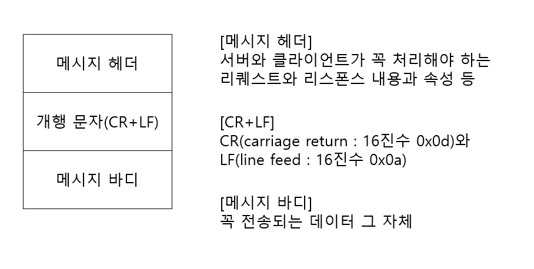
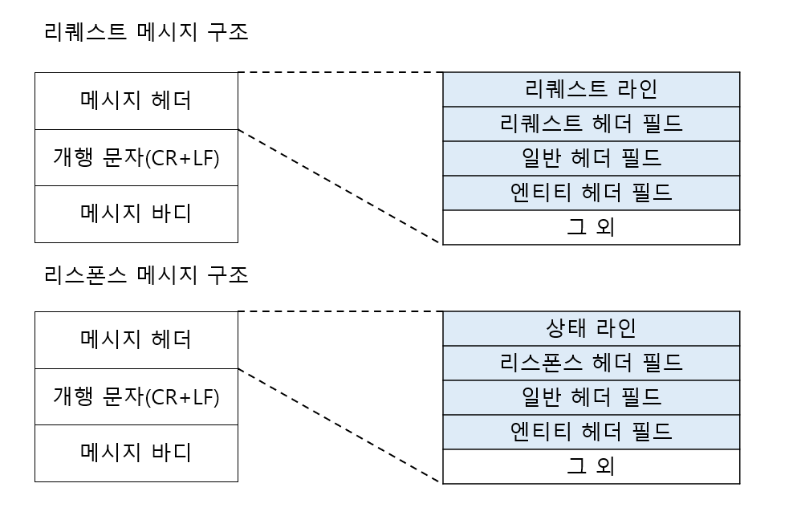
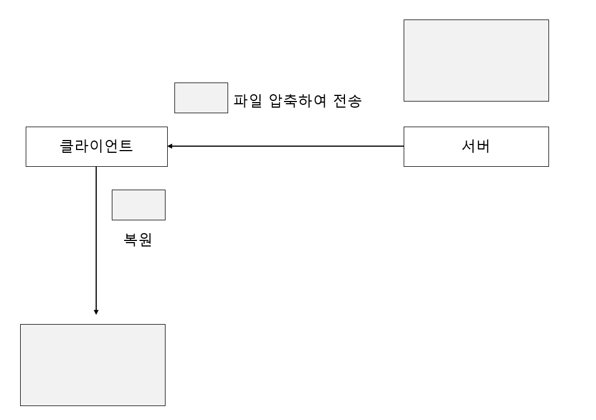
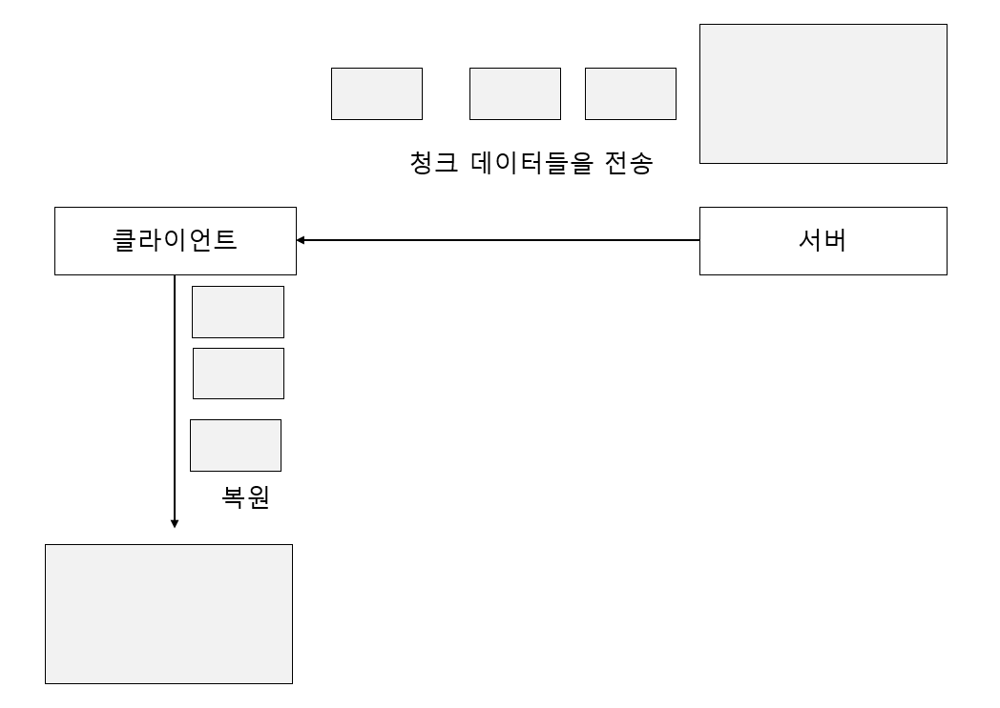

# HTTP 메시지

- HTTP 메시지 : HTTP에서 교환하는 정보 단위
    - 리퀘스트 메시지
    - 리스폰스 메시지
- HTTP 메시지는 복수 행(개행 문자는 CR+LF)의 데이터로 구성된 텍스트 문자열
- 최초에 나타나는 개행 문자로 메시지 헤더와 메시지 바디를 구분합니다.
- 메시지 바디는 존재하지 않을 수 있습니다.

# 리퀘스트 메시지와 리스폰스 메시지의 구조

- 리퀘스트 라인
    - 리퀘스트에 사용하는 메서드와 리퀘스트 URI와 사용하는 HTTP 버전이 포함됩니다.
- 상태 라인
    - 리스폰스 결과를 나타내는 상태 코드와 설명, 사용하는 HTTP 버전이 포함됩니다.
- 헤더 필드
    - 리퀘스트와 리스폰스의 여러 조건과 속성 들을 나타내는 가종 헤더 필드가 포함됩니다.

# 인코딩으로 전송 효율을 높이다

- HTTP로 데이터를 그대로 전송할 수도 있지만 인코딩하여 보내면 전송 효율을 높일 수 있습니다.
- 인코딩하여 전송하면 다량의 액세스를 효율 좋게 처리할 수 있씁니다.

## 메시지 바디와 엔티티 바디의 차이

- 메시지 바디는 요청이나 응답에 담길 실제 데이터를 말합니다.
- 메시지 바디에 담기는 데이터는 텍스트, 이미지, 바디오 등 여러 형식이 가능합니다.
- 엔티티는 메시지 바디와 함께 전송되는 데이터에 대한 **메타데이터(Metadata)**입니다.
- 엔티티는 요청이나 응답에서 전송된 데이터의 형식, 길이, 인코딩 등을 정의합니다.
- 엔티티는 엔티티 헤더 필드와 엔티티 바디로 구성됩니다.

HTTP 메시지 바디의 역할은 리퀘스트랑 리스폰스에 관한 엔티티 바디를 운반하는 일입니다.

기본적으로 메시지 바디와 엔티티 바디는 같지만 전송 코딩이 적용된 경우에는 엔티티 바디의 내용이

변환하기 때문에 메시지 바디와 달라집니다.

## 압축해서 보내는 컨텐츠 코딩

- 컨텐츠 코딩 : 엔티티에 적용하는 인코딩을 가리킵니다. 엔티티 정보를 유지한채로 압축합니다.
- 컨텐츠 코딩은 파일을 압축하여 첨부해서 보내는 역할을 수행합니다.

주요 컨텐츠 압축

- gzip(GNU zip)
- compress(UNIX의 표준 압축)
- deflate(zlib)
- identity(인코딩 없음)

## 분해해서 보내는 청크 전송 코딩

- 청크 전송 코딩 : 엔티티 바디를 분할하는 기능
- 사이즈가 큰 데이터를 청크라는 단위로 분해하여 전송합니다.
- 청크 데이터를 복원하여 조금씩 화면에 표시합니다.

# 여러 데이터를 보내는 멀티파트

HTTP에서 멀티파트(Multipart)는 **하나의 HTTP 메시지에 여러 개의 독립적인 데이터를 포함
할 수 있도록 하는 방법**입니다.

멀티파트는 HTTP 메시지의 엔티티 바디 부분에 사용됩니다.

멀티파트는 각각의 데이터를 구분하기 위해 Boundary 문자열을 사용합니다. Boundary 문자열은 엔티티 바디
내에서 유일한 문자열이어야 하며, 각 데이터의 시작과 끝을 구분하는 역할을 합니다.

## 멀티 파트 종류

- multipart/form-data : Web 폼으로부터 파일 업로드에 사용됩니다.
- multipart/byteranges : 상태 코드 206 리스폰스 메시지가 복수 범위의 내용을 포함하는 때에 사용됩니다.

# 일부분만 받는 레인지 리퀘스트

- 레인지 리퀘스트의 필요성 : 다운로드를 받는 중 연결이 끊기면 다시 입력받아야 합니다.
  이때 리줌이라는 기능을 이용하여 다운로드를 재개할 수 있습니다. 이 기능을 실현하기 위한 기술이 레인지 리퀘스트입니다.
- 레인지 리퀘스트 : 범위를 지정하여 리퀘스트 하는 기술입니다.
- 전체 10,000 바이트 크기의 리소스에서 5001~10000 바이트 범위만을 리퀘스트 할 수 있습니다.

# 최적의 콘텐츠를 돌려주는 컨텐츠 네고시에이션

- Content Negotiation은 클라이언트와 서버 간에 통신을 할 때, 요청한 리소스에 대해
  최적의 표현 방법을 주는 과정입니다.
- 클라이언트는 원하는 컨텐츠 유형을 지정하고 서버는 이에 대해 사용 가능한 표현 방법을 제시합니다.

## Content Negotiation 종류

- 서버 구동형 네고시에이션(Server-driven Negotiation)
    - 서버 측에서 컨텐츠 네고시에이션을 하는 방식입니다..
    - 서버 측에서 리퀘스트 헤더 필드의 정보를 참고해서 자동적으로 처리합니다.
- 에이전트 구동형 네고시에이션(Agent-driven Negotiation)
    - 클라이언트 측에서 컨텐츠 네고시에이션을 하는 방식입니다.
    - 브라우저에서 표시된 선택지 중에서 유저가 수동으로 선택합니다.
- 트랜스페어런트 네고시에이션(Transparent Negotiation)
    - 서버 구동형과 에이전트 구동형을 혼합한 방식입니다.
    - 서버와 클라이언트가 각각 컨텐츠 네고시에이션을 하는 방식입니다.
