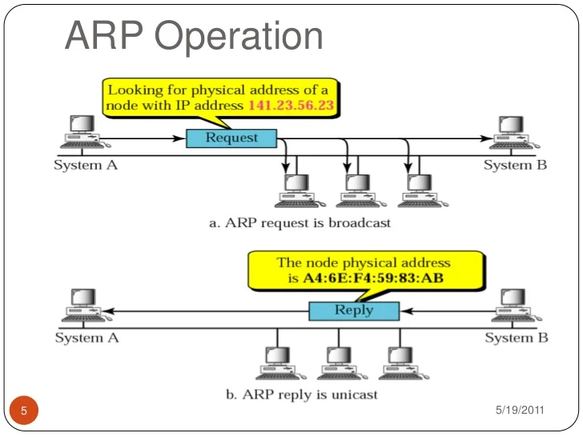
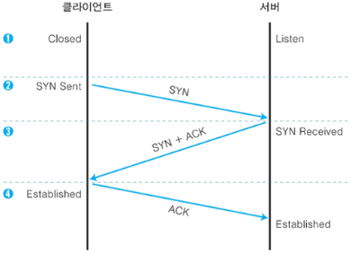

# HTTP와 관계가 깊은 프로토콜은 IP/TCP/DNS

## 배송을 담당하는 IP
### IP의 개념
- IP(Integer Protocol)는 데이터를 패킷 단위로 만들어 상대방에게 전달하는 역할
- IP가 패킷을 상대방에게 전달하기 위해서는 IP 주소와 MAC 주소가 필요함
  - IP 주소 : 각 노드에 부여도니 주소를 가리킴, 변경 가능함
  - MAC 주소 : 각 네트워크 카드에 할당된 고유의 주소, 변경 불가능함
- 네트워크 계층에 위치한 프로토콜

### 통신은 ARP를 이용하여 MAC주소에서 한다
- IP 통신은 MAC 주소에 의존해서 통신을 수행합니다.
- 여러대의 컴퓨터와 네트워크 기기를 중계해서 상대방에게 도착합니다.
- 중계하는 동안 다음으로 중계할 곳의 MAC 주소를 사용하여 목적지를 찾아갑니다.
- 목적지를 찾아가기 위해서 `ARP(Address Resolution Protocol)`을 사용합니다.

### ARP
- ARP는 IP 주소와 MAC 주소를 매핑하기 위한 프로토콜입니다.
- ARP는 네트워크에서 다른 컴퓨터의 IP를 가지고 있을때 이 IP 주소에 해당하는 MAC 주소를 찾아내는 역할을 합니다.

위 그림과 같이 System A가 연결된 모든 컴퓨터에 141.23.56.23 IP 주소에 대한 MAC 주소를 아는지 브로드캐스팅합니다.

System B가 해당 IP의 MAC 주소가 A4:6E:F4:59:83:AB라고 응답합니다.

그럼 System A의 네트워크 계층에서는 IP 프로토콜을 사용하여 현재 나의 IP에서 상대방 IP로의 경로로

라우터들을 거쳐서 전송합니다.

하지만 실제로 우리의 컴퓨터는 랜 카드를 이용하여 네트워크에 연결되어 있기 때문에

3계층에서 2계층으로의 정보 전달을 위해 우리는 MAC 주소가 필요하고 이를 위해 ARP 프로토콜이 필요합니다.

## 신뢰성을 담당하는 TCP
- 용량이 큰 데이터를 보내기 쉽게 TCP 세그먼트 단위로 분해하여 관리하는 역할
- 데이터가 정확하게 도착했는지 확인하는 역할
- TCP는 전송계층에 위치함

### 상대방에게 데이터를 확실하게 보내는 방법 : 쓰리웨이 핸드셰이킹(three way handshaking)
- 쓰리웨이 핸드셰이킹 : 패킷을 보내고 나서 바로 끝내는 것이 아닌 보내졌는지 여부를 상대에게 확인하는 방법

1. 클라이언트가 서버에게 SYN 패킷을 보냅니다.
2. 서버가 클라이언트에게 SYN/ACK 패킷을 보내어 패킷을 받았다고 응답합니다.
3. 클라이언트가 ACK 패킷을 보내어 패킷 교환이 완료됨을 전합니다.
4. 1~3번 과정중 응답하지 않는다면 다시 패킷을 전송합니다.

## References
- [ARP란](https://xyom.github.io/2018/01/08/ARP%E1%84%85%E1%85%A1%E1%86%AB/)