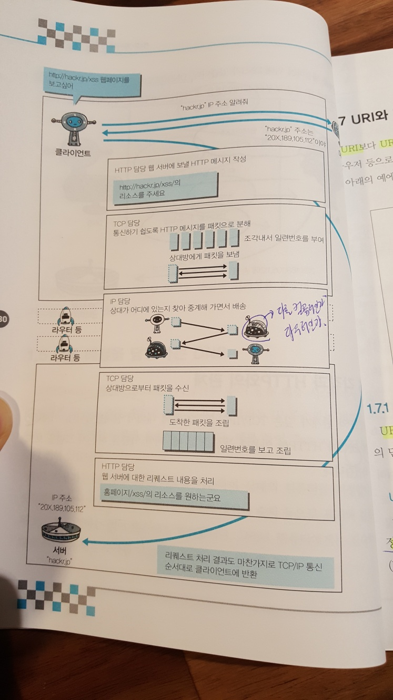

# IP/TCP/DNS와 HTTP와의 관계
- HTTP <-> DNS : 클라이언트가 웹 서버에 요청을 하기 위해서 DNS 서버에 도메인명에 따른 IP 주소를 요청함
- HTTP <-> TCP : 클라이언트가 웹 서버에 요청시 데이터를 세그먼트 패킷 단위로 만들어 전송하고 서버가 응답을 받았는지 확인함
- HTTP <-> IP : 클라이언트가 웹 서버에 요청시 패킷을 IP 주소를 이용하여 라우터 등을 거치면서 전송함

