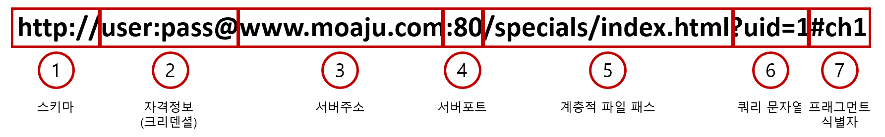

# URI와 URL
## URI는 리소스 식별자
- URI(Uniform Resource Identifiers)
- URI는 서버에서 각각의 리소스를 구별할 수 있는 문자열입니다.
- 예를 들어 대한민국이라는 서버에서 '홍길동'이라는 사람의 리소스는 한명뿐이므로 '홍길동' 이라는 문자열로 리소스를 식별할 수 있습니다.

## URL 포맷
- URL(Uniform Resource Locator)
- URL은 리소스의 이름뿐만이 아니라 리소스가 위치한 장소까지 명시된 문자열을 의미합니다.
- 예를 들어 대한민국이라는 서버에서 단순히 '홍길동'이라는 이름의 문자열은 URI이지만 '서울 강남 00아파트 00동 00호에 사는 홍길동'과 같은
이름의 문자열은 URL이 됩니다.

- 스키마 : 리소스를 얻는 방법
- 자격정보 : 서버로부터 리소스를 얻기 위한 인증 정보 (옵션)
- 서버 주소 : 서버의 IP 주소에 해당하는 도메인명 주소, IP 주소로 대체 가능
- 서버 포트 : 서버의 접속 대상이 되는 네트워크 포트 번호 (옵션)
- 계층적 파일 패스 : 특정한 리소스를 식별하기 위한 서버 상의 파일 경로를 지정한 것
- 쿼리 문자열 : 파일 경로로 지정된 리소스에 임의의 파라미터를 넘겨주기 위한 문자열 (옵션)
- 프래그멘트 식별자 : 주로 취득한 리소스에서 서브 리소스를 가리키기 위한 것 (옵션)
