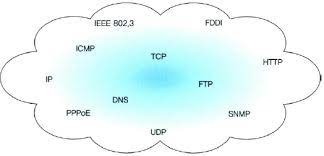

# 네트워크의 기본은 TCP/IP
## TCP/IP는 프로토콜의 집합
컴퓨터와 네트워크 기기가 상호간에 통신하기 위해서는 서로 같은 방법으로 통신하여야 합니다.

예를 들어 **어떻게 상대를 찾고, 어떻게 상대에게 이야기를 시작하고, 어떠한 언어로 이야기를 하며, 
어떻게 이야기를 종료할까와 같은 규칙을 결정할 필요가 있습니다.**

위와 같이 서로 다른 하드웨어와 운영체제를 가지고 서로 같은 통신을 하기 위해서는 위와 같은 고려 사항에 규칙이 필요합니다.
이러한 규칙을 프로토콜이라고 부릅니다.

프로토콜에는 여러 가지가 존재합니다. 
- 케이블 규격
- IP 주소 지정 방법
- 떨어진 상대를 찾기 위한 방법
- 그곳에 도달하는 순서
- 웹을 표시하기 위한 순서 등

위의 그림과 같이 TCP/IP에는 다양한 프로토콜이 있는데 이러한 **인터넷과 관련된 프로토콜들을 총칭해서 TCP/IP**라고 부릅니다.

## 계층으로 관리하는 TCP/IP
### TCP/IP의 4계층
TCP/IP는 4개의 계층으로 구성됩니다.
- 애플리케이션 계층
- 전송 계층
- 네트워크 계층
- 링크 계층

### TCP/IP 계층화의 필요성
TCP/IP를 계층화 시켜야 하는 이유는 **인터넷이 하나의 프로토콜로 되어 있다면 어디선간 사양이 변경되었을 때 전체를 바꿔야 하지만, 계층화가 되어 있다면
사양이 변경된 해당 계층만 변경하면 되기 때문**입니다. 각각의 계층은 계층이 연결되어 있는 부분만 결정되어 있어, 각 계층의 내부는 자유롭게 설계할 수 있습니다.

예를 들어 애플리케이션 게층에서 애플리케이션은 자기 자신이 담당하는 부분을 고려하면 되고, 상대가 어디에 있는지와 같은 고려를 하지 않아도 됩니다.

### 애플리케이션 계층
**애플리케이션 계층은 유저에게 제공되는 애플리케이션에서 사용하는 통신의 움직임을 결정**합니다.

애플리케이션 계층 제공 프로토콜
- FTP(File Transmission Protocol) : 대량의 파일을 처리할때 사용하는 프로토콜
- DNS(Domain Name System) : 도메인 주소를 IP 주소로 변환하는 역할
- HTTP(HyperText Transmission Protocol) : 클라이언트와 서버가 웹으로 데이터를 통신하기 위해 정한 약속

### 전송 계층
**전송 계층은 애플리케이션 게층에 네트워크로 접속되어 있는 2대의 컴퓨터 사이의 데이터의 흐름을 제공**합니다.

전송계층 제공 프로토콜
- TCP(Transmission Control Protocol) : 연결형 서비스를 지향하는 전송계층 프로토콜
- UDP(User Data Protocol) : 비연결형 서비스를 지향하는 전송계층 프로토콜

### 네트워크 계층(인터넷 계층)
**네트워크 계층은 네트워크 상에서 패킷의 이동을 다룹니다.**

상대방의 컴퓨터까지 어떠한 경로로 패킷을 보낼지 결정합니다.

패킷 : 전송 데이터의 최소 단위

### 링크 계층(데이터 링크 계층, 네트워크 인터페이스 계층)
**전송하고자 하는 데이터를 전기적인 신호로 변환하여 전송합니다.**

운영체제가 하드웨어를 제어하기 때문에 디바이스 드라이버랑 네트워크 인터페이스 카드를 포함합니다.

케이블 등과 같이 물리적으로 보이는 부분(커넥트 등을 포함하는 여러가지 전송 매체)도 포함합니다.

하드웨어의 측면은 모두 링크 계층의 역할이 됩니다.

## TCP/IP 통신의 흐름

송신하는 측은 애플리케이션 게층에서부터 내려가고, 수신하는 측은 애플리케이션 계층으로 올라갑니다.

애플리케이션 계층에서 HTTP 데이터는 "어느 웹 페이지를 보고 싶다"와 같은 HTTP Request가 될 수 있습니다.

그 다음 전송 계층에서는 애플리케이션 계층에서 받은 데이터(HTTP 데이터)를 통신하기 쉽게 조각내어 `안내 번호`와 `포트 번호`를 붙여서 네트워크 계층에 전달합니다.

네트워크 계층에서는 수신지 MAC 주소를 추가해서 링크 계층에서 전달합니다.

링크 계층에서는 전기적인 신호로 변환하여 서버의 링크 계층으로 전달합니다.

수신측 서버는 데이터를 받아들여 순새대로 위의 계층에 전달하여 애플리케이션 계층까지 도달합니다.

애플리케이션 계층에 도착하면 클라이언트가 요청한 HTTP 요청을 수신할 수 있습니다.

**캡슐화**
- 클라이언트에서 서버로 전달할때 반드시 헤더를 각 계층에 필요한 정보를 추가하고 서버측에서는 각 계층을 거칠때마다 사용한 헤더를 삭제하는 과정

