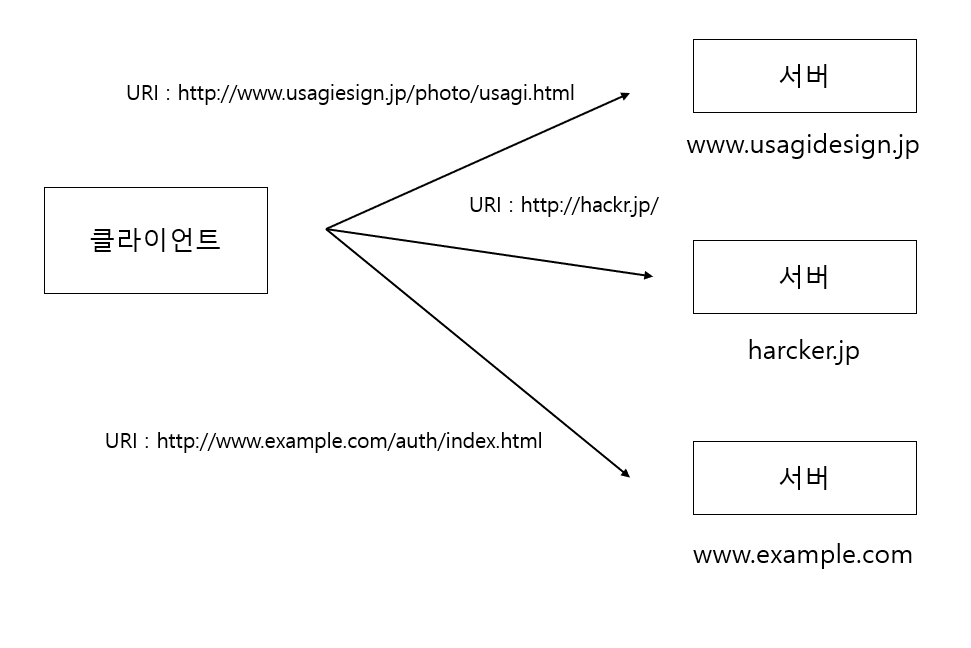
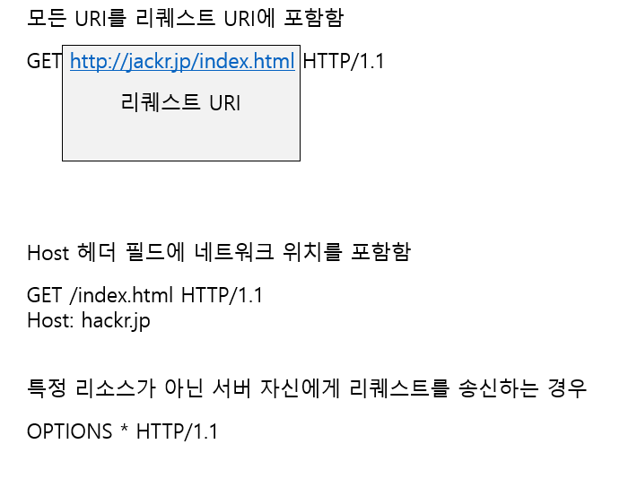

# 리퀘스트 URI로 리소스를 식별
HTTP는 URI를 사용하여 네트워크 상의 리소스를 지정합니다.

다음 그림과 같이 HTTP는 URI를 사용해서 클라이언트가 리소스를 특정합니다.

## 리퀘스트 URI를 지정하는 방법
- 모든 URI를 리퀘스트 URI 포함
- Host 헤더 필드에 네트워크 위치를 포함시킴
- 리퀘스트 URI에 [*]를 지정하여 특정 리소스가 아닌 서버 자신에게 리퀘스트 송싱

