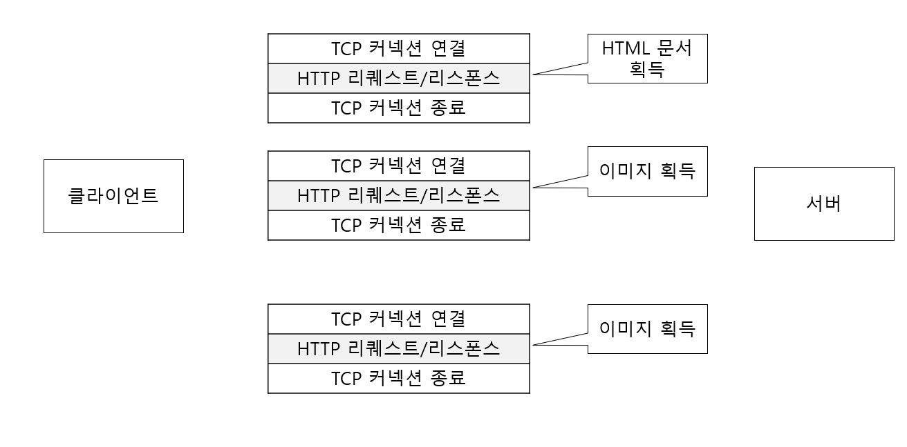
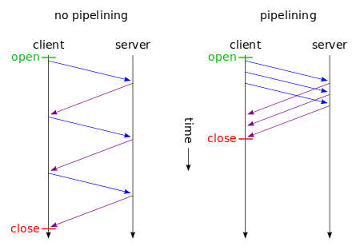

# 지속 연결로 접속량을 절약

## 지속 연결 필요성

- HTTP 초기 버전에서는 HTTP 통신 한번 할때마다 TCP에 의해 연결과 종료를 할 필요가 있었습니다.
- 문제는 다량의 이미지를 포함한 문서등이 늘어나서 하나의 문서를 요청하고 다시 이미지 같은 것들을 계속 요청하는 문제가 있었습니다.

## 지속 연결

- 지속 연결은 어느 한쪽이 명시적으로 연결을 종료하지 않는 이상 TCP 연결을 계속 유지하는 것입니다.
- HTTP/1.1 표준 동작

### 지속 연결의 장점

- 지속 연결을 하면 TCP 커넥션의 연결과 종료를 반복되는 오버헤드를 줄여주기 때문에 서버에 대한 부하가 경강됩니다.
- 오버헤드가 줄어들면 HTTP 리퀘스트와 리스폰스가 빠르게 완료되기 때문에 웹 페이지를 빨리 표시할 수 있습니다.

다음 그림은 1회의 TCP 커넥션 연결로 리퀘스트와 시스폰스 교환을 여러번 수행하는 지속 연결하는 그림입니다.

다음 그림은 지속 연결을 하지 않은 여러 번의 TCP 커넥션 연결과 1회의 TCP 커넥션 연결로 리퀘스트와 리스폰스를 여러번 수행하는 지속 연결그림입니다.

## 파이프라인화

- 지속 연결은 여러 리퀘스트를 보낼수 있도록 파이프라인(HTTP pipelining)화를 가능하게 합니다.
- 파이프라인화를 수행하면 리퀘스트 송신 후에 응답을 기다리지 않고 바로 다음 리퀘스트를 보낼수 있습니다.

다음 그림은 파이프라인화를 하지 않은 지속 연결과 파이프라인화를 수행하는 지속 연결을 나타낸 그림입니다.

