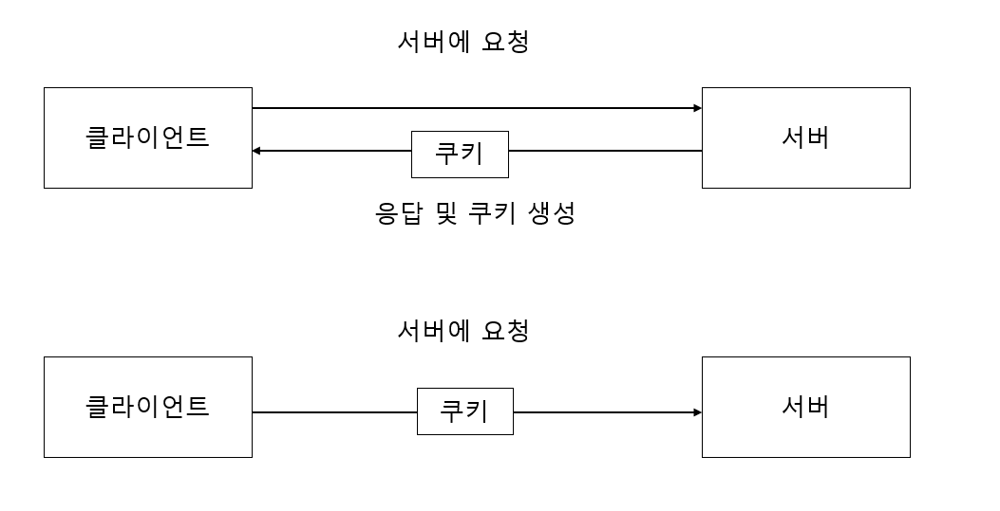

# 쿠키를 이용한 상태 관리

## 쿠키의 필요성

HTTP는 무상태(stateless) 프로토콜이기 때문에 리퀘스트와 리스폰스의 상태를 관리하지 않습니다.

이는 과거 상태를 가지고 현재 리퀘스트를 처리하는 것은 불가능합니다.

예를 들면 **인증이 필요한 웹 페이지에서 상태 관리를 하지 않는다면 새로운 페이지를 이동할 때마다 인증을 해주어야하는

문제가 발생합니다.**

## 쿠키의 개념

- 쿠키는 리퀘스트와 리스폰스에 쿠키라는 정보를 추가해서 클라이언트의 상태를 파악하기 위한 시스템입니다.
- 서버는 리스폰스에 Set-Cookie라는 이름의 헤더 필드에 의해서 쿠키를 클라이언트 보존하게 합니다.
- 다음 요청에서 클라이언트는 같은 서버로 리퀘스트 할때 쿠키 값을 넣어서 송신합니다.
- 서버는 클라이언트가 보내온 쿠키를 확인해서 어느 클라이언트가 접속했는지 확인하고 서버 상의 기록을 확인해서 이전 상태를 알 수 있습니다.



위의 그림과 같이 쿠키를 교환할때 HTTP 리퀘스트의 리스폰스 내용은 다음과 같습니다.

### 리퀘스트(쿠키를 가지고 있지 않은 상태)

```
GET /reader/ HTTP/1.1
Host: www.yongjin.com
* 헤더 필드에 쿠키는 없다.
```

### 리스폰스(서버가 쿠키를 발행)

```
HTTP/1.1 200 OK
Date: Thu, 12 Jul 2012 07:12:20 GMT
Server: Apache
<Set-Cookie: sid=1342077140226724; path=/;expires=Wed, => 10-Oct-12 07:12:20 GMT>
Content-Type: text/plain; charset=UTF-8
```

### 리퀘스트(보관하고 있던 쿠키를 자동 송신)

```
GET /reader/ HTTP/1.1
Host: www.yongjin.com
Cookie: sid=1342077140226724
```