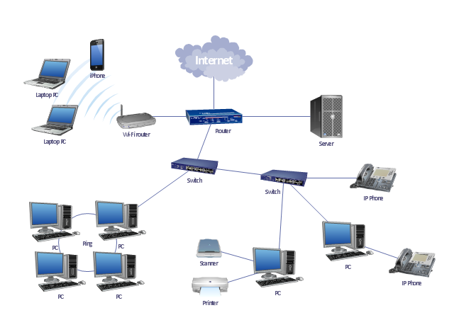
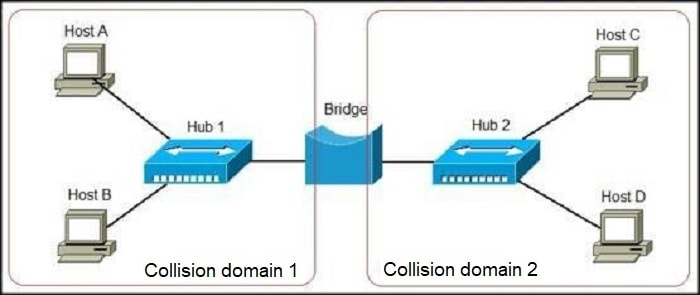
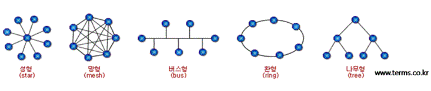

# 네트워크 구성
## 목차
- [x] [네트워크의 구성](#네트워크의-구성)
- [x] [네트워크의 형태](#네트워크의-형태)
- [x] [네트워크의 접속 장치](#네트워크의-접속-장치)
- [ ] [네트워크의 접속 형태](#네트워크의-접속-형태)
- [ ] [네트워크의 전송 매체](#네트워크의-전송-매체)

## 네트워크의 구성
- PC
- 네트워크 접속 장치
  - 스위치 : 한 네트워크 내부에서 데이터 저송을 수행하는 장치
  - 라우터 : 서로 다른 네트워크를 구분하고 연결하는 장치
- 네트워크 전송 매체
  - 유선
  - 무선

## 네트워크의 형태
- LAN(Local Area Network) : 건물안이나 특정 지역 범위안에서 네트워크로 통신
  - 가정집, 연구실
- WAN(Wide Area Network) : 2개 이상의 LAN을 넓은 지역에 걸쳐 연결한 통신
  - SKT, KT
- 인트라넷 : 인터넷에서 사용하는 회선과 여러 기반 기술을 이용하여 구축하는 사설 네트워크
  - 캠퍼스, 회사 사내 인트라넷

## 네트워크 접속 장치
- LAN 카드(Network Interface Card, NIC) : 네트워크에 접속하기 위해 필요한 카드
- 허브(Hub) : 여러개의 컴퓨터를 같은 네트워크로 연결하는 장치
  - 더미 허브 : 데이터를 연결된 다른 컴퓨터로 전송하는 장치
  - 스윙치 허브 : 스위칭기능이 있어 더미 허브보다 빠른 장치
    - 모두에게 데이터를 보내지 않고 한 컴퓨터에만 보낼 수 있음
  - 스태커블 허브 : 허브와 허브를 연결할 수 있는 허브
  - 인텔리전트 허브 : 데이터 제어와 분석이 가능한 허브
- 스위치(Switch) : 근거리 네트워크가 제공하는 대역폭을 컴퓨터로 모두 전송할 수 있는 장치
  - 연결된 컴퓨터 개수 상관없이 동일한 대역폭 제공
  - 허브보다 상위호한인 장치

- 브리지(Bridge) : 2개 이상의 근거리 통신망을 연결하여 하나의 네트워크로 만드는 장치

- 게이트웨이(Gateway) : 종류가 다른 2개 이상의 네트워크를 연결시켜주는 장치
- 중계기 : 접속 시스템 수를 증가시키거나 네트워크 전송 거리를 연장시키는 장치
- 라우터 : 서로 다른 네트워크 간에 통신하는데 사용하는 장치
  - LAN, MAN, WAN을 연결
  - IP주소를 수신지까지 효율적인 경로를 선택하여 보내줌 (라우팅)

## 네트워크 접속 형태

### 성형
중앙의 허브에 다른 컴퓨터들을 연결한 형태

장점
- 설치 비용이 저렴함
- 유지, 보수나 확장이 좋음
- 다른 컴퓨터가 끊어질때 다른 컴퓨터는 영향을 받지 않음

단점
- 중앙의 허브가 고장나면 전체가 네트워크가 안됨
- 많은 케이블이 필요함

### 버스형
모든 컴퓨터가 일자형 케이블에 연결되어 있는 형태

장점
- 설치 간단하고 비용이 적게듬
- 컴퓨터를 추가하기 쉽고 다른 컴퓨터가 고장이 나도 전체에 영향을 미치지 않음
- 필요한 케이블양이 엊ㄱ음

단점
- 연결된 컴퓨터가 많아질수록 속도가 느려짐
- 중앙의 케이블이 고장나면 전체 네트워크가 고장남

### 트리형
성형의 변형으로 중앙에 있는 전송 제어 장치에 모든 컴퓨터를 연결하는 것이 아니라
트리 모양의 노드에 전송 제어 장치를 두고 허브와 컴퓨터들을 연결하는 형태

장점
- 제어가 간단하고 확장이 쉬움
- 중앙 제어 장치에 많은 장비를 연결하여 전송 거리를 늘릴 수 있음
- 여러 컴퓨터 분리하거나 우선순위 부여할 수 있음
  - 예를 들어 특정한 2차 허브에 연결된 컴퓨터에 더 높은 우선순위를 부여할 수 있음

단점
- 중앙에 트래픽이 쏠릴수 있어 병목현상이 발생할 수 있음
- 중앙 제어 장치가 다운되면 모든 네트워크가 고장남

### 링형
컴퓨터들이 원형으로 연결된 형태

장점
- 구조가 단순하여 설치와 재구성이 쉬움
- 장애가 발생해도 복구 시간이 빠름
- 장치의 추가와 삭제가 쉬움, 케이블 2개만 움직이면 됨
- 신호가 순환되므로 한 장치가 신호를 못받으면 경보를 함
- 케이블 비용을 줄일 수 있음

단점
- 링 제어 절차가 복잡함
- 링에 결함이 생기면 전체 네트워크가 고장남

### 그물형
중앙 제어 노드가 없고 모든 노드가 서로 점대점으로 연결된 형태

장점
- 전용 링크를 통해 전송하므로 많은 장치를 공유하는 상황에서 통신량 문제를 해결할 수 있음
- 한 링크가 고장나도 전체에 문제가 되지 않음
- 전용선으로 보내서 보안이 높음
- 결함의 식별과 분리가 쉬움

단점
- 노드를 다른 모든 노드와 연결해야 하므로 설치나 재구성이 어려움
- 각 링크와 연결되는 하드웨어(입출력 포트와 전선)에 비용이 많이듬

### 혼합형
버스형, 링형, 성형과 같은 여러 형태들을 복합적으로 사용하는 형태
