# 1. 운영체제(OperatingSystem) 소개

- [운영체제의 역할과 정의](#1.1-운영체제의-역할과-정의)
  - [운영체제의 역할](#운영체제의-역할)
  - [운영체제의 정의](#운영체제의-정의)
- [컴퓨터 시스템 구성](#컴퓨터-시스템-구성)
  - [기본 컴퓨터 시스템](#기본-컴퓨터-시스템)
  - [부트스트랩(bootstrap)](#부트스트랩(bootstrap))
  - [인터럽트(Interrupt)](#인터럽트(Interrupt))
  - [폰 노이만 구조](#폰-노이만-구조)
  - [저장장치 계층](#저장장치-계층)
  - [입출력 구조(I/O Structure)](#입출력-구조(I/O-Structure))
  - [DMA(Direct Memory Access)](#DMA(Direct-Memory-Access))

## 운영체제의 역할과 정의
### 운영체제의 역할
- 운영체제는 하드웨어(CPU, Memory, HDD 등)를 제어하는 소프트웨어
- 프로그램의 서비스를 제공하는 소프트웨어
- 운영체제는 프로그램과 하드웨어 사이에 위치

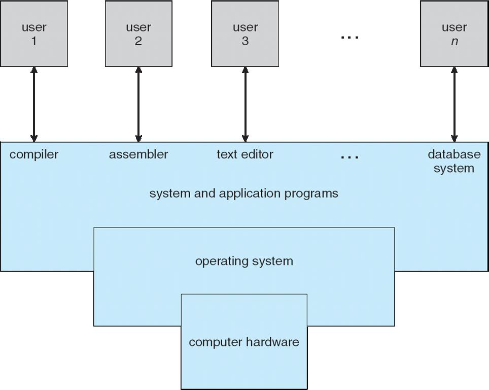

1. 사용자가 응용 프로그램에 서비스를 요청
2. 운영체제는 요청에 따른 명령을 하드웨어를 제어해서 수행

### 운영체제의 정의
-   **하드웨어를 제어하는 소프트웨어**
-   컴퓨터 위에서 항상 실행되는 하나의 프로그램
-   Kernel

## 컴퓨터 시스템 구성

### 기본 컴퓨터 시스템
- CPU는 메모리에 명령어들을 저장하고 기기 제어기를 통해서 하드웨어 작업을 수행

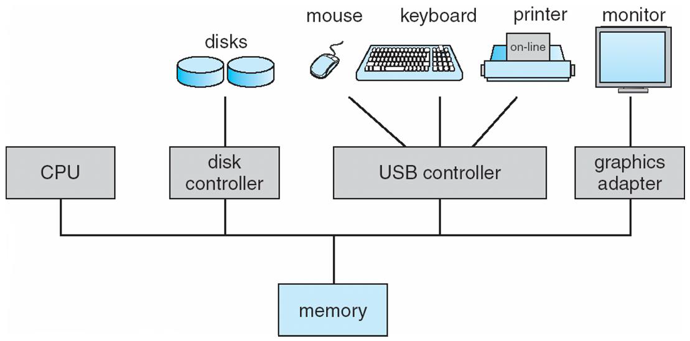

### 부트스트랩(bootstrap)
- 컴퓨터 전력이 들어오자마자 제일 처음에 수행되는 프로그램**
- 운영체제를 메모리에 올리는 프로그램

### 인터럽트(Interrupt)
- 하드웨어가 작동 중에 CPU에게 알려주는 신호
- 버스를 통해서 하드웨어는 CPU에게 인터럽트를 발생시킬 수 있음

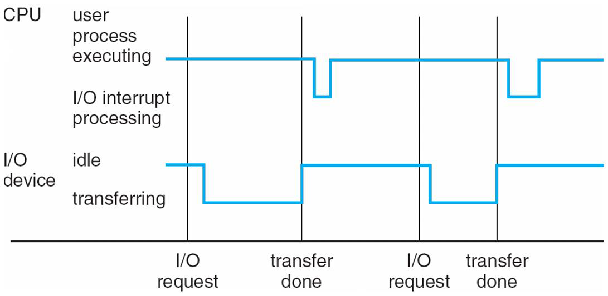

### 폰 노이만 구조
폰 노이만 구조는 현재 컴퓨터의 기반이 되는 구조
1. 명령어 실행 사이클(Instruction-execution cycle)은 첫번째로 메모리에서 명령어를 인출(fetches)하고 
명령어 레지스터(Instruction Register)에 명령어를 저장함
2. 명령어는 그런 다음 디코딩되어 메모리에서 피연산자(처리될 데이터)를 가져올 수 있습니다. 
그리고 내부 레지스터(Internal Register)에 저장됩니다.
3. 명령어 실행 이후의 결과는 메모리에 저장됨

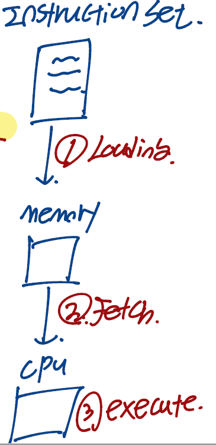

### 저장장치 계층
저장장치 기준
1.  용량(storage capacity)
2.  접근 속도(access time)

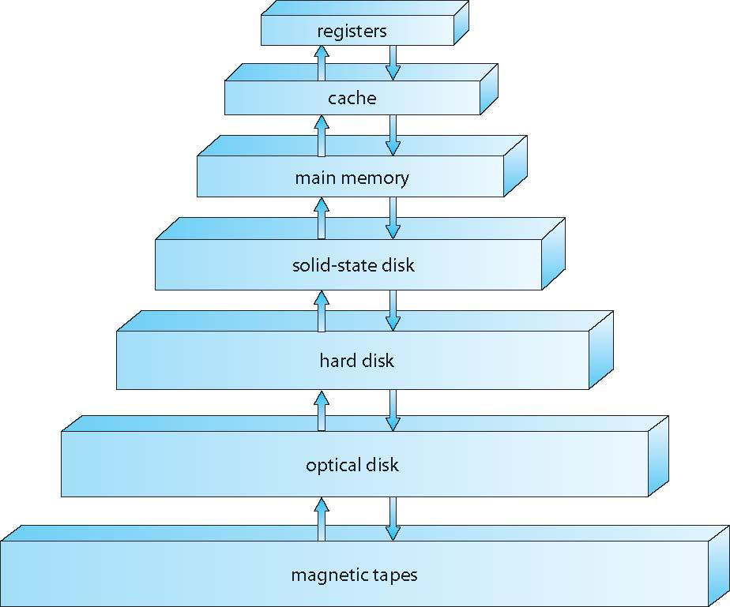
- 위로 갈수록 용량은 적어지지만 접근 속도는 빨라짐
- 아래로 갈수록 용량은 많아지지만 접근 속도는 느려짐

### 입출력 구조(I/O Structure)
운영체제 코드의 많은 부분이 입출력(Input/Output)을 관리하는데 사용되고 있습니다. 
다음 그림은 현대 컴퓨터 시스템이 어떻게 작동하는지를 나타내는 그림입니다.

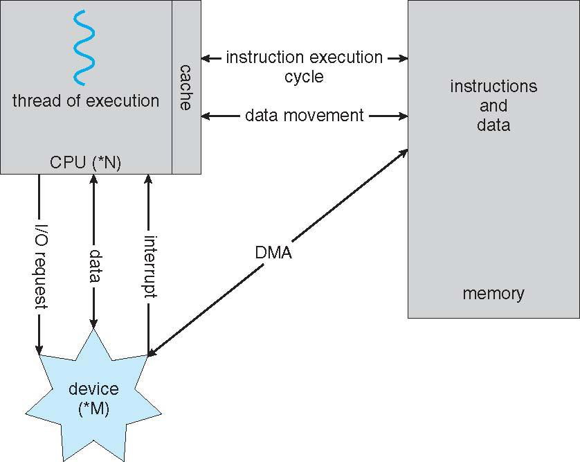

1. CPU는 입출력 기기에게 입출력을 요청합니다. (I/O request)
2. CPU와 입출력 기기는 서로 데이터를 통신합니다. (data)
3. 입출력 기기에서 CPU에게 인터럽트를 전송할 수 있습니다. (interrupt)
4. CPU는 메모리로부터 명령어를 인출하고 실행하여 결과를 다시 메모리에 적재할 수 있음 
(instruction execution cycle, data movement)
5. 입출력 기기와 메모리는 **DMA(Direct Memory Access)**를 직접 접근할 수 있음 (DMA)

### DMA(Direct Memory Access)
- **하드웨어(HDD, 그래픽 카드 등)들이 메모리에 직접 접근하여 읽거나 쓸 수 있도록 하는 기능**
- CPU의 개입이 없음
- CPU가 해야할 주변장치와의 전송을 DMA 장치가 대신하여 CPU 효율을 높힘

## 컴퓨터 시스템 구조
### 컴퓨터 시스템 부품
- CPU : 명령어들을 실행시키는 하드웨어, 프로세서의 종류 중 하나
- Processor : 1개의 이상의 CPU가 포함된 물리적인 칩
- Core : CPU의 각종 연산을 수행하는 핵심 요소
- Multicore : 같은 CPU 위에 여러개의 계산용 코어가 포함되어 있는 것
- Multiprocessor : 프로세서가 여러개 인것

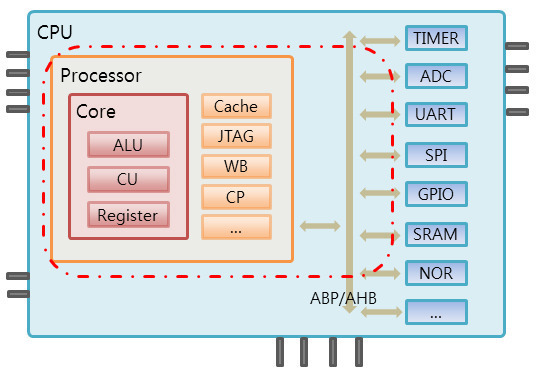

대칭형 다중 처리(Symmetric Multiprocessing, SMP)

-   각각의 CPU 프로세서가 모든 작업을 수행하는 가장 일반적인 다중 프로세서 시스템(multiprocessor systems)

아래 그림은 대칭형 다중 처리의 구조를 나타냅니다.

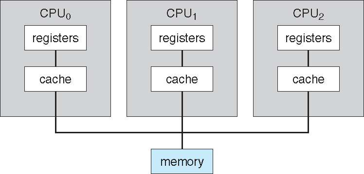

**멀티 코어 설계(Multi-core design)**

-   같은 하나의 물리적인 CPU칩 안에 여러개의 코어들이 포함됨

아래 그림은 같은 칩안에 2개의 코어가 포함된 멀티 코어 설계그림입니다.

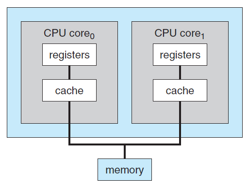

### 1.4 운영체제 연산들(Operating System Operations)

**멀티프로그래밍(Multiprogramming)**

멀티프로그래밍이란 메모리에 여러 개의 응용 프로그램을 적재하는 것입니다. 멀티프로그래밍을 하는 이유는 메모리에 여러개의 프로그램을 올려두어서 CPU가 하나의 프로그램이 대기중일때 다른 프로그램을 수행시켜 효율을 극대화하기 위해서입니다.

아래 그림은 멀티프로그래밍 시스템을 위한 메모리 구조를 나타낸 것입니다. 아래 그림의 job1~4가 각각의 프로그램들입니다.

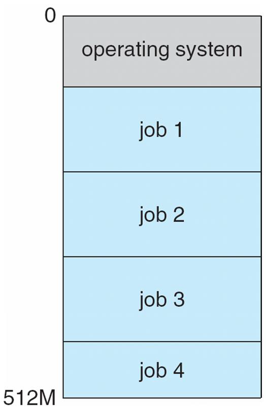

**프로그램이란 무엇인가?**

프로그램이란 **명령어의 집합(Set of Instruction)**이라고 정의할 수 있습니다.

**멀티태스킹=멀티프로세싱(Multitasking=Multiprocessing)이란 무엇인가?**

멀티프로세싱이란 멀티프로그래밍의 논리적인 확장입니다. 위에서 멀티 프로그래밍의 개념은 메모리에 여러개의 프로그램을 올려두어서 CPU가 쉬지않고 일을하게 만들게 하는 것이라고 하였습니다. 그런데 CPU가 하나의 프로그램을 작업하는 동안 다른 프로그램들은 수행되지 않습니다. 하지만 지금의 사용자들은 여러개의 프로그램을 띄우고 동시에 사용합니다. 위와 같이 **프로그램들을 동시에 사용할 수 있게 하는 기술을 멀티프로세싱**이라고 합니다.

위에서 멀티프로세싱이란 프로그램을 동시에 사용할 수 있게 한다고는 하였지만 정확히는 사용자가 동시에 여러개의 프로그램들을 사용하는 것과 같은 착각을 일으킬 정도로 CPU가 빠르게 수행되는 것입니다. 이는 CPU가 동시에 수행되는 것처럼 빈번하게 프로그램들을 교체하기 때문에 사용자들은 여러개의 프로그램들을 사용한다고 생각하는 것입니다.

CPU가 여러개의 프로그램들을 빠르게 교체하기 위해서 프로그램의 실행 순서를 결정하는 CPU 스케줄링을 수행합니다. CPU 스케줄링이란 만약 여러개의 프로세스들이 같은 시간에 실행될 준비가 되었다면 운영체제는 다음에 실행될 프로그램을 결정해야 합니다. 즉, **운영체제가 다음에 CPU의 의해 실행될 프로그램을 고르는 것을 CPU 스케줄링**이라고 합니다.

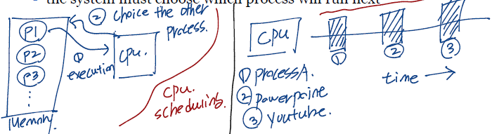

대표적인 CPU 스케줄링 방식으로 시분할 시스템(time-sharing) 방식이 있습니다. 운영체제가 컴퓨터 자원을 일정 시간동안 분할하고 CPU는 해당 프로그램을 배분받은 시간동안만 수행시키고 다른 프로그램을 수행시키는 방식입니다.

**운영체제 연산의 2가지 모드**

1.  유저 모드(user mode)
    -   사용자가 접근할 수 있는 영역을 제한적으로 두고, 프로그램의 자원에 함부로 침범하지 못하는 모드
    -   유저 모드에서 코드를 작성하고, 프로세스를 실행하는 등의 행동을 할 수 있음
2.  커널 모드(kernel mode)
    -   커널 모드란 잘못된 프로그램으로 인해 다른 프로그램이 잘못 실행되지 않도록 하기 위해 사용되는 모드입니다.
    -   커널 모드는 모든 자원(드라이버, 메모리, CPU 등)에 접근, 명령을 할 수 있음

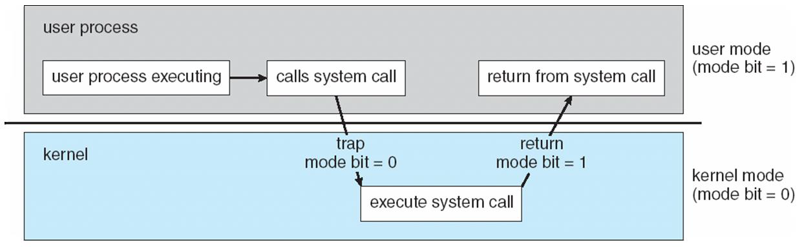

#### **1.7 가상화(Virtualization)**

**가상화(Virtualization)**

가상화 기술은 하나의 컴퓨터 하드웨어 위에서 여러개의 다른 운영체제를 실행하는 기술입니다. 가상화 기술을 사용하면 하드웨어에 VMM(Virtual Machine Manager)를 올리게 됩니다. VMM의 종류로는 Vmare, XEN, WSL 등이 존재합니다.

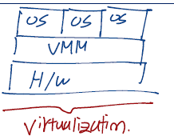

위의 그림에서 (a)는 하나의 운영체제를 올린 것이고 (b)는 하드웨어에 VMM을 통하여 여러개의 운영체제를 수행시키는 모습니다.

### 1.10 컴퓨팅 환경(Computing Environments)

운영체제에는 다양한 컴퓨팅 환경이 있습니다.

-   일반적인 컴퓨터
-   모바일 컴퓨팅(Mobile Computing)
-   클라이언트-서버 컴퓨팅(Client-Server Computing)
-   P2P 컴퓨팅(Peer-to-Peer Computing)
-   클라우드 컴퓨팅(Cloud Computing)
-   실시간 내장 시스템(Real-Time Embedded Systems)

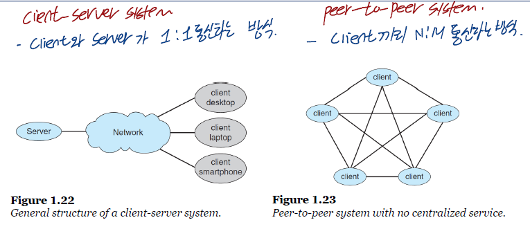

**클라우드 컴퓨팅이란 인터넷을 통해서 서버에 접속하는 컴퓨팅 환경**입니다. 사용자는 오직 클라우드 인터페이스를 통해서만 서버에 접근이 가능합니다.

> [\[인프런\] 운영체제 공룡책 강의](https://www.inflearn.com/course/%EC%9A%B4%EC%98%81%EC%B2%B4%EC%A0%9C-%EA%B3%B5%EB%A3%A1%EC%B1%85-%EC%A0%84%EA%B3%B5%EA%B0%95%EC%9D%98/dashboard)  
> Operating System Concepts, 10th Ed. feat. by Silberschatz et al.  
> http://melonicedlatte.com/computerarchitecture/2019/10/15/143300.html  
> https://blockdmask.tistory.com/69