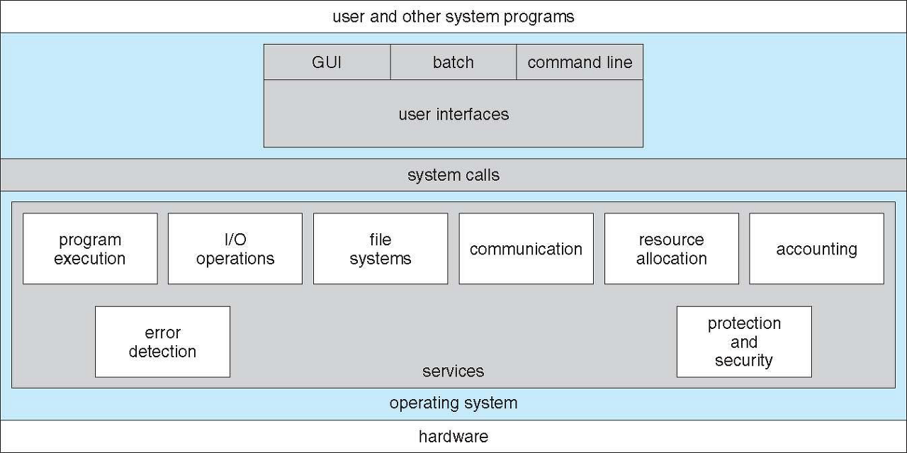
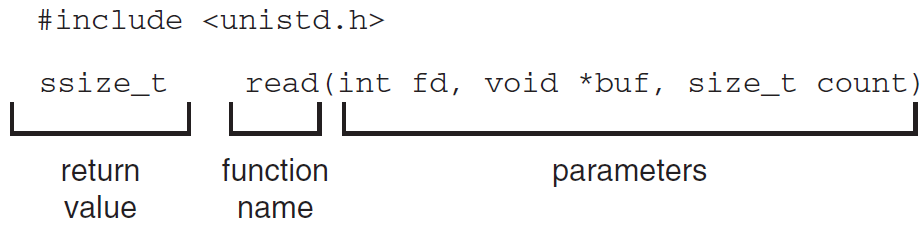
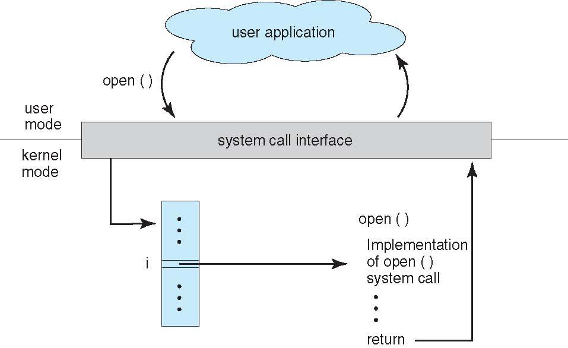
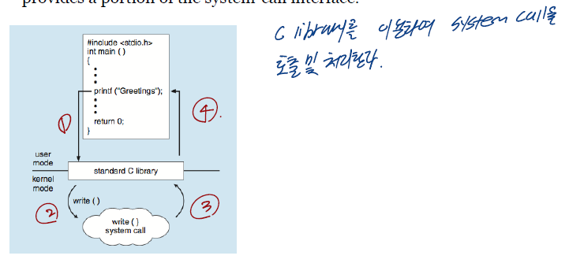

# 운영체제의 제공 서비스
## 목차
- [운영체제의 제공 환경](#운영체제의-제공-환경)
- [유저와 운영체제간 인터페이스](#유저와-운영체제간-인터페이스)
- [시스템 콜(System Calls)](#시스템-콜(System-Calls))
  - [표준 C 라이브러리](#표준-C-라이브러리)

## 운영체제의 제공 환경
- 유저 인터페이스(User Interface)
- 프로그램의 실행(Program execution)
- 입출력 연산(I/O operation)
- 파일 시스템 조작(File-system manipulation)
- 에러 탐색(Error detection)
- 자원 할당(Resource allocation)
- 로깅(Logging)
- 보호 및 보안(Protection and security)

## 유저와 운영체제간 인터페이스
- CLI(Command Line Interface) : 쉘(shells)로 알려진 sh, bash, csh, tcsh, zsh 등이 존재함
- GUI(Graphical User Interface) : Windows, MacOS 등
- Touch-Screen Interface : Android UI, iPhone UI 등

## 시스템 콜(System Calls)
- 프로그램이 운영체제와 통신하기 위한 방법
- OS API(Application Program Interface) : System Calls

- read 함수를 통하여 시스템 콜을 호출
- 커널 모드로 진입하여 파일에 접근

- 프로그램에서 open 함수를 호출하여 시스템 콜을 호출
- 커널 모드로 진입하여 파일에 접근

### 표준 C 라이브러리
- 시스템 콜 인터페이스 일부 제공

### References

> Operating System Concepts, 10th Ed. feat. by Silberschatz et al.  
> [\[인프런\] 운영체제 공룡책 강의](https://www.inflearn.com/course/%EC%9A%B4%EC%98%81%EC%B2%B4%EC%A0%9C-%EA%B3%B5%EB%A3%A1%EC%B1%85-%EC%A0%84%EA%B3%B5%EA%B0%95%EC%9D%98/dashboard)