# 프로세스의 이해
## 목차
- [프로세스 개념](#프로세스의-개념(Process-Concept))
  - [프로세스란 무엇인가?](#프로세스란-무엇인가?)
  - [프로세스 구조](#프로세스-구조)
  - [프로세스 상태](#프로세스-상태)
  - [프로세스 제어 블록(Process Control Block)](#프로세스-제어-블록(Process-Control-Block))
  - [프로세스와 쓰레드의 구분](#프로세스와-쓰레드의-구분)
- [프로세스 스케줄링](#프로세스의-스케줄링)
  - [멀티 프로그래밍 목적](#멀티-프로그래밍-목적)
  - [시분할 시스템 목적](#시분할-시스템-목적)
  - [스케줄링 큐](#스케줄링-큐)
  - [문맥 교환(Context Switch)](#문맥-교환(Context-Switch))

## 프로세스의 개념(Process Concept)
### 프로세스란 무엇인가?
- 실행중인 프로그램
- **메모리 위에 적재된 프로그램**
- 프로세스는 운영체제에서 작업 단위
- 프로세스는 작업의 최소 단위인 테스크(Task)를 완료하기 위해서 다음과 같은 자원(resources)가 필요함
    -   CPU의 점유
    -   메모리(memory)
    -   파일(files)
    -   입/출력 장치(I/O devices)

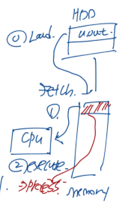
1. 보조기억장치(HDD)에서 프로그램을 메모리 위로 적재함
2. CPU는 프로그램의 명령어를 CPU로 인출함
3. 인출한 명령어를 실행함

### 프로세스 구조
- Text Section : 실행가능한 코드를 저장하는 공간
- Data Section : 전역 변수를 저장하는 공간
- Heap Section : 프로그램 실행동안 동적으로 할당되는 변수가 저장되는 공간
- Stack Section : 함수가 실행되는 동안 지역변수가 저장되는 임시 공간, 대표적으로 함수 매개변수, 리턴 주소, 지역 변수 등이 포함됨

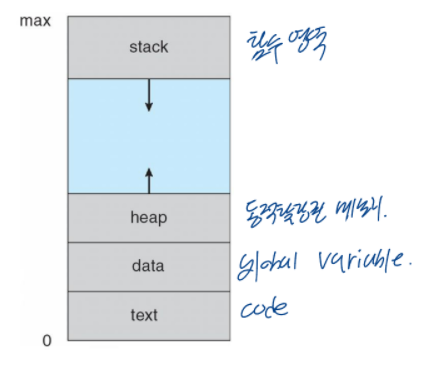

```text
#include <stdio.h>
#include <stdlib.h>

int x;
int y = 15;

int main(int argc, char *argv[])
{
    int *values;
    int i;

    values = (int *) malloc(sizeof(int)*5);

    for(i=0; i<5; i++)
    {
        values[i] = i;
    }
    return 0;
}
```
- Stack Section : main, values, i
- Heap Section : (int \*) malloc(sizeof(int)\*5)
- Data Section
  - uninitialized data : x
  - initialized data : y
- Text Section : 코드 텍스트

아래의 그림은 위 코드를 컴파일하고 영역간의 사이즈를 출력한 결과입니다.

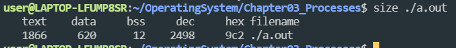
- Text Section : 1866
- Data Section : 620

### 프로세스 상태
- New : 프로세스가 생성된 상태
- Running : 프로세스가 수행되는 상태
- Waiting : 프로세스 이벤트가 발생되어 입/출력 완료를 기다리는 상태
- Ready : 프로세스가 프로세서에 의해 실행되기를 기다리는 상태(언제라도 실행 가능)
- Terminated : 프로세스 실행 종료 상태

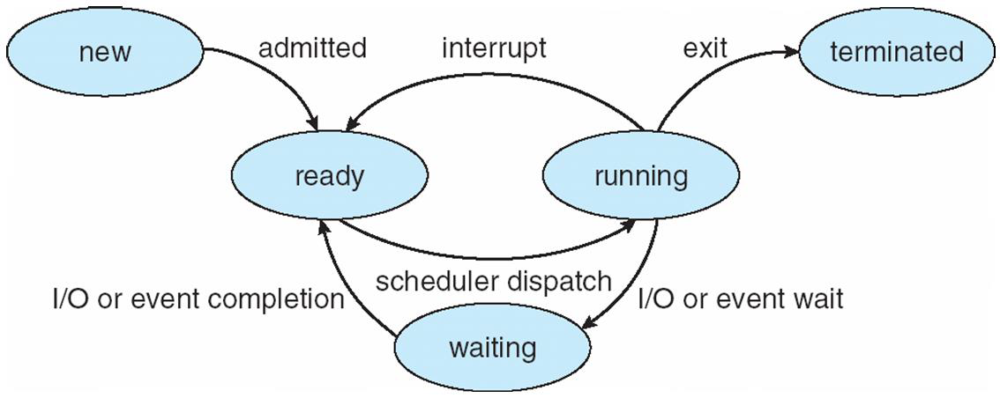

### 프로세스 제어 블록(Process Control Block)
#### 프로세스 제어 블록이란 
- PCB는 하나의 프로세스에 연관된 정보들을 포함합니다.

#### 프로세스 제어 블록 구성 정보
- 프로세스 상태(Process State) : new, ready, running, waiting, terminated 상태 중 하나에 해당됨
- 프로그램 카운터(Program Counter) : 메모리의 다음 명령어 주소를 저장함
- CPU 레지스터(CPU registers) : IR(Instruction Register), DR(Data Register), PC(Program Counter)와 같은 저장공간이 포함됨
- CPU 스케줄링 정보(CPU-scheduling information) : 프로세스 실행 순서를 정하는 정보
- 메모리 관리 정보(Memory-management information)
- 통계 정보(Accounting Information) : 프로세스의 실행, 시간 제한, 실행 ID 등에 사용되는 CPU양의 정보
- 입/출력 상태 정보(I/O status information)

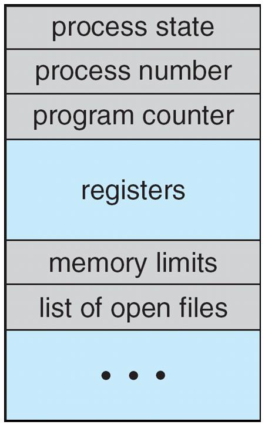

### 프로세스와 쓰레드의 구분
#### 프로세스
- 하나의 싱글 쓰레드를 실행하는 프로그램
- 한번에 하나의 최소 작업 단위(Task)만 실행이 가능함
- 현대의 운영체제는 멀티프로세싱으로 발전함, 따라서 운영체제의 핵심 기능은 멀티프로세싱(Multiprocessing)을 제공하는 것임

#### 쓰레드
- 하나의 싱글 쓰레드에서 파생되어 프로세스 안에 또다른 작은 프로세스를 의미함

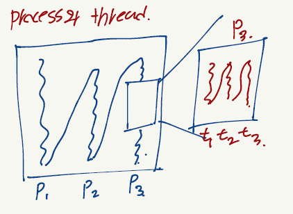

## 프로세스의 스케줄링
### 멀티 프로그래밍 목적
- 동시에 여러 프로세스를 실행
- CPU 효율 극대화

### 시분할 시스템 목적
- 사용자가 각각의 프로그램을 동시에 수행되는 것처럼 보이게 하기 위해서

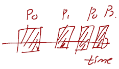

### 스케줄링 큐
- 프로세스들이 Ready 상태이고 CPU Core 위에서 실행하기 위해서 기다리다면 프로세스들은 Ready Queue에 삽입됨
- 특정한 이벤트가 발생되기를 기다리는 프로세스들은 Wait Queue에 위치함
- Ready Queue 또는 Wait Queue와 같은 큐들은 일반적으로 PCB들의 연결리스트에서 구현됩니다.

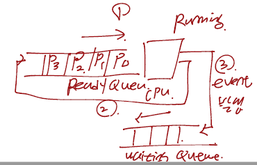

아래 그림은 Ready Queue와 Wait Queue들을 표현한 것입니다

#### Ready Queue와 Wait Queue
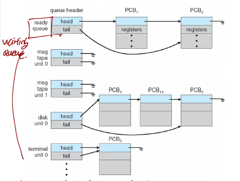

#### 프로세스 스케줄링의 대기열 다이얼그램
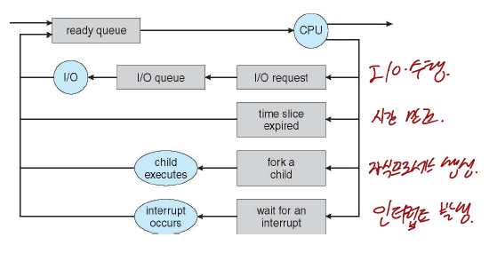

### 문맥 교환(Context Switch)
- **마지막에 수행했던 명령어 위치**
- 프로세스의 문맥(Context)은 PCB에 표시
- 인터럽트가 발생했을 때 운영체제는 현재 수행중인 프로세스의 문맥을 저장하고 다시 그 프로세스를 수행할 때 저장했던 문맥을 복구합니다.
- Context Switch
  - **CPU Core를 다른 프로세스에게 양도하는 것**
  - 현재 프로세스의 상태를 저장함
  - Context Switch하게되면 다른 Process Context를 복원함

#### P0와 P1의 문맥 교환
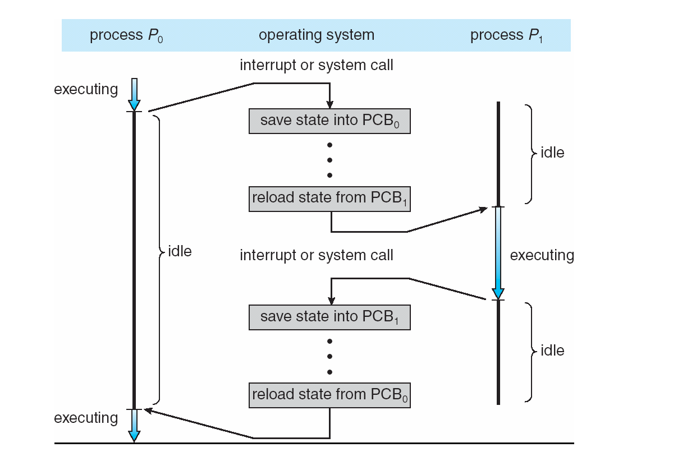
1. 프로그램 실행중 인터럽트 또는 시스템 콜 발생시 현재 프로세스의 상태를 PCB에 저장
2. 다른 프로세스를 수행하기 위해서 또 다른 PCB에서 문맥을 복원하여 수행

### References
> Operating System Concepts, 10th Ed. feat. by Silberschatz et al.  
> [\[인프런\] 운영체제 공룡책 강의](https://www.inflearn.com/course/%EC%9A%B4%EC%98%81%EC%B2%B4%EC%A0%9C-%EA%B3%B5%EB%A3%A1%EC%B1%85-%EC%A0%84%EA%B3%B5%EA%B0%95%EC%9D%98/dashboard)