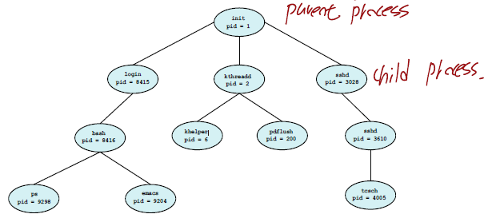
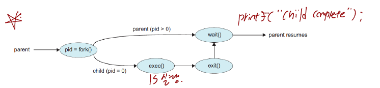

# 프로세스의 생성
## 목차
- [x] [프로세스 연산들](#프로세스의-연산들)
  - [x] [부모 프로세스와 자식 프로세스](#부모-프로세스와-자식-프로세스)
  - [x] [부모 프로세스와 자식 프로세스 관계](#부모-프로세스와-자식-프로세스-관계)
  - [x] [좀비 프로세스와 고아 프로세스](#좀비-프로세스와-고아-프로세스)
  - [x] [exit](#exit)
  - [x] [fork](#fork)
  - [x] [wait](#wait)
 
# 프로세스의 연산들
## 부모 프로세스와 자식 프로세스
- 운영체제는 프로세스를 생성하거나 종료할 수 있습니다.
- 부모 프로세스(Parent Process) : 기존에 생성한 프로세스
- 자식 프로세스(Child Process) : 기존 생성한 프로세스에 의해서 다시 생성된 프로세스



## 부모 프로세스와 자식 프로세스 관계
### 프로세스 실행 두가지 경우
1. 부모 프로세스와 자식 프로세스가 동시에 실행
2. 부모 프로세스가 자식 프로세스가 종료될때까지 대기

### 프로세스 주소 공간 두가지 경우
1. 자식 프로세스가 부모 프로세스와 동일한 프로그램 실행
2. 자식 프로세스가 부모 프로세스와 다른 프로그램 실행

### 부모 프로세스의 자식 프로세스 호출 예제
```
#include <stdio.h>
#include <unistd.h>
#include <wait.h>

int main()
{
    pid_t pid;

    // 자식 프로세스 생성
    pid = fork();
    
    if(pid<0)   // 에러 발생
    {
        fprintf(stderr, "Fork Failed");
        return 1;
    }
    else if(pid==0) // 자식 프로세스인 경우
    {
        execlp("/bin/ls","ls",NULL);
    }
    else    // 부모 프로세스인 경우
    {
        wait(NULL); // 자식 프로세스가 종료될때까지 대기
        printf("Child Complete\n");
    }

    return 0;
}
```
```
a.out  ch03_01_memory-Layout.c  ch03_02_parent-childProcess.c
Child Complete
```

1. 부모 프로세스가 fork() 호출시 자식 프로세스를 생성하고 fork() 함수 반환값으로 자식 프로세스의 프로세스 아이디 반환
2. 부모 프로세스의 pid는 pid > 0이므로 자식 프로세스가 종료될때까지 대기함
3. 자식 프로세스의 pid는 pid = 0이므로 ls 명령어를 수행하고 종료
4. 부모 프로세스는 자식 프로세스가 종료되자마자 출력문을 수행하고 종료

위 코드의 수행과정을 그림으로 표현하면 다음과 같습니다.



## 좀비 프로세스와 고아 프로세스
- 좀비 프로세스 : 실행이 종료되었지만 아직 삭제되지 않은 프로세스
- 고아 프로세스 : 부모 프로세스가 자식 프로세스보다 먼저 종료된 프로세스

## exit
- 프로세스를 종료하는 시스템 콜
- 프로세스의 종료는 마지막 명령어를 실행하고 나서 종료됨
- 운영체제는 프로세스가 종료되면 자원을 해제함

## fork
- 새로운 프로세스를 생성하는 시스템 콜
- 자식 프로세스는 부모 프로세스의 복사본이 됨
- 새로 생성된 프로세스는 fork 이후 명령문을 실행함
- fork 호출시 반환값
  - 부모 프로세스 : 자식 프로세스의 아이디를 반환함
  - 자식 프로세스 : 부모 프로세스에게 프로세스 번호 0을 할당받음

```
#include <stdio.h>
#include <unistd.h>

int main()
{
    pid_t pid;

    pid = fork();
    printf("Hello, Process! %d\n",pid);
    return 0;
}
```
```
Hello, Process! 15389
Hello, Process! 0
```

위 실행결과를 보면 부모 프로세스가 가지는 pid 값은 자식 프로세스의 프로세스 아이디=15389입니다.

자식 프로세스의 pid값은 0입니다.

## wait
- 자식 프로세스가 종료될때까지 대기하는 시스템 콜 명령어

```
#include <stdio.h>
#include <unistd.h>
#include <wait.h>

int main()
{
    pid_t pid;

    pid = fork();
    
    if(pid>0)
    {
        wait(NULL);
    }
    printf("Hello, Process! %d\n", pid);
    return 0;
}
```
```
Hello, Process! 0
Hello, Process! 16330
```