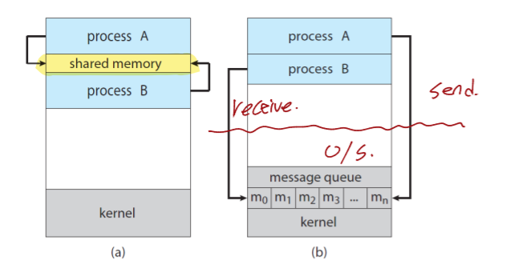
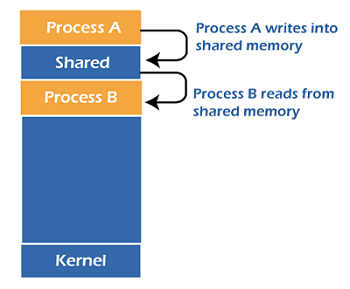
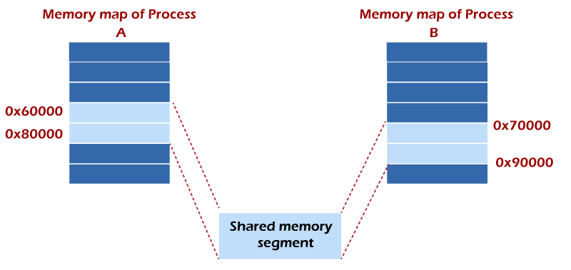

# 프로세스 통신
## 목차
- [x] [프로세스 통신](#프로세스-통신)
  - [x] [IPC](#IPC)
  - [x] [IPC 모델](#IPC-모델)
- [ ] [프로세스 통신 방법](#프로세스-통신-방법)
  - [x] [공유 메모리](#공유-메모리)
  - [ ] 메시지 전송

# 프로세스 통신
## IPC
IPC(Interprocess Communication)는 프로세스들간의 데이터를 보내거나 데이터를 받아 데이터를 공유하는 것

## IPC 모델
1. 공유 메모리
2. 메시지 송수신



# 프로세스 통신 방법
## 공유 메모리
- **공유 메모리(Shared Memory) 통신 방법은 각각의 프로세스가 공유 메모리 공간을 통해서 프로세스간의 데이터를 공유하는 기술**
- 각각의 프로세스는 공유된 데이터를 저장할 공간을 가지고 있음

### 공윺 메모리 통신 장점
- 프로세스 간 통신 방법 중 가장 빠름
  - 운영 체제는 여러 프로세스의 주소 공간에 있는 메모리 세그먼트를 매핑하여 운영체제 기능을 호출하지 않고 해당 메모리에서 읽고 쓸 수 있기 때문
- 대용량 데이터 교환시 메시지 큐 방식보다 좋음

### 공유 메모리를 사용하기 위한 방법
1. 프로세스 간에 공유할 수 있는 메모리 세그먼트를 운영체제게 요청
2. 해당 메모리 일부 또는 전체 메모리를 호출한 프로세스의 주소 공간과 연결

### 공유되는 메모리 세그먼트는 무엇인가
- 여러개의 프로세들에 의해서 공유되는 물리적인 메모리 공간
- 다른 프로세스가 구조체를 만들 수 있고 다른 프로세스가 구조체를 읽고 쓸 수 있음



두개 이상의 프로세스들간에 공유 메모리가 형성될때 각 프로세스들이 복사하여 가지는 주소 공간에 베이스 주소가 다를 수 있습니다.



### IPC로 공유 메모리를 선택한 이유
- 파이프 방식이나 메시지 큐 방식 같은 경우 데이터를 교환하기 위해서는 커널을 통해서 교환해야합니다.
- 반면 공유 메모리 방식은 메모리에 저장된 곳을 프로세스가 참조하기 때문에 커널을 통하지 않고 데이터를 교환할 수 있습니다.

### 공유 메모리를 사용한 IPC 함수 기능
- shmget : 공유 메모리 세그먼트 생성
- shmat : 공유 메모리 세그먼트를 프로세스의 주소 공간과 연결

#### shmget
shmget 문법
```
#include <sys/ipc.h>   
#include <sys/shm.h>   
int shmget (key_t key, size_t size, int shmflg);  
```
- key : 공유된 메모리 세그먼트를 식별하는 고유 번호
- size : 공유된 메모리 세그먼트의 크기
  - ex) 1024byte 또는 2048byte
- shmflg
  - 함수 동작 관련 플래그, IPC_CREAT, IPC_EXCL 로 구성된다. 
  - IPC_CREAT : 새로운 공유 메모리를 할당한다. 만약 이 플래그가 사용되지 않는다면, shmget() 함수는 key 와 연관된 공유 메모리를 찾고 사용자가 메모리에 접근할 수 있는 권한이 있는지 확인한다. 
  - IPC_EXCL : IPC_CREAT 와 함께 사용되며, 만약 공유 메모리가 이미 할당되어있다면 실패(-1)를 반환한다
  - 할당 성공시 공유 메모리 세그먼트 식별자가 값을 반환함

#### shmat
```
#include <sys/types.h>  
#include <sys/shm.h>  
void *shmat(int shmid, const void *shmaddr, int shmflg);  
```
- shmid : 공유 메모리 세그먼트 식별자값
- shmaddr : 호출하는 프로세스의 연결하고자 하는 주소 공간
  - NULL인 경우 운영체제가 자동으로 맞춰줌
- shmflag
  - shmaddr = null이고 shmflag = 0이됨
  - 그외는 SHM_RND에 의해서 명시됨

### 공유 메모리 사용 IPC의 수행 방법
프로세스는 shmget 함수를 사용해서 공유 메모리 세그먼트 생성한다. 

공유 메모리 세그먼트를 만든 프로세스는 shmctl 함수를 사용하여 다른 사용자에게 소유권을 할당할 수 있습니다.

반대로 소유권 할당또한 회수할 수 있습니다. 적절한 허가를 가진 다른 프로세들은 shmctl 함수를 사용하여 공유된 메모리 세그먼트에
다양한 제어 함수를 수행할 수 있습니다.

일단 공유된 메모리 세그먼트가 만들어지면 shmat 함수를 사용하여 프로세스의 특정한 주소 공간에 복사하여 저장할 수 있습니다.

반대로 shmdt 함수를 사용하여 분리할 수 있습니다. 

연결된 프로세스에는 shmat 함수에 대한 적절한 권한을 가지고 있어야 합니다.

일단 연결이 되면 프로세스는 세그먼트에 읽기 또는 쓰기를 할 수 있습니다.

세그먼트의 식별자는 shmid라고 부릅니다.

공유된 메모리 세그먼트에 대한 구조 설명은 <sys/shm.h>에서 확인할 수 있습니다.

### 공유 메모리 예제
첫번째 프로그램은 공유된 메모리 세그먼트를 생성하고 내용을 작성합니다.

두번째 프로그램은 메모리 세그먼트를 읽습니다.

```c
#include<stdio.h>  
#include<stdlib.h>  
#include<unistd.h>  
#include<sys/shm.h>  
#include<string.h>  
int main()  
{  
  int i;  
  void *shared_memory;  
  char buff[100];  
  int shmid;  
  shmid=shmget((key_t)2345, 1024, 0666|IPC_CREAT);   
  //creates shared memory segment with key 2345, having size 1024 bytes. IPC_CREAT is used to create the shared segment if it does not exist. 0666 are the permissions on the shared segment  
  printf("Key of shared memory is %d\n",shmid);  
  shared_memory=shmat(shmid,NULL,0);   
  //process attached to shared memory segment  
  printf("Process attached at %p\n",shared_memory);   
  //this prints the address where the segment is attached with this process  
  printf("Enter some data to write to shared memory\n");  
  read(0,buff,100); //get some input from user  
  strcpy(shared_memory,buff); //data written to shared memory  
  printf("You wrote : %s\n",(char *)shared_memory);  
}  
```
```
Key of shared memory is 0
Process attached at 0x7ffe040fb000
Enter some data to write to shared memory 
Hello World
You wrote: Hello World 
```


```
#include<stdio.h>  
#include<stdlib.h>  
#include<unistd.h>  
#include<sys/shm.h>  
#include<string.h>  
int main()  
{  
  int i;  
  void *shared_memory;  
  char buff[100];  
  int shmid;  
  shmid=shmget((key_t)2345, 1024, 0666);  
  printf("Key of shared memory is %d\n",shmid);  
  shared_memory=shmat(shmid,NULL,0); //process attached to shared memory segment  
  printf("Process attached at %p\n",shared_memory);  
  printf("Data read from shared memory is : %s\n",(char *)shared_memory);  
}  
```
```
Key of shared memory is 0
Process attached at 0x7f76b4292000
Data read from shared memory is: Hello World 
```

## 메시지 전송
메시지 큐는 두 프로세스 사이에서 데이터를 교환하기 위한 IPC 통신 방식들 중 하나입니다.

프로세스는 메시지가 대기열에 저장되고 처리 대기중이며 처리후 삭제되는 서로에게 메시지를 전송하여 비동기적으로 통신할 수 있습니다.


메시지 큐는 공유된 변수들에 접근하는 것보다 서로에게 메시지를 전달하여 통신하는 테스크가 존재하는 비공유 메모리 환경에서 사용되는 버퍼입니다.

테스크들은 공용 버퍼 풀을 공유합니다.

메시지 큐는 여러개의 쓰레드로부터 동시에 접근되는 것을 보호된 선입선출 큐입니다.

이벤트들은 비동기적입니다. 한 클래스가 다른 클래스에게 이벤트를 송신할때 목적징 클래스로 직접 보내는 대신

운영체제 메시지 큐로 이벤트를 전달합니다. 

목적지 클래스는 이벤트를 처리할 준비가 되면 메시지 큐의 헤드에서 이벤트를 꺼냅니다.

대신 트리거된 연산들을 사용하여 동기적인 이벤트를 전달할 수 있습니다.

많은 테스크들이 큐로 메시지들을 작성할 수 있습니다. 그러나 오직 하나만이 한순간에 큐로부터 메시지를 읽을 수 있습니다.

판독기(reader)는 처리할 메시지가 있을때까지 메시지 대기열에서 대기합니다. 메시지 크기는 제한이 없습니다.

### 메시지 큐의 기능들
- int msgget (key_t key, int msgflg)
- int msgsnd (int msqid, const void *msg_ptr, size_t msg_sz, int msgflg)
- int msgrcv (int msqid, void *msg_ptr, size_t msg_sz, long int msgtype, int msgflg)
- int msgctl (int msqid, int command, struct msqid_ds *buf)

#### int msgget (key_t key, int msgflg)
메시지 큐에 접근하고 생성하기 위해서 msgget 함수를 사용합니다. 파라미터는 다음과 같습니다.

- 메시지 큐의 이름
- 메시지 큐에 사용 권한을 할당하는 데 사용되며 ORed와 IPC_CREATE와 함께 처리되어
큐가 아직 없는 경우 큐를 생성합니다. 큐가 이미 있으면 IPC_CREATE는 무시됩니다.
할당에 성공하면 msgget 함수는 큐 식별자인 양수를 반환하고 실패하면 -1을 반환함

#### int msgsnd (int msqid, const void *msg_ptr, size_t msg_sz, int msgflg)
메시지 큐에 메시지를 추가하는 기능. 파라미터는 다음과 같습니다.

- 메시지 큐 식별자 값
- 전송하고자 하는 메시지를 가리키는 포인터
- 메시지 사이즈
- 제어신호들, 만약 메시지 큐가 가득찼거나 메시지 큐가 한계에 도달했을때 발생하는 신호들
함수가 성공하면 0을 반환하고 메시지 큐에 메시지 데이터의 복사본이 넣어집니다.
실패하면 -1을 반환합니다.

메시지의 구조와 관련된 2가지 제약이 있습니다.

첫번째는 시스템이 제한한 크기보다 메시지의 크기가 작아야합니다.

두번째는 long int 타입이어야 합니다.

```
struct my_message   
{  
  long int message_type;  
  /* The data you wish to transfer */  
}  
```

#### int msgrcv (int msqid, void *msg_ptr, size_t msg_sz, long int msgtype, int msgflg)
메시지 큐에서 메시지들을 가져오는 기능입니다.


## References
- [IPC through Shared Memory](https://www.javatpoint.com/ipc-through-shared-memory)
- [IPC using Message Queues](https://www.javatpoint.com/ipc-using-message-queues)

 