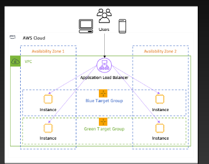

# EC2

## Amazon EC2
- Elastic Computing Cloud
- 가상 컴퓨터 인스턴스를 제공하여 사용자가 필요한 만큼
컴퓨팅 자원을 빠르게 생성하고, 확장하고, 조정할 수 있도록 해주는 서비스입니다.
- Instance
  - 가상 컴퓨터
  - 사용자가 선택한 운영 체제와 소프트웨어를 실행시킬 수 있습니다.
- Comtainers
  - Docker와 같은 컨테이너 기술을 사용하여 애플리케이션을 실행하고 배포하는데 사용되는 가상화 기술입니다.
- Serverless
  - AWS Lambda와 같은 이벤트 기반 서비스를 통해 인프라를 추상화하고 코드 실행에 중점을 둔 컴퓨팅 서비스입니다.
  - AWS Lambda는 이벤트 기반 서비스로, 코드 실행에 집중된 서버리스 컴퓨팅 서비스입니다.
- Hybrid
  - 온프레미스와 클라우드를 연결하는 하이브리드 클라우드 솔루션입니다.

## EC2 특징
- 초당 요금 계산
- 인스턴스를 빠르게 생성하고 서비스 운영이 가능합니다.
- ELB, Auto Scaling, S3등 다양한 서비스와 연동됩니다.
  - ELB(Elastic Load Balancer) : 트래픽을 분산 관리합니다.
- Linux, Windows, MacOS 운영체제를 지원합니다.

## EC는 AZ 기반 서비스
- EC2와 주요 구성요스들은 AZ 기반입니다.
- 고가용성을 위해서는 MultiAZ를 이용 가용성을 확보해야 합니다.
- Multi AZ
  - 둘 이상의 AZ를 활용해서 서비스를 구축해야 합니다.
  - 두 대 이상의 서버가 필요합니다.
  - 주로 ELB를 이용해서 서버를 연결해서 사용합니다.

## EC2 관련 서비스들
- EC2 : 서버, 주로 CPU + Memory입니다.
- EBS(Elastic Block Storage) : EC2의 블록 저장장치, SSD, AZ 서비스
- VPC(Virtual Private Cloud) : EC2가 연결되는 사설 네트워크 망, 리전 기반
- Subnet : VPC의 하위망, AZ 서비스로 EC2는 subnet에 연결됩니다.
- ENI(Elastic Network Interface) : 가상 네트워크 인터페이스, 가상 랜카드, AZ 서비스
- security group : EC2의 방확벽 기능, 포트 접근을 제어합니다.
- ELB(Elastic Load Balancer) : 트래픽 분산 관리합니다.
- Auto Scaling : EC2의 확장성을 위해 제공되는 서비스입니다. 
- EBS Snapshot : EBS의 백업 데이터를 저장하기 위해 사용됩니다.
- AMI(Amazon Machine Image) : EC2 서버의 백업 이미지, EC2를 시작할대 사용합니다.
  - AWS에서 제공하는 AMI를 이용해서 EC2를 시작합니다.
  - 사용자가 원하는 시점에 AMI를 생성하고 이를 통해 EC2 시작이 가능합니다.

### VPC, ELB, EC2 예제

