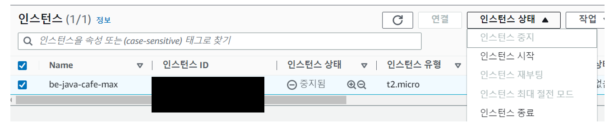
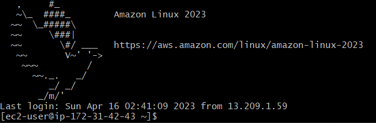
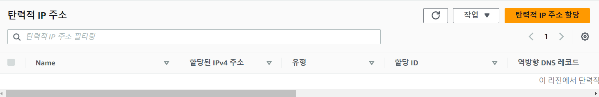
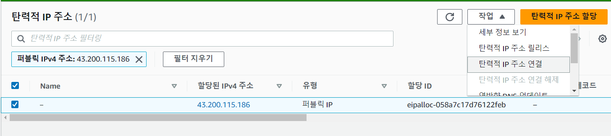
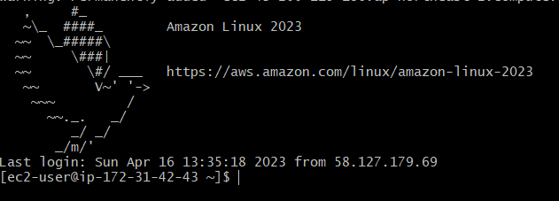

# EC2 실습

## EC2 생성

### EC2 생성전 주의사항

- 자기 계정이 맞는지 확인
- 리전이 서울인지 확인

### EC2 생성 과정

1. 서비스 -> EC2 선택
2. 인스턴스 시작 클릭
3. AMI 선택
    1. Amazon Linux 2 AMI 선택
4. 인스턴스 유형 선택
    1. t2.micron , 프리티어
5. 인스턴스 세부 정보 구성
    1. 스팟 인스턴스 요청 해제
    2. 기본값 vpc 선택
    3. EC2 SUBNET 연결, 기본 설정 없음 선택
    4. 퍼블릭 IP 자동 할당 선택
6. 스토리지 추가
    1. 크키 : 8
    2. 볼륨 유형 : 범용 SSD, 기본값
7. 태그 추가
    1. 키 : Name, 값 : be-java-cafe-max
8. 보안 그룹 생성
    1. demo-sg
9. 키 페어 생성
    1. 이름 : be-java-cafe-max

https://yonghwankim-dev.tistory.com/583

## EC2 접속 방법

1. EC2 인스턴스 연결
2. Session Manager
3. SSH 클라이언트

가장 간단한 방법은 EC2 인스턴스 연결 방법입니다.

## EC2 정지 또는 종료 방법

1. 인스턴스 선택
2. 인스턴스 상태 -> 인스턴스 중지 또는 종료



인스턴스는 중지 중이여도 디스크가 살아있기 때문에 요금이 계속 나오게됩니다.

요금이 안나오게 하려면 완전히 종료해야합니다.

프리티어도 1년동안 요금이 나오지 않지만 1년 후에는 요금이 청구됩니다.

## EC2 SSH 접속

윈도우에서는 git-bash를 설치하면 동일하게 EC2에 접속할 수 있습니다.

1. 인스턴스 퍼블릭 IP 확인
2. 인스턴스 연결 -> SSH 클라이언트 선택
3. pem 파일 권한 변경
    - chmod 400 pem파일.pem
4. SSH 연결
    - 명령어 형식 : ssh -i pem파일.pem ec2-user@public-ip

```shell
$ chmod 400 be-java-cafe-max.pem
$ ssh -i "be-java-cafe-max.pem" ec2-user@ec2-13-209-48-7.ap-northeast-2.compute.amazonaws.com
```



## 인스턴스 팁

- 안쓰는 인스턴스는 중지 또는 종료
- 다음에 다시 써야 한다면 중지
- 새로 만들 예정이라면 종료
- 중지 후 재시작하면 IP가 변경됩니다.
- 고정 IP가 필요하면 Elastic IP를 사용자

## 탄력적 IP 사용 방법

1. 네트워크 보안 -> 탄력적 IP 선택



2. 생성
3. 탄력적 IP Name 작성
4. 작업 -> 탄력적 IP 주소 연결



5. 인스턴스 선택


6. IP 확인후 SSH 접속



## 탄력적 IP 주의 사항

- 사용중에는 무료
- 사용하지 않을 경우 과금됨. 월 4천원 정도
- 탄력적 IP를 연결하지 않을 때 과금되고 탄력적 IP와 연결된 인스턴스가 중지 상태일때 과금됩니다.
- 사용하지 않을 경우 반납하자
- 서비스 중인 IP를 삭제하면 장애가 발생함

