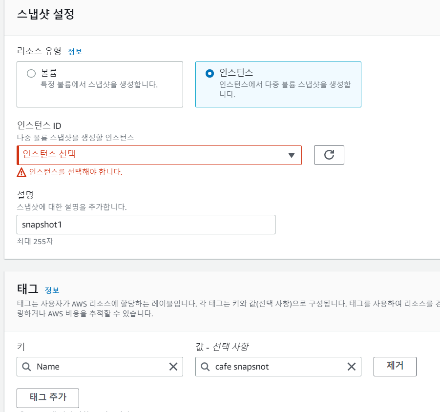
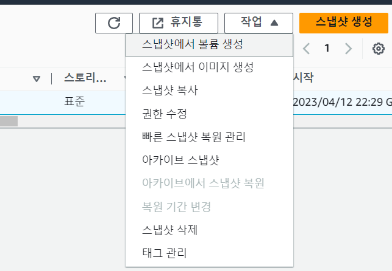
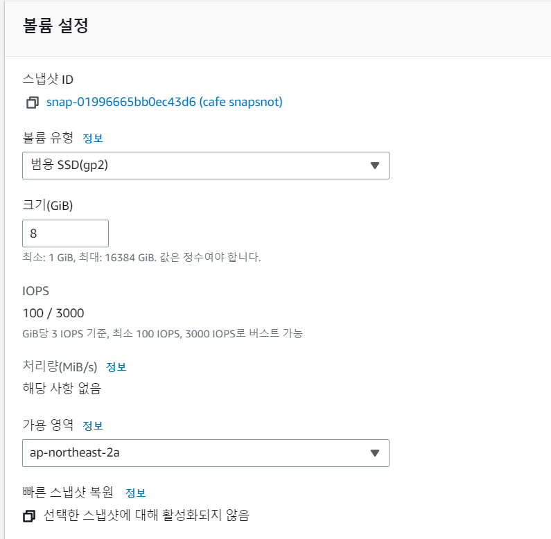
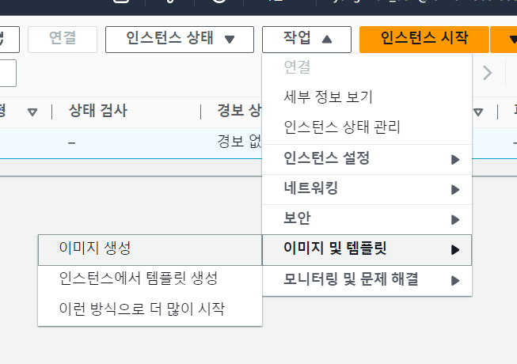
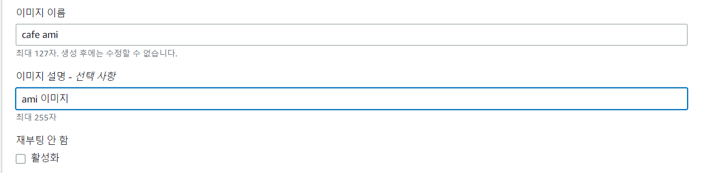

# EC2_실습

## ESBS 스냅샷

- EBS 스냅샷 : EBS 데이터를 백업하는 것
- 리전 서비스
- 스냅샷은 S3에 저장됨
- 증분으로 관리되므로 용량 및 비용 효율적
    - 스냅샷을 여러개 만든다고 용량을 차지하는 것이 아니고 변경된 부분만 반영되서 용량 및 비용에 효율적이다.
- 인스턴스는 중지중에 사용하는 것이 권장됨
- EBS는 AZ 서비스지만 스냅샷을 이용해서 다른 AZ로 복사 가능함

## 스냅샷 생성

1. 스냅샷 메뉴 입장
    - aws 대시보드 페이지 -> Elastic Block Store -> 스냅샷 클릭


2. 스냅샷 생성
    1. 리소스 유형 : 인스턴스
    2. 인스턴스 ID : 기존 생성한 인스턴스 선택
    3. 설명 및 태그 작성



## 스냅샷을 이용한 볼륨 생성

1. 스냅샷 메뉴 입장
2. 작업 -> 스냅샷에서 볼륨 생성
3. 가용 영역 선택
4. 태그 추가




## 인스턴스를 이용한 AMI 생성

1. AMI 만들 인스턴스 선택
2. 작업 -> 이미지 및 템플릿 -> 이미지 생성
3. 이미지 이름 작성
4. 생성 버튼 클릭
5. AMI 메뉴가서 생성 확인
6. 스냅샷 메뉴가서 AMI 생성으로 인한 스냅샷 생성 확인
    - AMI 삭제시 남아있는 스냅샷도 따로 제거해야함






## AMI를 이용한 새로운 인스턴스 생성

1. AMI 선택
2. 작업 -> 시작하기
3. 인스턴스 유형 선택
4. 인스턴스 세부 정보 구성
    - 서브넷 : ap-northeast-2b, 기존 2a
    - public IP 자동 할당 : 서브넷 사용 설정, 활성화
5. 스토리지 추가
6. 태그 추가
7. 보안 그룹 구성
    - 기존 인스턴스의 security-group 재사용
8. 시작하기
    - 키페어 기존 것을 선택

## EC2 meta data

- EC2 인스턴스 내에서 자신의 정보를 확인할 때 사용합니다.
- ec2의 public IP 알아보기

```
$ curl -w '\n' http://169.254.169.254/latest/meta-data/public-ipv4    
```

## EC2 Role 사용해보기

- EC2 Role : EC2 인스턴스가 다른 AWS 리소스(S3 등)를 제어할 때 사용하는 IAM Role입니다.
- EC2 안에서 CLI을 이용하여 설정할 수도 있지만 EC2 Role을 사용하는 것이 더 안전합니다.
- EC2 Role을 사용하기 위해서는 추가적인 IAM 권한이 필요합니다.

### S3 서비스를 이용할 수 있는 역할 생성

1. 역할 만들기
    - 액세스 관리 -> 역할 -> 역할 만들기 -> AWS 서비스 선택
2. AmazonS3FullAccess 정책 선택
3. 검토 정보 입력
    - 이름 : ec2-s3-full

### 개발 계정이 인스턴스에 대해서 IAM 역할 수정을 할 수 있도록 policy 생성

1. ec2-role-policy 정책 생성
    - 액세스 관리 -> 정책 -> 정책 생성
    - 다음과 같이 JSON 형식으로 정책 편집

```shell
{
"Version": "2012-10-17",
"Statement": [

   {
   "Sid": "VisualEditor0",
   "Effect": "Allow",
   "Action":[
   "iam:PassRole",
   "iam:ListInstanceProfiles"
   ],
   "Resource":"*"
   }
   ]
}
```

- iam:PassRole : 특정 IAM 역할을 다른 AWS 리소스로 전달할 수 있는 권한을 부여합니다.
- iam:ListInstanceProfiles : 사용자, 그룹, 역할에게 할당되어 해당 사용자,그룹,역할이 특정 AWS 계정내의
  모든 인스턴스 프로파일 목록을 가져올 수 있게 해줍니다.
    - 인스턴스 프로파일 : EC2 인스턴스에서 실해오디는 애플리케이션에서 AWS 자우너에 액세스할 수 있도록 인증을 제공하는 IAM 역할의 연결입니다.

2. 개발자 그룹에 ec2-role-policy 정책 추가
    - 사용자 그룹 -> codesquad_developer -> 권한 -> 정책 연결 -> ec2-role-policy 추가

3. 개발자 계정으로 접속
4. EC2 인스턴스에 EC2 Role(ec2-s3-full) 연결
    - 인스턴스 -> 작업 -> 보안 -> IAM 역할 수정 -> ec2-s3-full 선택
5. 인스턴스를 연결해서 다음 명령어가 수행되는지 확인

```shell
$ aws s3 ls
```

## 팁: EC2 유형 변경

- 실행중 일 경우에는 유형 변경 불가능
- 중지 상태에서는 유형 변경 가능
- 보안 그룹은 실행중에도 추가 변경 삭제 가능
- EC2 Role도 실행 중 변경 가능
- key-pair는 변경 불가능

## EC2의 상태와 요금 과금 정책

- 시작 : 처음 EC2를 생성함
- 실행중 : 현재 서버가 동작중인 상태, EC2 요금 + EBS 요금 과금
- 정지 : 정지되면 EC2 요금은 나오지 않지만 EBS 요금이 과금됨
- 종료 : 생성된 EC2가 완전히 사라진 상태, 기본 옵션을 EBS도 함께 사라짐

## EC2가 종료되었는데 과금이 되었다면?

- Elastic IP
- EBS 스냅샷이 남아 있으면 과금이 된다. (S3 요금)
- AMI 있다면 역시 과금이 됨(S3 요금)
- AMI를 제거해도 스냅샷은 남아 있는 경우가 있으므로 주의할 것
