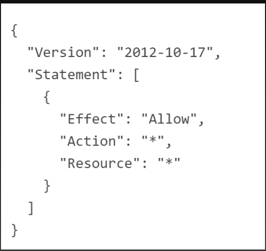
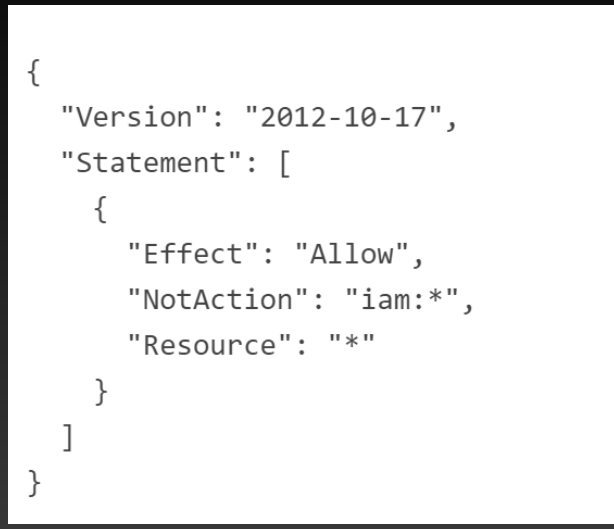
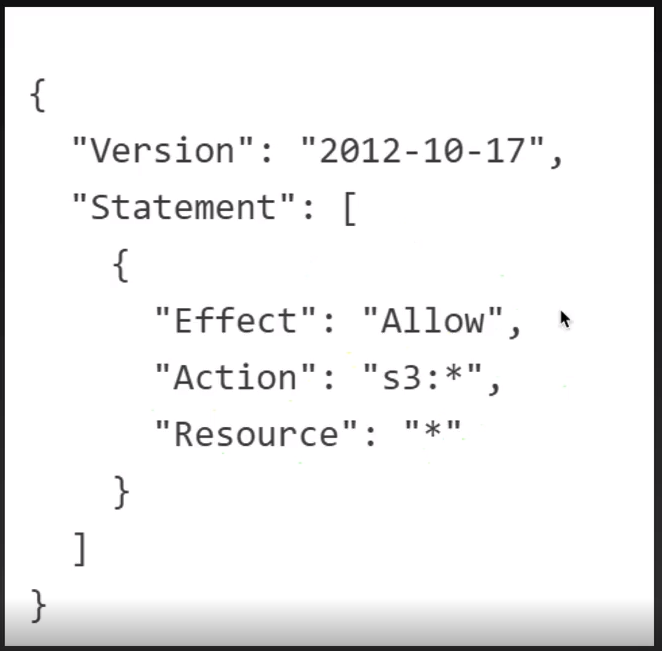

# IAM Policy

## 인증(Authentication)

- 사용자가 누구인지 확인하는 과정
- 예를 들어 어떤 한 사용자가 해당 시스템의 관리자라고 주장하면서 접근을 요청합니다. 이때 인증을 수행합니다.
- 인증 방법
    - 로그인

## 권한부여(Authroization)

- 사용자가 리소스에 접근하는 것을 허용하는 것
- 예를 들어 사용자가 ec2 인스턴스를 한개 만들고자 합니다. => No
- 사용자가 s3 파일을 다운로드 하고자 합니다. => Yes

## IAM Group

- 공통의 권한을 가지는 사용자들의 집합
- 그룹 생성후 IAM Policy에 연결
- 그룹에 사용자를 추가할 수 있습니다.
- 그룹 내 사용자는 그룹과 연결된 Policy의 권한을 사용할 수 있습니다.

## IAM User

- 그룹의 IAM Policy에 따라 권한을 부여받습니다.
- 사용자에게 직접 Policy를 추가할 수 있습니다.
- IAM User의 인증방식과 사용 용도
    - ID / 패스워드 방식 : 관리 콘솔에서 사용
    - AccessKey ID / Secret access Key : CLI, SDK, Web API에서 사용
    - 영구 자격 증명(Long term credential)이라고 합니다.

## IAM Policy

- AWS 서비스의 접근 권한을 세부적으로 관리하기 위해 사용됩니다.
- JSON 포맷의 문서입니다.

## IAM Policy의 종류

- AWS 관리 정책
    - AWS가 미리 만들어 놓은 정책입니다.
    - 사용자느 편집이 불가능합니다.
- 사용자 관리 정책
    - 사용자가 직접 생성한 정책입니다.
    - 기존 정책으로부터 생성 및 수정 또는 직접 생성이 가능합니다.
    - GUI 편집기 / JSON 편집기 모두 사용이 가능합니다.
- Inline 정책
    - 1회용 정책입니다.
    - 재사용되지 않습니다.

### AdmministrationAcess Policy

- 모든 리소스에 대해서 모든 액션이 가능합니다.

### Power User Policy

- 모든 리소스에 대해서 iam 빼고 허용하겠다는 의미입니다.

### S3 Full Permission

- 모든 리소스에 대해서 s3의 액션을 허용하겠다는 의미입니다.

