# IAM Role 실습

## Switch Role 만들기

1. IAM 어드민 계정 접속
2. 액세스 관리 -> 역할 -> 역할 만들기 접속

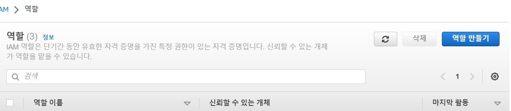

3. 다른 AWS 계정 선택
    - 만들고자 하는 역할이 다른 계정이 IAM 서비스의 일부를 사용하고자 하는 경우 다른 AWS 계정 선택

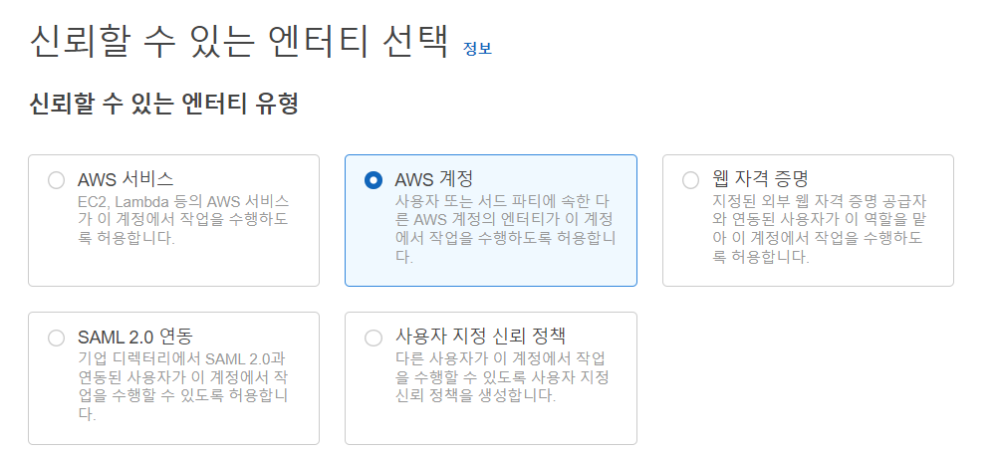

4. 계정 ID에 IAM Role 호출할 수 있는 ID를 입력 (IAM 어드맨 계정 ID)
5. 정책 연결
    - IAMFullAccess 선택

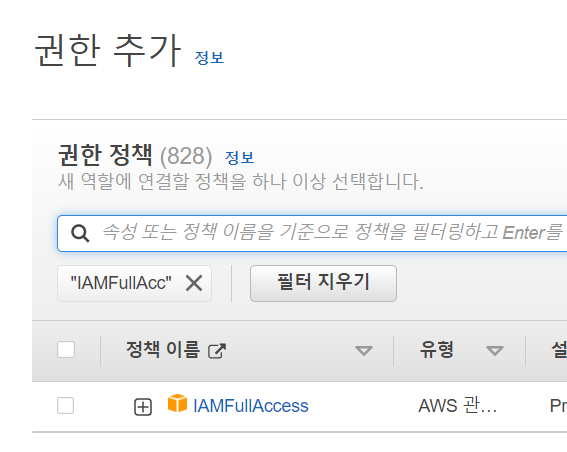

6. 역할 이름 설정 및 역할 생성

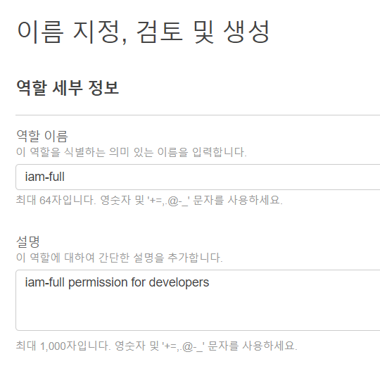

## Switch Role 사용

1. IAM 서비스를 사용하고자 하는 사용자 계정으로 접속

2. 역할 전환 클릭

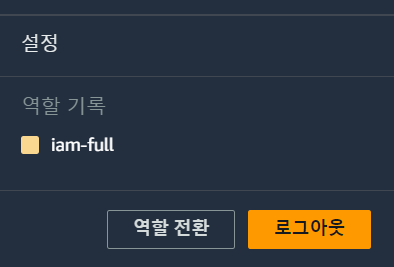

3. 계정, 역할, 표시 이름 작성 및 역할 전환 요청

- 계정 : IAM 서비스를 제공 역할을 제공하는 주체의 아이디, 저같은 경우 IAM 어드민 계정의 아이디
- 역할 : iam-full
- 표시 : iam-full

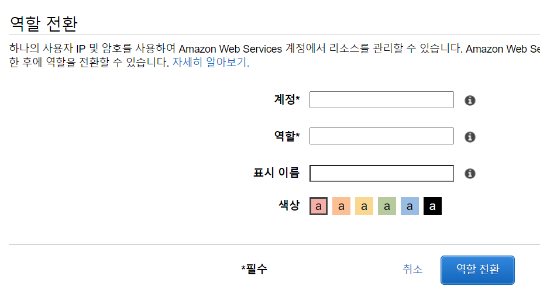

4. 역할 전환을 확인합니다.


## CLI 설치 및 사용해보기

### CLI 설치 및 확인

1. CLI 설치
   https://docs.aws.amazon.com/cli/latest/userguide/getting-started-install.html

2. aws 설치 확인

```shell
$ aws --version
```

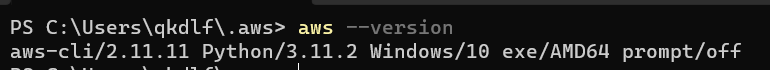

### aws CLI에 aws 인증하기

1. IAM 서비스 권한을 가진 계정으로 접속
2. 액세스 관리 -> 사용자 -> 액세스 키 만들 사용자 선택

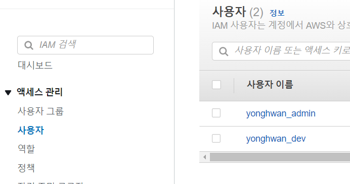

3. 보안 자격 증명 탭 선택 -> 액세스 키 만들기 -> Command Line Interface 선택 -> 액세스 키 만들기

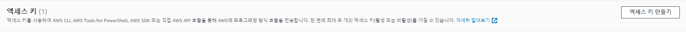

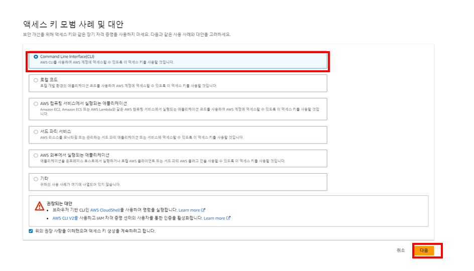

4. 액세스 키 csv 파일 다운로드

5. CLI에서 aws 인증

```
$ aws configure
AWS Access Key ID [None] : [액세스 키 아이디]
AWS Secret Access Key [None] : [시크릿 액세스 키]
Default region name [None] : ap-northeast-2
Default output format [None] : json
```

6. aws 서비스 명령어 테스트

```shell
$ aws s3 ls
```

아무것도 나오지 않으면 정상입니다. 왜냐하면 s3에 아무 버킷도 생성하지 않았기 때문입니다.

7. iam 서비스 사용해보기

```shell
$ aws iam list-users
```

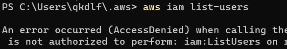

위와 같은 결과가 나오면 정상입니다. 왜냐하면 아직 현재 사용자가 CLI에 IAM Role을 등록해주지 않았기 때문입니다.

8. config, credentials 파일 내용 확인

```shell
$ cd ~/.aws
.aws $ cat config
.aws $ cat credentials
```

위 명령어를 실행하면 설정 정보와 자격 증명 정보를 확인할 수 있습니다.

## CLI에서 IAM Role 사용하기

1. IAM Role을 사용할 프로파일 생성

```shell
$ aws configure --profile iamyonghwan
```

2. 프로파일 생성 확인

```shell
$ cat ~/.aws/config
```

3. 새로 생성한 프로파일에 role_arn과 source_profile 설정

- role_arn은 설정할 역할에 대한 ARN을 설정합니다.
    - 액세스 관리 -> 역할 -> 설정할 역할 선택(ex, iam-full) -> ARN 복사하여 저장
- source_profile = default로 설정합니다.
    - 현재 사용자가 명시된 role_arn을 그대로 사용할 것이라는 의미입니다.

~/.aws/config 파일 내용

```shell
[default]
region = ap-northeast-2
output = json
[profile iamyonghwan]
region = ap-northeast-2
output = json
role_arn = [IAME Role에 대한 arn 주소]
source_profile = default
```

4. iam 서비스 사용 확인

```shell
$ aws iam list-users --profile iamyonghwan
```

사용자 정보가 나온다면 성공입니다.


