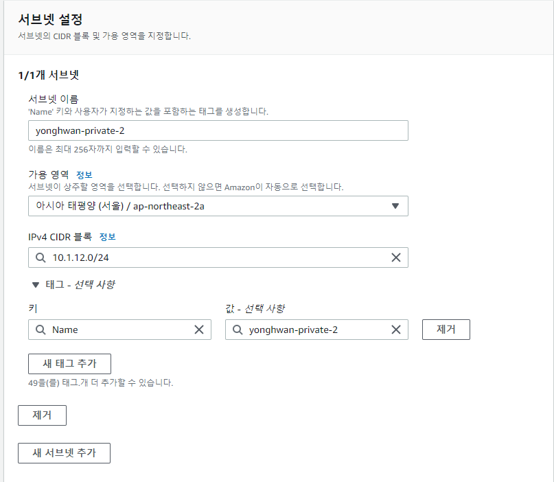
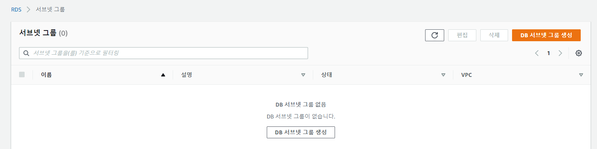
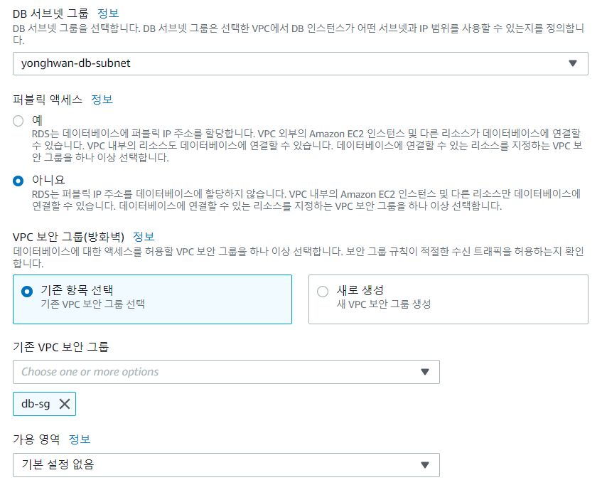
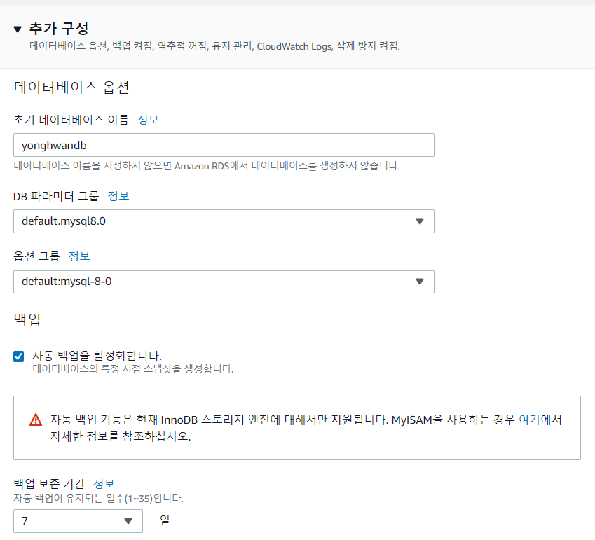
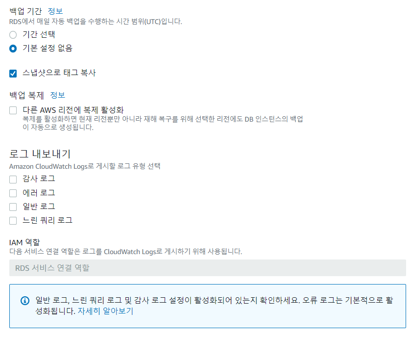
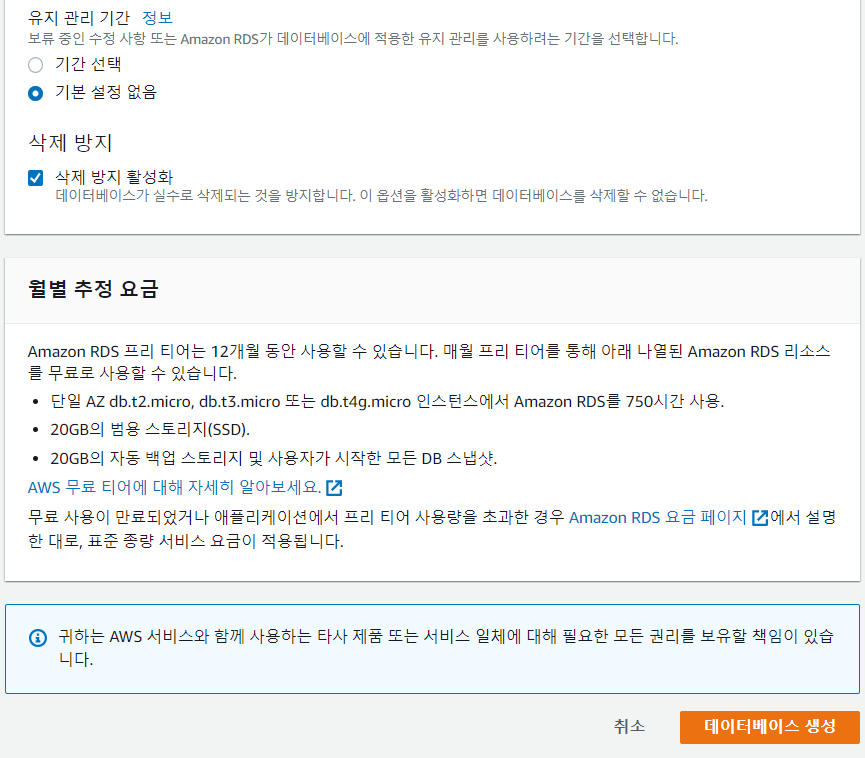

# RDS 소개와 특징

## Amazon Relational Database Service(RDS)

- AWS에서 관계형 데이터베이스를 쉽게 사용할 수 있게 도와주는 서비스
- 장점 : 관계형 데이터베이스 관리의 부담을 덜어준다.
- 단점 : 추가적인 비용이 발생한다.

## 관계형 데이터베이스(RDBMS)

- 테이블 모양의 2차원 데이터 (행과열, 레코드와 필드)를 저장함
- 데이터와 데이터 사이의 관계를 활용하여 중복데이터를 방지하고 검색 성능을 높임
- 가장 대표적인 데이터베이스의 형태
- Oracle, MySQL, MS-SQL Server 등이 가장 유명함

## RDS에서 지원하는 RDB

- Oracle
- MySQL
- MariaDB
- Aurora
- PostgreSQL
- SQL Server

# RDS 장단점

## RDS를 사용해야 하는 이유

- 쉬운 백업과 복구
- 고가용성 확보
- 수직 확장 수평 확장시 다운타임 최소화
- AWS 타 서비스들과의 통합 편리
- 다양한 기능
- 높은 성능

## RDS를 사용하지 말아야 하는 이유

- 비싸다
- 완전한 최적화는 어렵습니다.
- 특정 벤더들의 경우 벤더사의 클라우드 제품이 더 유리할 수 있다.
- 멀티 클라우드는 어떤가?
- 초보에게는 득보다 실이 많음

# RDS 생성 전 준비작업

## 사전준비 단계

1. 어드맨 계정 접속
2. 최소 2개 이상의 AZ로 구성된 DB 서브넷 그룹 생성하기
3. 데이터베이스가 사용할 보안 그룹 생성하기

## DB 서브넷 그룹 생성하기

1. VPC 접속
2. 서브넷 생성

3. DB 서브넷 그룹 생성
   

- 이름 : yonghwan-db-subnet
- 설명 : yonghwan-db-subnet
- VPC : my-vpc-01
- 가용영역 : ap-northeast-2a, ap-northeast-2b
- 서브넷 : 10.1.11.0/24, 10.1.12.0/24 선택

## 데이터베이스가 사용할 보안 그룹 생성하기

1. EC2 접속
2. 보안 그룹 접속
3. 보안 그룹 생성
    - 이름 : db-sg
    - 설명 : db-sg
    - VPC : my-vpc-01
4. 인바운드 규칙
    - 종류 : MySQL/Aurora
    - 소스 : yonghwan-public-sg

# RDS 생성

1. RDS 서비스 이동
2. 데이터베이스 생성

위 그림에서 퍼블릭 액세스는 "아니오"를 선택합니다.

