# S3 권한 제어

## S3 권한 제어 유형

- ACL
- Bucket Policy
- IAM을 이용한 제어
- PresignedURL (매우 유용함)

## 파일을 public으로 설정하기

1. 버킷 퍼블릭 액세스 차단 해제

- 버킷 선택 -> 권한 -> 퍼블릭 액세스 차단 -> 편집 -> 모든 퍼블릭 액세스 차단 해제

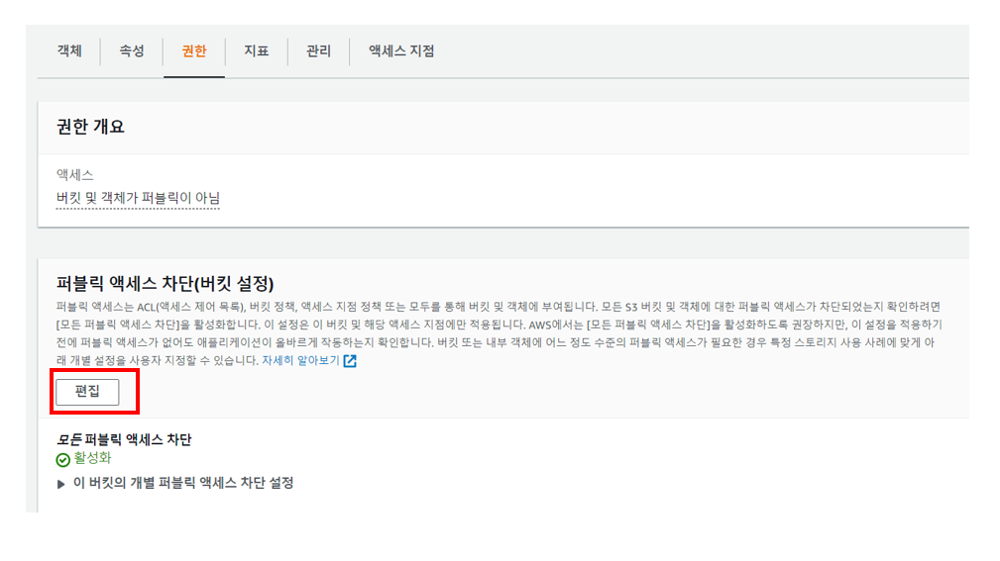

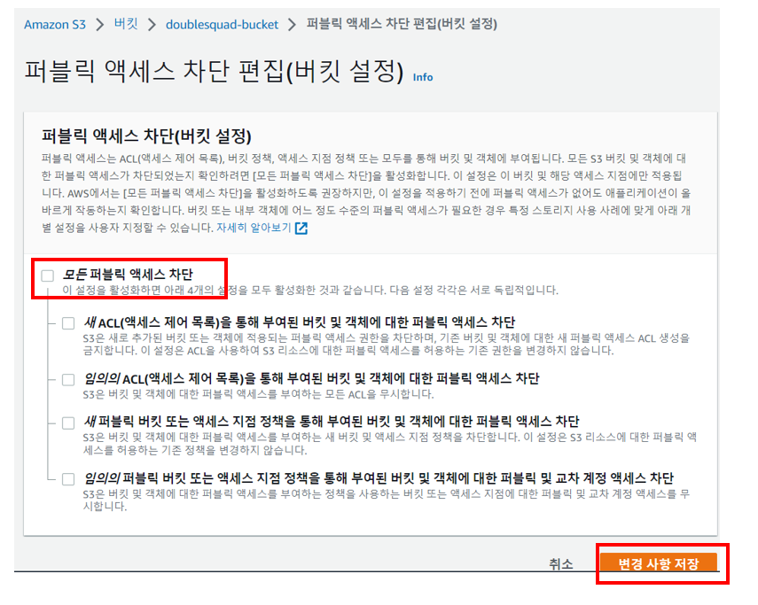

2. 버킷의 ACL 활성화

- 버킷 선택 -> 권한 -> 객체 소유권 설정 -> 편집 -> ACL 활성화됨 선택
  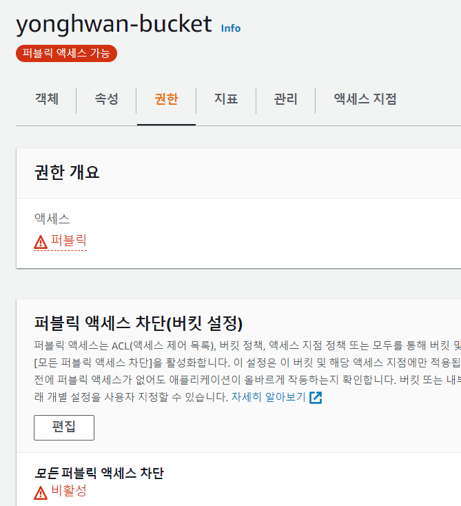
  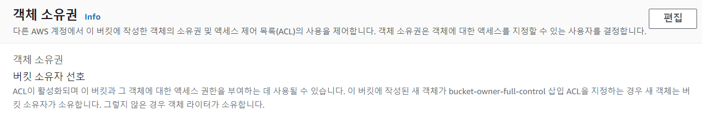
  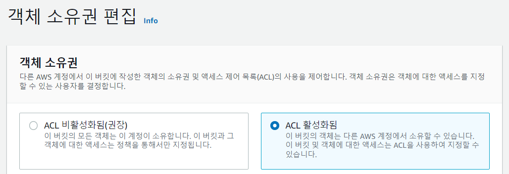

3. 버킷의 ACL 편집에서 버킷 ACL 읽기 설정

- ACL -> 편집 -> 모든 사람(퍼블릭 액세스) -> 버킷 ACL 읽기 선택

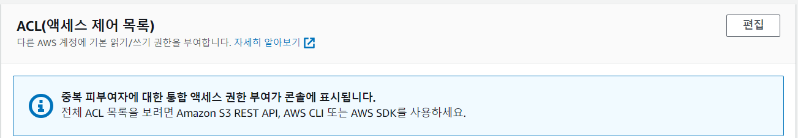

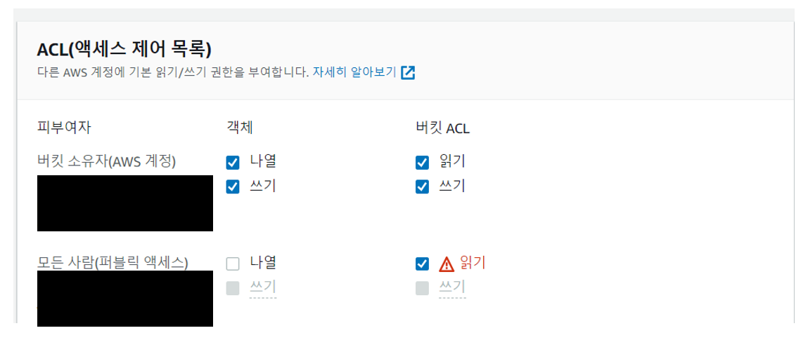

4. 폴더 및 파일 ACL을 통한 퍼블릭 설정

- 퍼블릭으로 설정할 폴더 및 파일을 선택 -> 작업 -> ACL을 통해 퍼블릭으로 설정 클릭

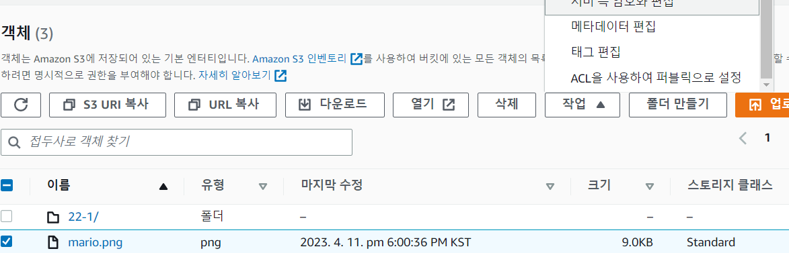

5. 파일의 객체 URL을 클릭하여 공개되었는지 확인

## Bucket Policy로 특정 폴더 아래에 모든 파일 public으로 설정하기

1. 정책 생성기 접속

- 버킷 선택 -> 권한 -> 버킷 정책의 편집 -> 정책 생성기

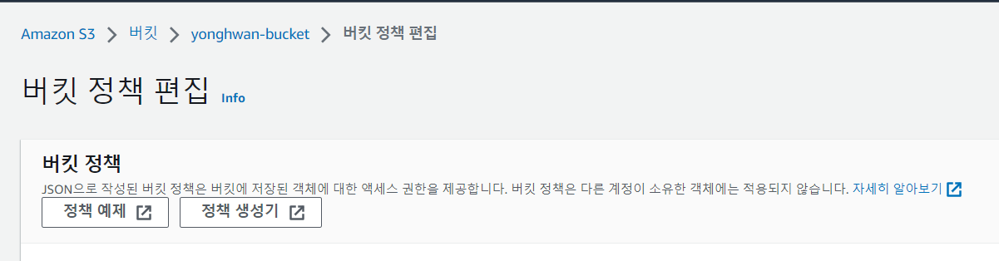

2. 정책 생성기 정보 입력
   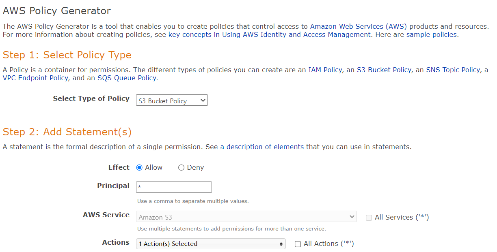

- Select Type of Policy : S3 Bucket Policy
- Effect : Allow
- Principal(대상) : * (모두)
- ARN : 버킷 ARN/public/*
    - 버킷 ARN/public/* : 버킷 경로에 public 폴더 아래 전부 대상

3. Generate Policy 버튼 클릭하고 정책 생성
4. 정책 내용을 복사하고 버킷 정책에 붙여넣기 후 변경 사항 저장

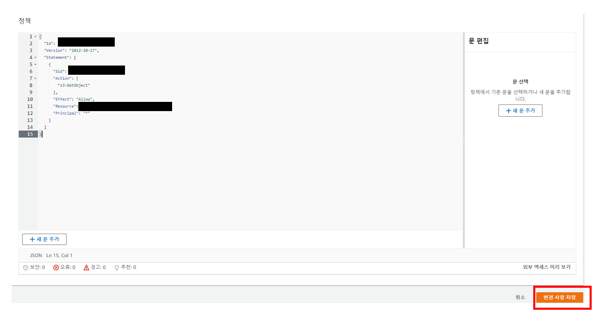

6. 버킷 폴더에 public 폴더 아래 객체를 선택하고 객체 URL을 클릭하여 공개 되었는지 확인

