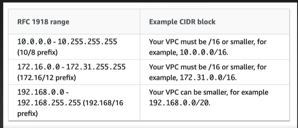

# VPC 소개

## VPC란?

- Amazon Virtual Private Cloud
- AWS의 가상 사설 네트워크
- AWS를 잘 사용하기 위해서 반드시 알아야 대는 필수 지식
- EC2의 네트워크 계층
- 많은 AWS 서비스들이 VPC를 통해 네트워크에 연결됨

## VPC를 이용한 네트워크 구성 예제

## 핵심 개념

- VPC: 사용자의 AWS 계정 전용 가상 네트워크 망, 리전 서비스
- 서브넷 : VPC를 더 작은 범위의 네트워크로 나눈 것, AZ 서비스
- EC2 인스턴스는 반드시 서브넷에 연결되어야 합니다.
- 라우팅 테이블 : 네트워크 트래픽 전달 규칙을 지정한 테이블입니다.
- CIDR 블록 : CIDR 표기법을 통해 IP 주소 범위를 지정합니다.

## CIDR 표기법

- IP의 범위를 간단하게 표기하는 표기법
- prefix의 범위는 0~32이고 의미는 상위 고정 비트 또는 네트워크 파트를 의미합니다.
- 고정되지 않은 하위 비트가 호스트 파트이며 범위값을 가집니다.

상위 고정 비트 : 지정된 비트만큼 값이 고정됩니다.

예를 들어 "192.168.1.0 / 24"라면 앞쪽에서부터 24비트인 192.168.1을 고정하겠다는 의미입니다.
나머지 0은 가변이고 이것을 네트워크 파트라고 합니다. 8bit는 호스트 파트가 됩니다.

## CIDR IP 범위

- CIDR 블록이 가지는 IP 범위 개수 = 2 ^ (32 - prefix)
- prefix가 작을수록 IP 범위가 커집니다.

## CIDR 표기법 예제

- 0.0.0.0 / 0 => 32비트가 가변 비트, 0.0.0.0 ~ 255.255.255.255
- 52.38.6.4 / 32 => 전부 다 고정
- 10.5.0.0 / 16 => 10.5 고정
- 10.5.1.0 / 24 => 10.5.1 고정
- 10.5.11.0 / 24 => 10.5.11 고정
- 10.5.21.64 / 28 =>

## CIDR 표기법 예제 (52.38.8.4/32)

- 고정 비트 : 52.38.8.4
- 가변 비트 : 0
- 범위 : 52.38.8.4
- 의미 : 특정 주소 1개

## CIDR 표기법 예제 (10.5.0.0/16)

- 고정비트 : 16
- 가변비트 : 16
- 범위 : 10.5.0.0 ~ 10.5.255.255
- 의미 : 2^8*2^8 = 2^16개

## CIDR 표기법 예제 (10.5.1.0/24)

- 고정 비트 : 24
- 가변 비트 : 8
- 범위 : 10.5.1.0 ~ 10.5.1.255
- 의미 : 2^8 = 256개

## CIDR 표기법 예제 (10.5.11.0/24)

- 고정 비트 : 24
- 가변 비트 : 8
- 범위 : 10.5.11.0 ~ 10.5.1.255
- 의미 : 2^8 = 256개

## VPC IP 범위

- 가장 큰 범위의 prefix : 16 => 32-16=16, 2^16=65536개
- 가장 작은 범위의 prefix : 28 => 32-28=4, 2^4=16개

