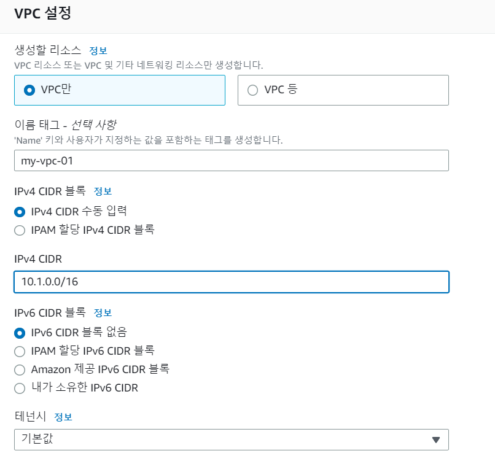
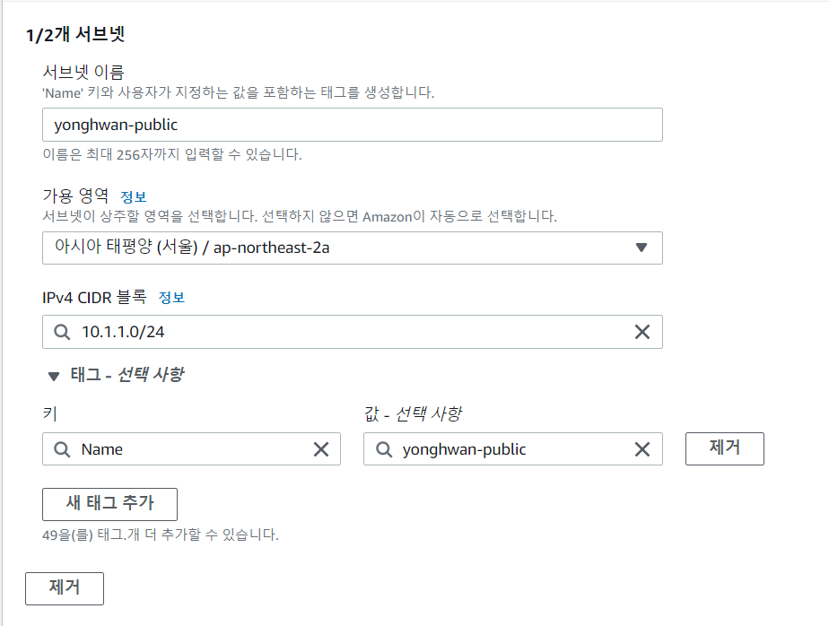
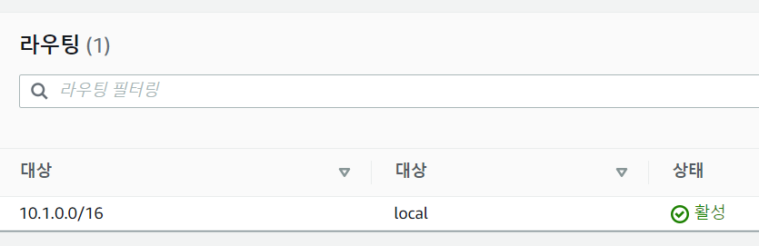
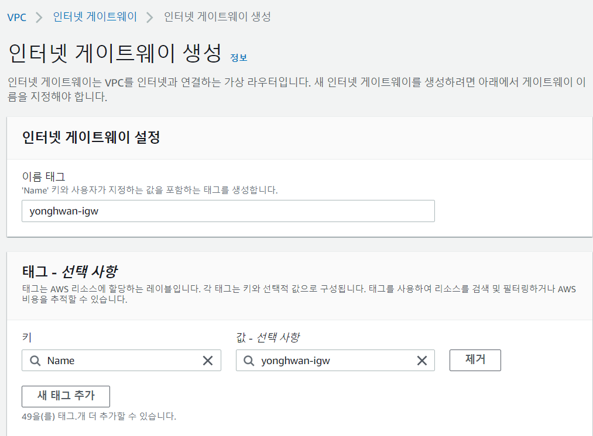
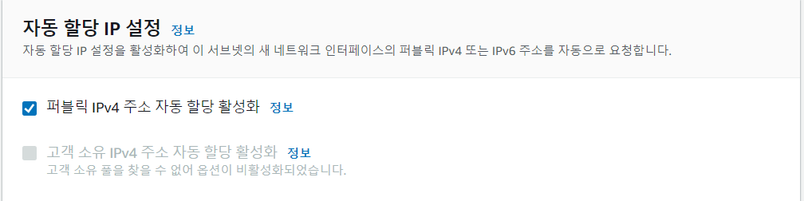

# VPC 실습

# VPC 생성

1. VPC 대시보드 입장
2. VPC 생성
3. 이름 작성
4. IPv4 CIDR 블록 지정
5. 생성

# 서브넷 생성 및 라우팅 테이블 연결 확인

## 서브넷 만들기

- 서브넷은 VPC CIDR 블록의 서브넷으로 생성합니다.
- CIDR 범위를 지정하고 AZ를 지정합니다.
- 중요: enable public IP 옵션을 선택할 수 있습니다.
- 서브넷은 반드시 하나의 라우팅 테이블을 연결합니다.

## 서브넷 만들기 실습

1. 서브넷 입장
2. 서브넷 생성
3. 이전 생성한 VPC 선택
4. 서브넷 2개 생성
    - 이름 : yonghwan-public
    - 가용영역 : ap-northeast-2a
    - CIDR : 10.1.1.0/24

    - 이름 : yonghwan-private
    - 가용영역 : ap-northeast-2b
    - CIDR : 10.1.2.0/24

5. 서브넷 생성
6. 서브넷의 라우팅 테이블을 확인하여 10.1.0.0/16인지 확인

# 인터넷 게이트웨이 생성 및 VPC 연결

## 인터넷 게이트웨이 추가

- 인터넷 게이트웨이(IGW)를 VPC에 연결하지 않으면 VPC에서 인터넷을 할 수 없다.
- 대부분의 경우 IGW를 생성해서 VPC에 연결한다.

## 인터넷 게이트웨이 생성 실습

1. 인터넷 게이트웨이 메뉴 클릭
2. 인터넷 게이트웨이 생성

- 이름 : yonghwan-igw

3. 생성
4. VPC에 연결 클릭
5. 이전에 만든 vpc 선택

# Public subnet

## 서브넷과 라우팅 테이블

- 서브넷이 인터넷과 연결하기 위해서 라우팅 규칙이 필요합니다.
- 라우팅 테이블 생성
- 해당 라우팅 테이블에 인터넷을 위한 규칙 생성
- 지정된 서브넷과 라우팅 테이블을 연결합니다.

## Public 서브넷이란?

- 인터넷 게이트웨이 규칙을 가지고 있는 서브넷을 public 서브넷이라고 합니다.
- 인터넷 세상에 열려있다는 의미입니다.
- 웹 서버, Bastion Server(Jump server) 등이 위치합니다.
- WAS(Web Application Server)의 위치는 상황에 따라 다르지만 public 서브넷에 놓는 경우가 많습니다.

# public subnet 라우팅 테이블 연결 및 확인

## 인스턴스 생성

1. 인스턴스 생성
2. 네트워크와 서브넷 설정
    - 네트워크 : yonghwan-vpc
    - 서브넷 : ap-northeast-2a
3. 퍼블릭 IP 자동 할당 : 활성화
4. 스토리지 8G
5. 태그 추가
    - Name - public-ec2
6. 보안 그룹 구성
    - 보안 그룹 새로 만들기 : yonghwan-public-sg

## 라우팅 테이블 생성

1. 라우팅 테이블 메뉴 접속
2. 라우팅 테이블 생성
    - 이름 : yonghwan-pub-rt
3. 라우팅 테이블 편집
4. 라우팅 추가
    - 0.0.0.0/0 => 모든 IP에 대해서 IGW에 연결하라는 의미

## 라우팅 테이블을 서브넷에 연결하기

1. yonghwan-public 서브넷을 yonghwan-pub-rt로 연결하기

# Private Subnet과 NAT Gateway

## Private Subnet

- 인터넷이 연결되지 않은 서브넷을 Private subnet이라고 합니다.
- 데이터베이스가 이곳에 위치합니다.
- 인터넷을 하기 위해서는 NAT 인스턴스, NAT 게이트웨이 등이 필요합니다.
- 팁: NAT 게이트웨이는 비싸기 때문에 가격에 주의해야 합니다.
- private subnet은 인터넷과 간접적으로 연결되어 있습니다.

## Private 서브넷에서 인터넷 사용방법

- NAT Gateway 서비스 이용 (월 5만원)
- EC2로 직접 NAT instance 구축 (권장)

# 서브넷 public ip 자동 할당

1. 서브넷 메뉴 입장
2. public 서브넷 선택
3. 작업 -> 서브넷 설정 편집 선택
4. 퍼블릭 IPv4 주소 자동 할당 활성화 선택

# ec2 private instance에 접속하기

핵심 키워드 : key-forwarding

